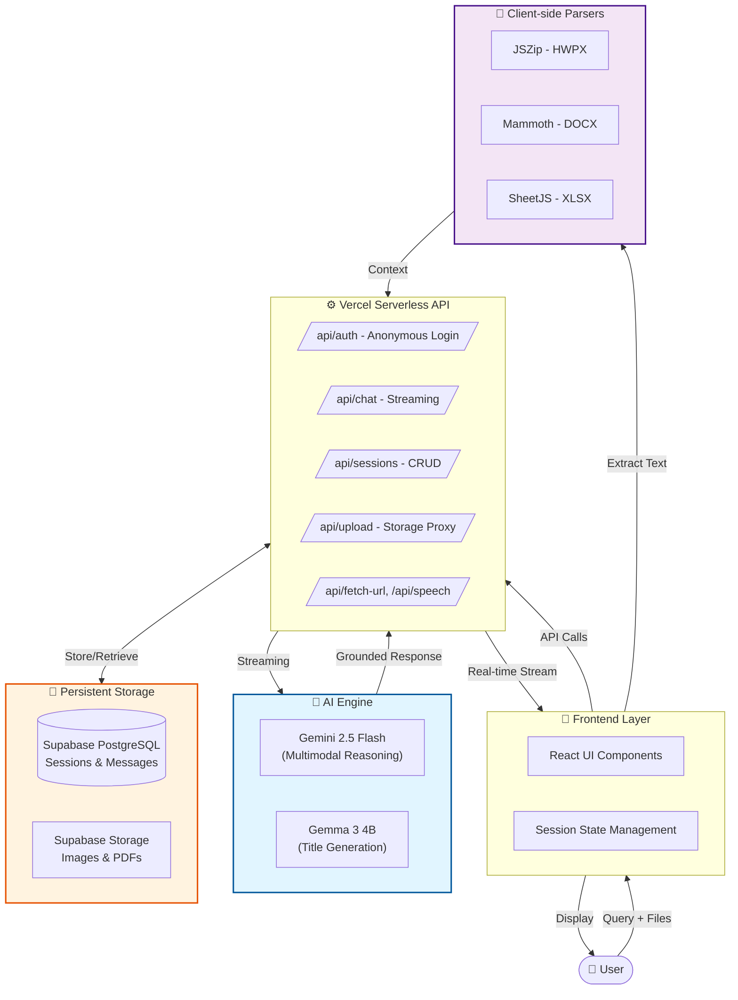

# 🚀 Chat with Gemini - Next-Gen AI Persistent Messenger

**Chat with Gemini** is an intelligent AI messenger that combines the power of Google's **Gemini 2.5 Flash** engine with **Supabase** persistent storage. It offers a seamless **Login-less** experience while maintaining **Persistent History** across devices.

---

## ✨ Key Features

### ⚡ Login-less Experience (Guest-First)
- **Automatic Anonymous Auth**: Start chatting immediately with a random nickname and profile. No tedious sign-up or email verification required.
- **Profile Customization**: Easily set your custom nickname and avatar from the sidebar. All profile data is saved securely in the cloud.

### 💾 Persistent Conversation History
- **Supabase Integration**: All messages and sessions are stored in Supabase (PostgreSQL). Your chat history remains intact even after a page refresh or device change.
- **Intelligent Session Management**: Create, delete, and rename chat sessions. An AI-powered titling system (using Gemma 3) automatically generates representative titles for your conversations.

### 🌐 Comprehensive UI Localization
- **Multi-language Support**: Fully supports **English (EN)**, **Korean (KO)**, **Spanish (ES)**, and **French (FR)**.
- **Deep Localization**: Not just the AI responses, but the **entire UI**—including sidebar menus, confirmation dialogs, error messages, and loading statuses—instantly switches to your preferred language.

### 🔍 Intelligence & Multimodality
- **PDF & Image Analysis**: Upload documents (PDF) or images and ask Gemini to summarize, extract data, or describe visual content (up to 4MB).
- **Real-time Google Search**: For time-sensitive queries, the AI performs a live web search and provides accurate **Grounding Cards** with source citations.
- **Hybrid YouTube Analysis**: Paste a YouTube URL to extract summaries. If captions are missing, Gemini can "watch" and analyze the video content directly.

### 🎨 Mobile & UX Enhancements (New!)
- **Drag & Drop and Paste**: Simply paste (Ctrl+V) images or drag files directly into the chat area. A sleek overlay guides your upload.
- **Advanced Document Support**: Directly analyzes `.docx`, `.hwpx`, `.txt`, `.md`, and `.csv` using client-side text extraction (via Mammoth & JSZip), bypassing API MIME restrictions.
- **Unified Loading UX**: Replaced bulky text status boxes with a clean, consistent "..." bouncing animation for all analysis and wait states.
- **Mobile-First Design**: Optimized for mobile browsers with **Dynamic Viewport Height (100dvh)** support to prevent address bar layout shifts.
- **Premium Loading Experience**: Features a "Breathing" logo animation and bouncing indicators for a polished, app-like startup.

---

## 🗺️ System Architecture



---

### Frontend
- **React 19** + **Vite** (TypeScript)
- **Tailwind CSS** (Premium Responsive Design)
- **Glassmorphism UI** with smooth animations

### Backend & Database
- **Vercel Serverless Functions** (API Layer)
- **Supabase** (PostgreSQL / Storage / Auth)
- **Vercel Edge API Requests** for low-latency streaming

### AI Models
- **Chat**: `gemini-2.5-flash` (Next-generation high-speed multimodal model)
- **Summarization**: `gemma-3-4b-it` (High-efficiency title generation)
- **Speech**: `gemini-2.5-flash-preview-tts` (Premium natural-sounding voice)

---

## 📁 Project Structure

```
.
├── api/                   # Vercel Serverless Functions (Backend)
│   ├── auth.ts           # Anonymous login & Profile management
│   ├── chat.ts           # Gemini streaming logic (w/ Key Rotation)
│   ├── upload.ts         # Supabase Storage proxy for file uploads
│   ├── sessions.ts       # Chat session & Message CRUD
│   ├── speech.ts         # Text-to-Speech (TTS) service
│   ├── fetch-url.ts      # Real-time Web/Arxiv scraping
│   ├── fetch-transcript.ts # YouTube subtitle fetching
│   ├── summarize-title.ts # Intelligent titling via Gemma
│   └── lib/
│       └── supabase.ts   # Server-side Supabase client config
├── components/            # UI Components (Localized)
│   ├── ChatSidebar.tsx   # Session list & Language settings
│   ├── ChatInput.tsx     # Multimodal input, text extraction (Mammoth) & validation
│   ├── Dialog.tsx        # Premium custom modals
│   ├── ChatMessage.tsx   # Markdown & logic rendering
│   ├── Header.tsx        # User profile & global settings
│   └── Toast.tsx         # Notification feedback system
├── services/
│   └── geminiService.ts  # Frontend API bridge, streaming logic & audio control
├── App.tsx                # Central state, session management & layout
└── types.ts               # Global types & Message/Attachment interfaces
```

---

## 🔐 Security & Reliability

- **API Key Rotation**: Utilizes up to 5 API keys in a Round-Robin fashion to minimize **429 (Too Many Requests)** errors and ensure uptime.
- **Row Level Security (RLS)**: Enforced via Supabase to ensure users can only access their own private conversation data.
- **Server-side Secrecy**: All sensitive credentials and API keys are stored in environment variables and never exposed to the client-side browser.
- **Payload Optimization**: Includes intelligent handling for Vercel's 4.5MB payload limit to prevent deployment-specific upload failures.

---

## 🚀 Getting Started

### 1. Configure Environment Variables (.env.local)
```env
SUPABASE_URL=your_supabase_url
SUPABASE_KEY=your_supabase_service_role_key
API_KEY=your_gemini_key_1
API_KEY2=your_gemini_key_2
...
```

### 2. Install & Run
```bash
npm install
npm run dev
```

---

Developed by **jpjp92**  
*Powered by Google Gemini & Supabase Persistent Memory Systems*
