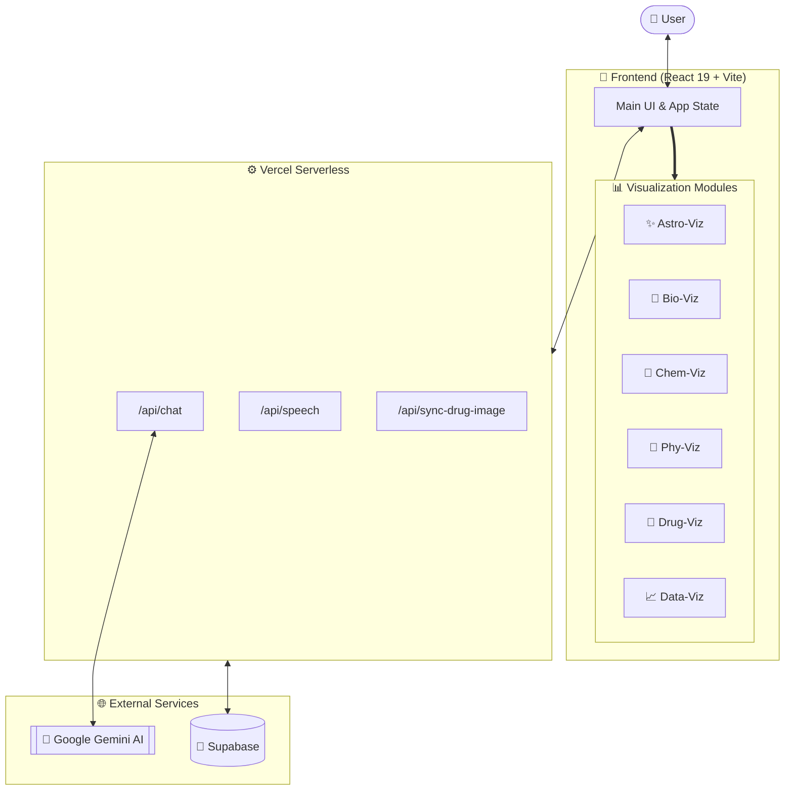
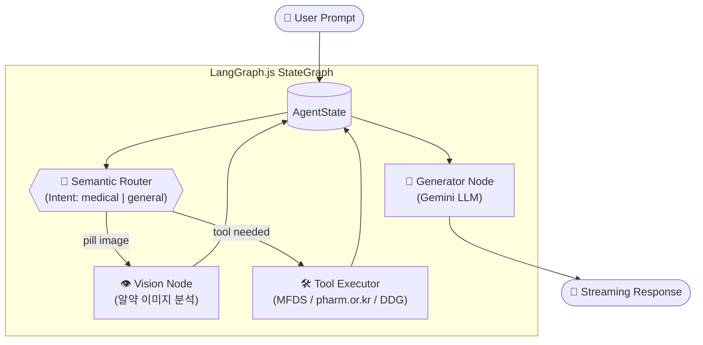

# 🚀 Chat Agent with Gemini

**Gemini 2.5 Flash** 기반 인텔리전트 AI 메신저. **Supabase** 영구 저장소 + **LangGraph.js** 에이전틱 파이프라인 + 7종 인터랙티브 시각화 렌더러를 탑재한 차세대 채팅 에이전트.

---

## ✨ 핵심 기능

### 💬 대화 & 인증
- **Login-less 경험**: 즉시 시작, 랜덤 닉네임 + 아바타 자동 발급
- **영구 히스토리**: Supabase(PostgreSQL) 기반 세션/메시지 지속 저장
- **AI 자동 제목**: 대화 내용 기반 세션 제목 자동 생성 (Gemma 3)
- **다국어 지원**: KO / EN / ES / FR 완전 로컬라이제이션

### 🧠 AI Intelligence
- **Gemini 2.5 Flash** (메인) + **Flash-Lite** (자동 전환)
- **Google Search Grounding**: 실시간 검색 + 소스 칩 반환
- **YouTube 분석**: 트랜스크립트 우선 / 없으면 직접 영상 분석 폴백. 타임스탬프 링크 포함 구조화 요약
- **멀티모달**: 이미지, PDF(30MB+), 영상, DOCX/HWPX/PPTX/XLSX 지원
- **LangGraph 에이전트**: Semantic Router → Vision/Generator 노드 기반 의도별 최적 경로 처리

### 📊 시각화 렌더러 (7종)
| 렌더러 | 트리거 | 기술 |
|--------|--------|------|
| **Drug-Viz** 💊 | 약품명 질의 | MFDS API + pharm.or.kr 딥링크 |
| **Chem-Viz** 🧪 | 분자/화학구조 질의 | SMILES Drawer |
| **Bio-Viz** 🧬 | 단백질/DNA 질의 | NGL Viewer (3D PDB) |
| **Physics-Viz** 🎾 | 역학/시뮬레이션 질의 | Matter.js |
| **Diagram-Viz** 📐 | 경사면/힘 다이어그램 | Canvas 2D |
| **Constellation-Viz** ✨ | 별자리/천체 질의 | HTML5 Canvas |
| **Chart-Viz** 📈 | 데이터/통계 질의 | ApexCharts |

### 💊 Drug-Viz 상세 (약품 식별 엔진)
- **Vision 각인 추출**: MFDS "마크" 반환 시 Gemini Vision으로 실제 각인 텍스트 추출
- **pharm.or.kr 딥링크**: 서버사이드 POST로 내부 `idx` 추출, 원클릭 식별 카드 링크
- **2단계 이미지 검증**: ConnectDI HTML 파싱 + 각인 매칭. 정확도 70% → 95%+
- **병렬 처리**: MFDS 조회 + pharm.or.kr 조회 동시 실행
- **DDG 폴백**: MFDS 미등록 약품 시 DuckDuckGo 검색으로 자동 폴백 + 소스 칩 반환

### ⚡ 성능
- **Lighthouse 83/100** (초기 44 → 개선)
- **JS Bundle 365KB** gzip (초기 1.0MB → Code Splitting + Lazy Loading)
- **CSS Bundle ~15KB** (초기 124KB → Build-time Tailwind)
- **CLS 0.00** / **Best Practices 100/100**

### 🔐 보안
- **Presigned URL 아키텍처**: 프론트엔드에 Supabase 자격증명 미노출
- **RLS 적용**: Supabase Row Level Security로 사용자 데이터 격리
- **API Key Rotation**: 429 발생 시 자동 키 순환 (60초 블랙리스트)

---

## 🏗️ 아키텍처

### 전체 구조


```mermaid
flowchart TB
    User([👤 User])

    subgraph Frontend ["🎨 Frontend (React 19 + Vite)"]
        UI[Main UI & App State]
        subgraph Visualizers ["📊 Visualization Modules"]
            Astro["✨ Astro-Viz"] & Bio["🧬 Bio-Viz"] & Chem["🧪 Chem-Viz"]
            Phy["🎾 Phy-Viz"] & Drug["💊 Drug-Viz"] & Charts["📈 Data-Viz"]
        end
    end

    subgraph Backend ["⚙️ Vercel Serverless"]
        ChatPipe["/api/chat"] & TTS["/api/speech"] & Sync["/api/sync-drug-image"]
    end

    subgraph Providers ["🌐 External Services"]
        Gemini[["🤖 Google Gemini AI"]]
        Supabase[("💾 Supabase")]
    end

    User <--> UI
    UI ==> Visualizers
    UI <--> Backend
    ChatPipe <--> Gemini
    Backend <--> Supabase
```

### LangGraph 에이전트 플로우


```mermaid
flowchart TB
    User([👤 User Prompt])

    subgraph StateGraph ["LangGraph.js StateGraph"]
        StateNode[("AgentState")]
        RouterNode{{"🧭 Semantic Router\n(Intent: medical | general)"}}
        Vision["👁️ Vision Node\n(알약 이미지 분석)"]
        ToolExecutor["🛠️ Tool Executor\n(MFDS / pharm.or.kr / DDG)"]
        Generator["📝 Generator Node\n(Gemini LLM)"]
    end

    Output([💬 Streaming Response])

    User --> StateNode --> RouterNode
    RouterNode -- "pill image" --> Vision --> StateNode
    RouterNode -- "tool needed" --> ToolExecutor --> StateNode
    StateNode --> Generator --> Output
```

---

## 🛠️ 기술 스택

| 레이어 | 기술 |
|--------|------|
| **Frontend** | React 19, Vite, TypeScript, Tailwind CSS, Framer Motion |
| **Visualization** | ApexCharts, smiles-drawer, NGL, matter-js, HTML5 Canvas |
| **Backend** | Vercel Serverless Functions, LangGraph.js |
| **AI** | Gemini 2.5 Flash / Flash-Lite, @google/genai SDK, LangChain |
| **Database** | Supabase (PostgreSQL, Storage, Auth) |

### AI 모델 용도
| 용도 | 모델 |
|------|------|
| 메인 채팅 | `gemini-2.5-flash` |
| 라우터 / 경량 처리 | `gemini-2.5-flash-lite` |
| TTS | `gemini-2.5-flash-preview-tts` |
| 세션 제목 | `gemini-2.5-flash-lite` / `gemma-3-4b-it` |

---

## 📁 프로젝트 구조

```
├── api/                        # Vercel Serverless Functions
│   ├── chat.ts                 # 메인 Gemini 스트리밍 (LangGraph)
│   ├── speech.ts               # TTS 서비스
│   ├── sync-drug-image.ts      # 약품 이미지 캐싱 & 파싱
│   ├── pill-search.ts          # 알약 식별 API
│   ├── sessions.ts             # 세션/메시지 CRUD
│   ├── upload.ts               # Supabase Storage 업로드 프록시
│   ├── fetch-url.ts            # 웹/Arxiv 스크래핑
│   ├── fetch-transcript.ts     # YouTube 자막 추출
│   └── _lib/                   # 유틸리티 (Vercel 함수 수 카운트 제외)
│       ├── agent/              # LangGraph 에이전트
│       │   ├── graph.ts        # StateGraph 정의
│       │   ├── nodes/          # router / vision / generator
│       │   ├── drug-info-tool.ts
│       │   ├── tools.ts
│       │   ├── prompt.ts
│       │   └── state.ts
│       ├── pill-logic.ts       # 약학정보원 검색 로직
│       └── supabase.ts
├── components/                 # UI 컴포넌트
│   ├── ChatMessage.tsx         # 마크다운 + 시각화 블록 파싱
│   ├── DrugRenderer.tsx        # 약품 카드
│   ├── BioRenderer.tsx         # 3D 단백질 구조
│   ├── ChemicalRenderer.tsx    # SMILES 분자 구조
│   ├── PhysicsRenderer.tsx     # 물리 시뮬레이션
│   ├── ConstellationRenderer.tsx # 별자리 맵
│   ├── ChartRenderer.tsx       # 차트
│   ├── DiagramRenderer.tsx     # 힘 다이어그램
│   └── ...
├── docs/                       # 프로젝트 문서
│   ├── DEV_HISTORY.md          # 버전별 개발 이력
│   ├── DEV_260404.md           # 최근 작업 로그
│   └── TODO.md                 # 로드맵
└── types.ts
```

---

## 🚀 시작하기

### 환경 변수 설정 (`.env.local`)

```env
SUPABASE_URL=your_supabase_url
SUPABASE_KEY=your_supabase_service_role_key
API_KEY=your_gemini_key_1
API_KEY2=your_gemini_key_2
MFDS_API_ENDPOINT=your_mfds_endpoint
MFDS_API_KEY=your_mfds_key
```

### 설치 & 실행

```bash
npm install
npm run dev
```

---

> 상세 변경 이력: [docs/DEV_HISTORY.md](docs/DEV_HISTORY.md)  
> Developed by **jpjp92** — Powered by Google Gemini & Supabase

