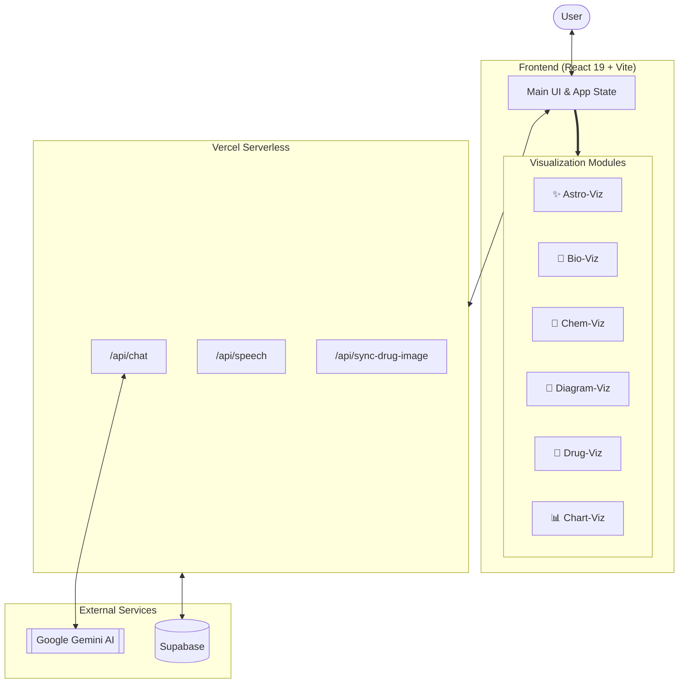
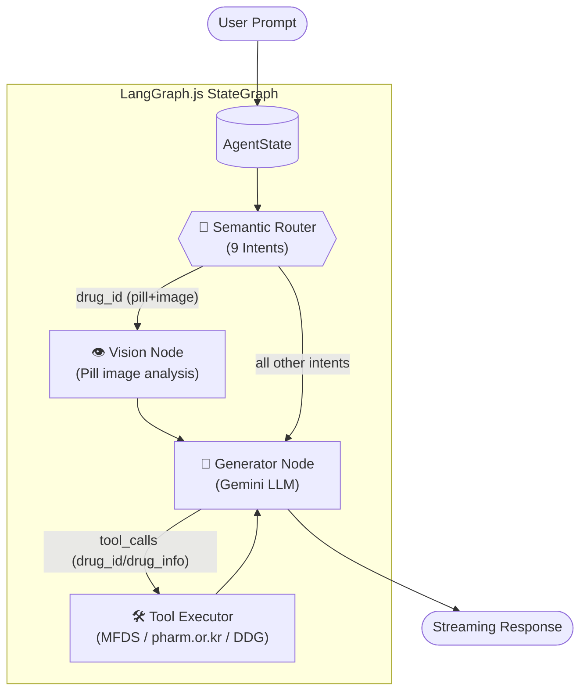

# Chat Agent with Gemini

An intelligent AI messenger powered by **Gemini 2.5 Flash**, combining **Supabase** persistent storage, a **LangGraph.js** agentic pipeline, and 6 interactive visualization renderers.

---

## 1. Features

### 1-1. Conversation & Auth
- **Login-less**: Start instantly with an auto-assigned random nickname and avatar
- **Persistent history**: Sessions and messages stored in Supabase (PostgreSQL)
- **Auto-title**: Session titles generated automatically from conversation content (Gemini 2.5 Flash)
- **Localization**: Full support for KO / EN / ES / FR

### 1-2. AI Intelligence
- **Gemini 2.5 Flash** (primary) with **Flash-Lite** for semantic routing
- **Google Search Grounding**: Real-time web search with source chip rendering
- **YouTube analysis**: Native Gemini video analysis (direct video reading); supports standard URLs, `youtu.be`, and Shorts (`/shorts/`); structured summary with timestamp links
- **Multimodal input**: Images, PDF (30MB+), video, DOCX / HWPX / PPTX / XLSX
- **LangGraph agent**: Semantic Router → Vision / Generator nodes with intent-based path routing

### 1-3. Visualization Renderers (6)

| Renderer | Intent | Trigger | Library |
|----------|--------|---------|---------|
| 💊 Drug-Viz | `drug_id` / `drug_info` | 약품명 질의 | MFDS API + pharm.or.kr |
| 🧪 Chem-Viz | `chemistry` | 분자 / 화학 구조 | smiles-drawer |
| 🧬 Bio-Viz | `biology` | 단백질 / DNA | NGL Viewer (3D PDB) |
| 📐 Diagram-Viz | `physics` | 자유물체도 / 포물선 / 충돌 / 경사면 | Canvas 2D |
| ✨ Constellation-Viz | `astronomy` | 별자리 / 천체 | HTML5 Canvas |
| 📊 Chart-Viz | `data_viz` | 데이터 / 통계 | ApexCharts |

### 1-4. 💊 Drug-Viz — Pill Identification Engine
- **Vision imprint extraction**: When MFDS returns a logo mark, Gemini Vision extracts the actual imprint text
- **pharm.or.kr deep link**: Server-side POST extracts internal `idx` for a one-click identification card link
- **2-stage image verification**: ConnectDI HTML parsing + imprint matching; accuracy 70% → 95%+
- **Parallel processing**: MFDS lookup and pharm.or.kr lookup run concurrently
- **DDG fallback**: Drugs not in MFDS fall back to DuckDuckGo search with source chips

### 1-5. Performance
- Lighthouse **91 / 100** (up from 44)
- JS bundle **365 KB** gzip (down from 1.0 MB via code splitting + lazy loading)
- CSS bundle **~15 KB** (down from 124 KB via build-time Tailwind)
- CLS **0.00** / Best Practices **100 / 100**

### 1-6. Security
- **Presigned URL architecture**: Supabase credentials never exposed to the frontend
- **Row Level Security**: Supabase RLS configured for per-user data isolation (service_role IDOR hardening planned — see TODO)
- **API key rotation**: 429 → 60s cooldown (`markKeyRateLimited`), 401/403 → 24h blacklist (`markKeyInvalid`); all-keys-exhausted returns `null` to prevent circular 429 loops
- **Error message sanitize**: Internal error details (`error.message`) never forwarded to the client; status-code-based user-friendly messages only
- **Request timeout protection**: All external fetches capped with `AbortController` (YouTube HTML 25s / XML 15s, MFDS/pharm.or.kr/DDG 8s, nedrug image 6s)

---

## 2. Architecture

### 2-1. System Overview


```mermaid
flowchart TB
    User([User])

    subgraph Frontend ["Frontend (React 19 + Vite)"]
        UI[Main UI & App State]
        subgraph Visualizers ["Visualization Modules"]
            Astro["✨ Astro-Viz"] & Bio["🧬 Bio-Viz"] & Chem["🧪 Chem-Viz"]
            Diagram["📐 Diagram-Viz"] & Drug["💊 Drug-Viz"] & Charts["📊 Chart-Viz"]
        end
    end

    subgraph Backend ["Vercel Serverless"]
        ChatPipe["/api/chat"] & TTS["/api/speech"] & Sync["/api/sync-drug-image"]
    end

    subgraph Providers ["External Services"]
        Gemini[["Google Gemini AI"]]
        Supabase[("Supabase")]
    end

    User <--> UI
    UI ==> Visualizers
    UI <--> Backend
    ChatPipe <--> Gemini
    Backend <--> Supabase
```

### 2-2. LangGraph Agent Flow


```mermaid
flowchart TB
    User([User Prompt])

    subgraph StateGraph ["LangGraph.js StateGraph"]
        StateNode[("AgentState")]
        RouterNode{{"🧭 Semantic Router\n(9 Intents)"}}
        Vision["👁️ Vision Node\n(Pill image analysis)"]
        Tools["🛠️ Tool Executor\n(MFDS / pharm.or.kr / DDG)"]
        Generator["📝 Generator Node\n(Gemini LLM)"]
    end

    Output([Streaming Response])

    User --> StateNode --> RouterNode
    RouterNode -- "drug_id (pill+image)" --> Vision --> Generator
    RouterNode -- "all other intents" --> Generator
    Generator -- "tool_calls (drug_id/drug_info)" --> Tools --> Generator
    Generator --> Output
```

### 2-3. Intent Routing

| Intent | Path | Model |
|--------|------|-------|
| `drug_id` | Vision → LangChain + Tools | gemini-2.5-flash |
| `drug_info` | LangChain + Tools | gemini-2.5-flash |
| `medical_qa` | SDK + Google Search | gemini-2.5-flash |
| `biology` | SDK + Google Search | gemini-2.5-flash |
| `chemistry` | SDK + Google Search | gemini-2.5-flash |
| `physics` | SDK + Google Search | gemini-2.5-flash |
| `astronomy` | SDK + Google Search | gemini-2.5-flash |
| `data_viz` | SDK + Google Search | gemini-2.5-flash |
| `general` | SDK + Google Search | gemini-2.5-flash |

---

## 3. Tech Stack

| Layer | Technology |
|-------|-----------|
| Frontend | React 19, Vite, TypeScript, Tailwind CSS, Framer Motion |
| Visualization | ApexCharts, smiles-drawer, NGL, HTML5 Canvas |
| Backend | Vercel Serverless Functions, LangGraph.js |
| AI | Gemini 2.5 Flash / Flash-Lite, @google/genai SDK, LangChain |
| Database | Supabase (PostgreSQL, Storage, Auth) |

### 3-1. Model Usage

| Purpose | Model |
|---------|-------|
| Main chat | `gemini-2.5-flash` |
| Router (intent classification) | `gemini-2.5-flash-lite` |
| TTS | `gemini-2.5-flash-preview-tts` |
| Session title | `gemini-2.5-flash-lite` (primary) / `gemini-2.5-flash` (fallback) |

---

## 4. Project Structure

```
├── api/                        # Vercel Serverless Functions
│   ├── chat.ts                 # Main Gemini streaming endpoint (LangGraph, SSE)
│   ├── speech.ts               # TTS service (gemini-2.5-flash-preview-tts)
│   ├── summarize-title.ts      # Auto session title generation
│   ├── sync-drug-image.ts      # Drug image caching and parsing
│   ├── pill-search.ts          # Pill identification API
│   ├── sessions.ts             # Session / message CRUD
│   ├── upload.ts               # Supabase Storage upload proxy
│   ├── fetch-url.ts            # Web / ArXiv scraping
│   ├── fetch-transcript.ts     # YouTube transcript proxy (disabled — native video analysis only)
│   ├── auth.ts                 # Auth handling
│   ├── create-signed-url.ts    # Supabase Storage signed URL generation
│   ├── proxy-image.ts          # Image proxy
│   └── _lib/                   # Shared utilities (excluded from Vercel function count)
│       ├── config.ts           # API key pool, markKeyRateLimited / markKeyInvalid
│       ├── agent/              # LangGraph agent
│       │   ├── graph.ts        # StateGraph definition
│       │   ├── nodes/          # router / vision / generator
│       │   ├── drug-info-tool.ts  # MFDS + pharm.or.kr + Vision imprint (timeouts)
│       │   ├── tools.ts        # identifyPillTool, searchWebTool (DDG 8s timeout)
│       │   ├── prompt.ts
│       │   └── state.ts
│       ├── pill-logic.ts       # pharm.or.kr search logic
│       └── supabase.ts
├── components/                 # UI components
│   ├── ChatMessage.tsx         # Markdown + visualization block parser
│   ├── DrugRenderer.tsx        # Drug card
│   ├── BioRenderer.tsx         # 3D protein structure
│   ├── ChemicalRenderer.tsx    # SMILES molecular structure
│   ├── ConstellationRenderer.tsx
│   ├── ChartRenderer.tsx
│   ├── DiagramRenderer.tsx
│   └── ...
├── src/
│   └── hooks/                  # Custom React hooks (App.tsx 오케스트레이션 분리)
│       ├── useAuthSession.ts   # Auth init, localStorage restore, 익명 로그인
│       ├── useChatSessions.ts  # Session CRUD, 메시지 lazy load
│       └── useChatStream.ts    # 메시지 전송 오케스트레이션 (upload / stream / title)
├── services/
│   └── geminiService.ts        # Gemini API wrapper, session/user remote calls
├── docs/
│   ├── DEV_HISTORY.md          # Version changelog (v4.x)
│   ├── DEV_*.md                # Session work logs (latest: DEV_260502.md)
│   ├── TODO.md                 # Roadmap
│   └── Guide/REF_*.md          # Renderer test prompt guides
├── App.tsx                     # 최상위 컴포넌트 (레이아웃 + 훅 조합)
└── types.ts                    # 공유 TypeScript 타입 정의
```

---

## 5. Getting Started

### 5-1. Environment variables (`.env.local`)

```env
SUPABASE_URL=your_supabase_url
SUPABASE_KEY=your_supabase_service_role_key
API_KEY=your_gemini_key_1
API_KEY2=your_gemini_key_2
MFDS_API_ENDPOINT=your_mfds_endpoint
MFDS_API_KEY=your_mfds_key
```

### 5-2. Install & run

```bash
npm install
npm run dev
```

---

> Detailed changelog: [docs/DEV_HISTORY.md](docs/DEV_HISTORY.md)  
> Developed by **jpjp92** — Powered by Google Gemini & Supabase

