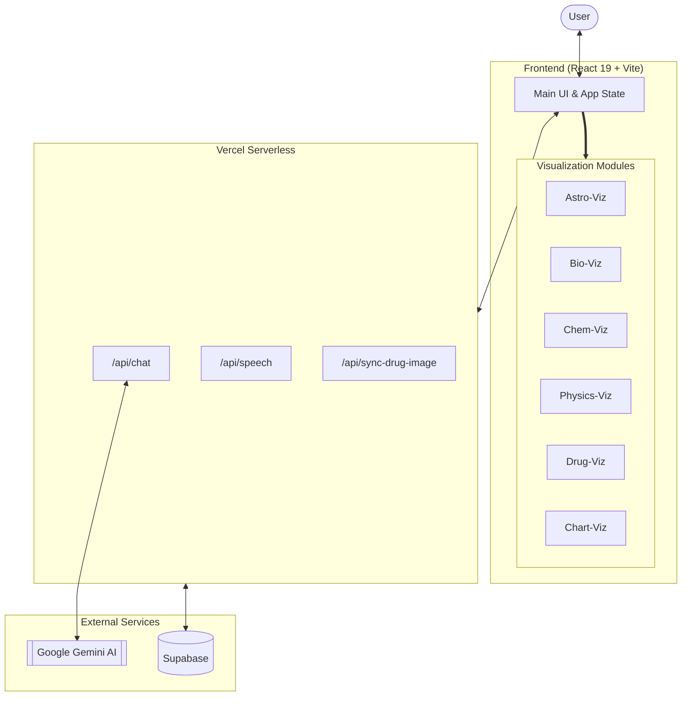
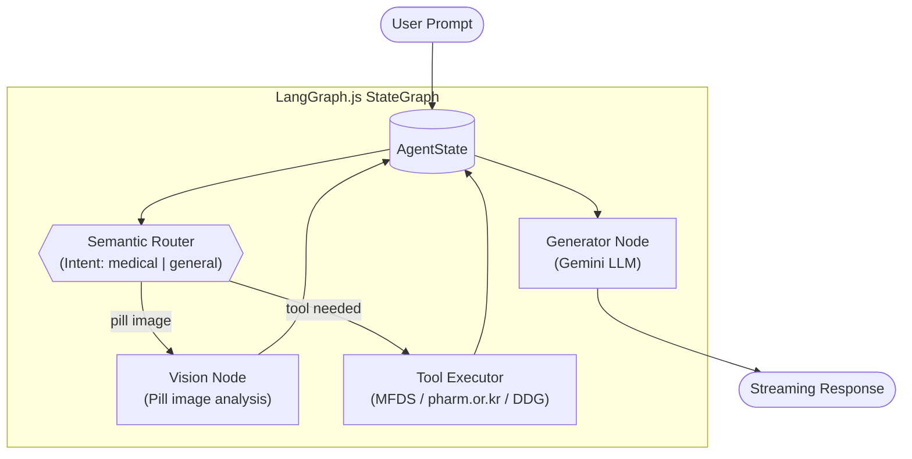

# Chat Agent with Gemini

An intelligent AI messenger powered by **Gemini 2.5 Flash**, combining **Supabase** persistent storage, a **LangGraph.js** agentic pipeline, and 7 interactive visualization renderers.

---

## Features

### Conversation & Auth
- **Login-less**: Start instantly with an auto-assigned random nickname and avatar
- **Persistent history**: Sessions and messages stored in Supabase (PostgreSQL)
- **Auto-title**: Session titles generated automatically from conversation content (Gemma 3)
- **Localization**: Full support for KO / EN / ES / FR

### AI Intelligence
- **Gemini 2.5 Flash** (primary) with **Flash-Lite** for routing and lightweight tasks
- **Google Search Grounding**: Real-time web search with source chip rendering
- **YouTube analysis**: Transcript-first with direct video analysis fallback; structured summary with timestamp links
- **Multimodal input**: Images, PDF (30MB+), video, DOCX / HWPX / PPTX / XLSX
- **LangGraph agent**: Semantic Router → Vision / Generator nodes with intent-based path routing

### Visualization Renderers (7)

| Renderer | Trigger | Library |
|----------|---------|---------|
| Drug-Viz | Drug name query | MFDS API + pharm.or.kr deep link |
| Chem-Viz | Molecule / chemical structure | smiles-drawer |
| Bio-Viz | Protein / DNA query | NGL Viewer (3D PDB) |
| Physics-Viz | Dynamics / simulation | Matter.js |
| Diagram-Viz | Force diagram / inclined plane | Canvas 2D |
| Constellation-Viz | Star / celestial query | HTML5 Canvas |
| Chart-Viz | Data / statistics | ApexCharts |

### Drug-Viz — Pill Identification Engine
- **Vision imprint extraction**: When MFDS returns a logo mark, Gemini Vision extracts the actual imprint text
- **pharm.or.kr deep link**: Server-side POST extracts internal `idx` for a one-click identification card link
- **2-stage image verification**: ConnectDI HTML parsing + imprint matching; accuracy 70% → 95%+
- **Parallel processing**: MFDS lookup and pharm.or.kr lookup run concurrently
- **DDG fallback**: Drugs not in MFDS fall back to DuckDuckGo search with source chips

### Performance
- Lighthouse **83 / 100** (up from 44)
- JS bundle **365 KB** gzip (down from 1.0 MB via code splitting + lazy loading)
- CSS bundle **~15 KB** (down from 124 KB via build-time Tailwind)
- CLS **0.00** / Best Practices **100 / 100**

### Security
- **Presigned URL architecture**: Supabase credentials never exposed to the frontend
- **Row Level Security**: Supabase RLS enforces per-user data isolation
- **API key rotation**: Automatic key cycling on 429 errors (60 s blacklist)

---

## Architecture

### System Overview


```mermaid
flowchart TB
    User([User])

    subgraph Frontend ["Frontend (React 19 + Vite)"]
        UI[Main UI & App State]
        subgraph Visualizers ["Visualization Modules"]
            Astro["Astro-Viz"] & Bio["Bio-Viz"] & Chem["Chem-Viz"]
            Phy["Physics-Viz"] & Drug["Drug-Viz"] & Charts["Chart-Viz"]
        end
    end

    subgraph Backend ["Vercel Serverless"]
        ChatPipe["/api/chat"] & TTS["/api/speech"] & Sync["/api/sync-drug-image"]
    end

    subgraph Providers ["External Services"]
        Gemini[["Google Gemini AI"]]
        Supabase[("Supabase")]
    end

    User <--> UI
    UI ==> Visualizers
    UI <--> Backend
    ChatPipe <--> Gemini
    Backend <--> Supabase
```

### LangGraph Agent Flow


```mermaid
flowchart TB
    User([User Prompt])

    subgraph StateGraph ["LangGraph.js StateGraph"]
        StateNode[("AgentState")]
        RouterNode{{"Semantic Router\n(Intent: medical | general)"}}
        Vision["Vision Node\n(Pill image analysis)"]
        ToolExecutor["Tool Executor\n(MFDS / pharm.or.kr / DDG)"]
        Generator["Generator Node\n(Gemini LLM)"]
    end

    Output([Streaming Response])

    User --> StateNode --> RouterNode
    RouterNode -- "pill image" --> Vision --> StateNode
    RouterNode -- "tool needed" --> ToolExecutor --> StateNode
    StateNode --> Generator --> Output
```

---

## Tech Stack

| Layer | Technology |
|-------|-----------|
| Frontend | React 19, Vite, TypeScript, Tailwind CSS, Framer Motion |
| Visualization | ApexCharts, smiles-drawer, NGL, matter-js, HTML5 Canvas |
| Backend | Vercel Serverless Functions, LangGraph.js |
| AI | Gemini 2.5 Flash / Flash-Lite, @google/genai SDK, LangChain |
| Database | Supabase (PostgreSQL, Storage, Auth) |

### Model Usage

| Purpose | Model |
|---------|-------|
| Main chat | `gemini-2.5-flash` |
| Router / lightweight | `gemini-2.5-flash-lite` |
| TTS | `gemini-2.5-flash-preview-tts` |
| Session title | `gemini-2.5-flash-lite` / `gemma-3-4b-it` |

---

## Project Structure

```
├── api/                        # Vercel Serverless Functions
│   ├── chat.ts                 # Main Gemini streaming endpoint (LangGraph)
│   ├── speech.ts               # TTS service
│   ├── sync-drug-image.ts      # Drug image caching and parsing
│   ├── pill-search.ts          # Pill identification API
│   ├── sessions.ts             # Session / message CRUD
│   ├── upload.ts               # Supabase Storage upload proxy
│   ├── fetch-url.ts            # Web / ArXiv scraping
│   ├── fetch-transcript.ts     # YouTube transcript extraction
│   └── _lib/                   # Shared utilities (excluded from Vercel function count)
│       ├── agent/              # LangGraph agent
│       │   ├── graph.ts        # StateGraph definition
│       │   ├── nodes/          # router / vision / generator
│       │   ├── drug-info-tool.ts
│       │   ├── tools.ts
│       │   ├── prompt.ts
│       │   └── state.ts
│       ├── pill-logic.ts       # pharm.or.kr search logic
│       └── supabase.ts
├── components/                 # UI components
│   ├── ChatMessage.tsx         # Markdown + visualization block parser
│   ├── DrugRenderer.tsx        # Drug card
│   ├── BioRenderer.tsx         # 3D protein structure
│   ├── ChemicalRenderer.tsx    # SMILES molecular structure
│   ├── PhysicsRenderer.tsx     # Physics simulation
│   ├── ConstellationRenderer.tsx
│   ├── ChartRenderer.tsx
│   ├── DiagramRenderer.tsx
│   └── ...
├── docs/
│   ├── DEV_HISTORY.md          # Version changelog
│   ├── DEV_260404.md           # Recent work log
│   └── TODO.md                 # Roadmap
└── types.ts
```

---

## Getting Started

### Environment variables (`.env.local`)

```env
SUPABASE_URL=your_supabase_url
SUPABASE_KEY=your_supabase_service_role_key
API_KEY=your_gemini_key_1
API_KEY2=your_gemini_key_2
MFDS_API_ENDPOINT=your_mfds_endpoint
MFDS_API_KEY=your_mfds_key
```

### Install & run

```bash
npm install
npm run dev
```

---

> Detailed changelog: [docs/DEV_HISTORY.md](docs/DEV_HISTORY.md)  
> Developed by **jpjp92** — Powered by Google Gemini & Supabase

