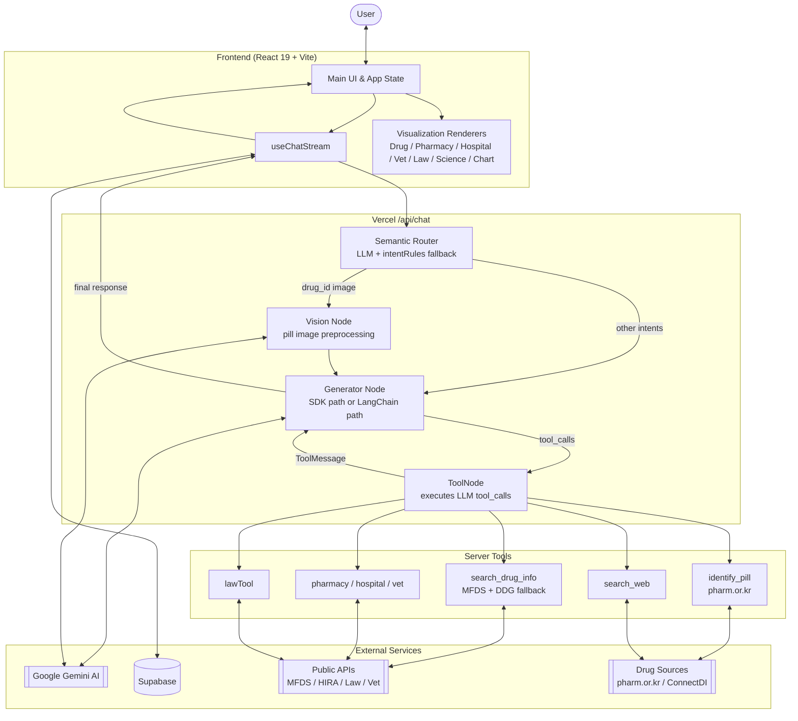
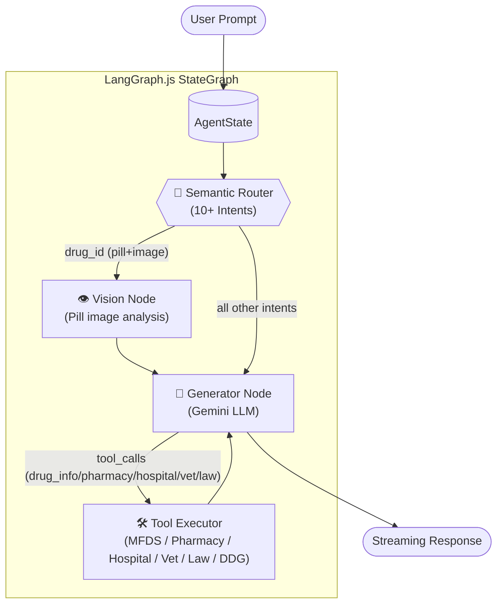
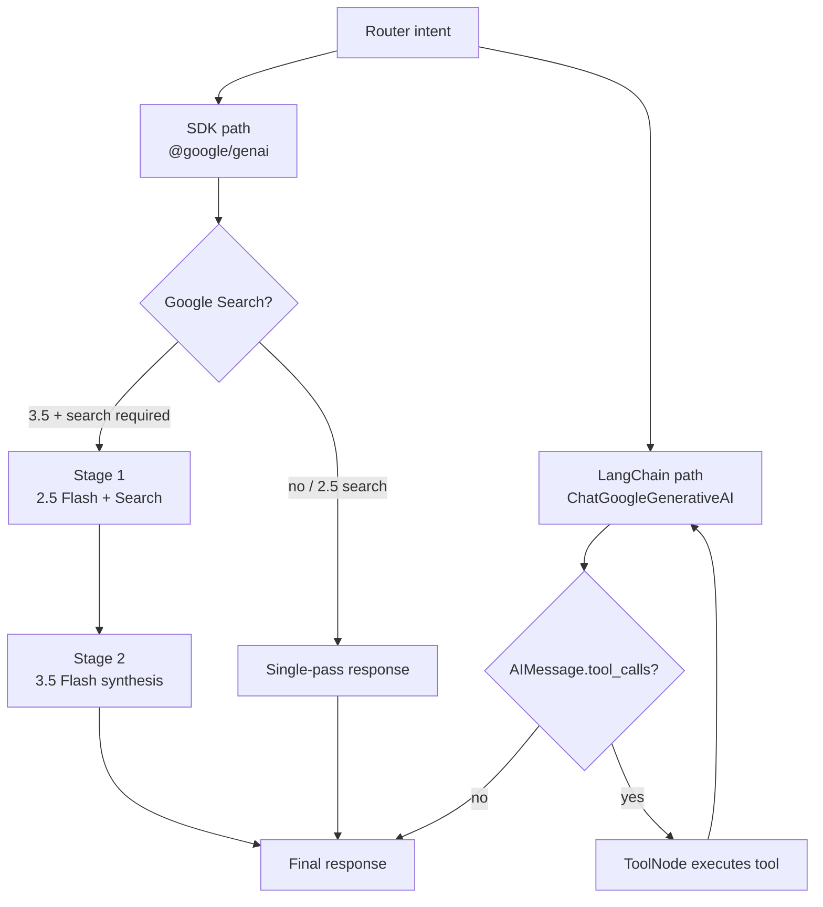
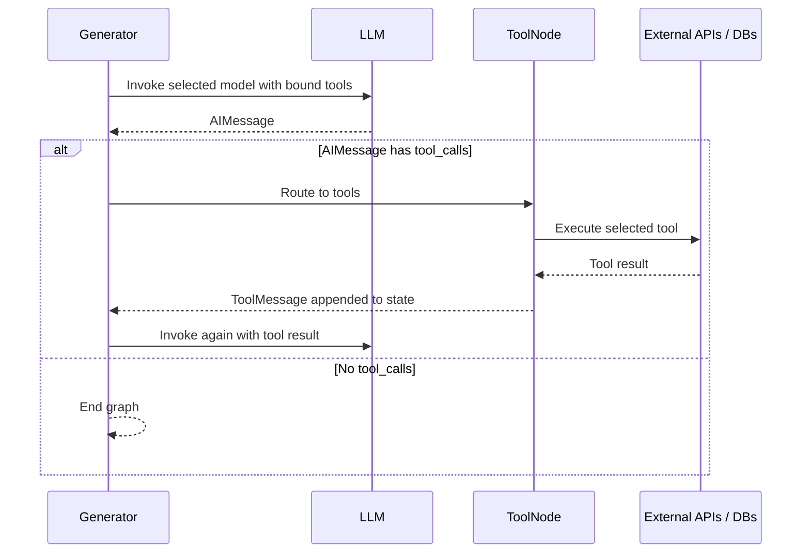
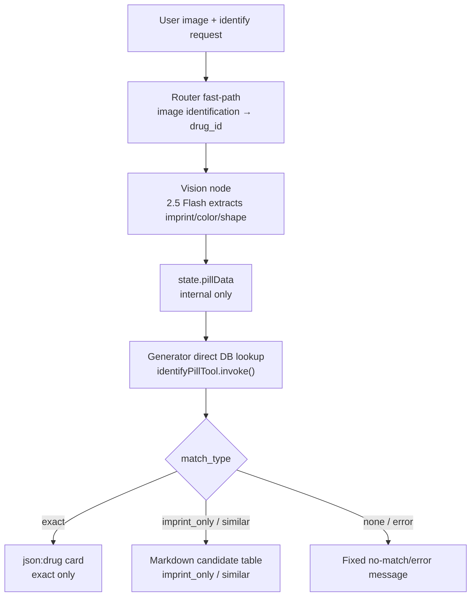
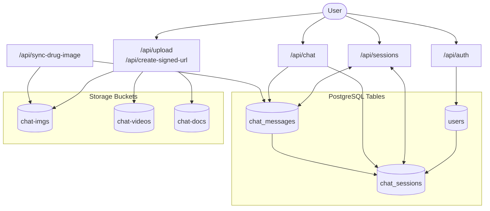

# Chat Agent with Gemini

An intelligent AI messenger powered by **Gemini 2.5 Flash / 3.5 Flash**, combining **Supabase** persistent storage, a **LangGraph.js** agentic pipeline, Google Search grounding, multimodal analysis, and 10 interactive visualization renderers.

---

## 1. Features

### 1-1. Conversation & Auth

- **Login-less**: Start instantly with an auto-assigned random nickname and avatar
- **Persistent history**: Sessions and messages stored in Supabase (PostgreSQL)
- **Auto-title**: Session titles generated automatically from conversation content (Gemini 2.5 Flash)
- **Sidebar infinite scroll**: Session list loads 30 items at a time; additional sessions are fetched automatically on scroll to bottom
- **Localization**: Full support for KO / EN / ES / FR

### 1-2. AI Intelligence

- **Gemini 2.5 Flash** as the default chat model, with **Gemini 3.5 Flash** selectable for higher-quality synthesis
- **Gemini Flash-Lite** for semantic routing
- **Centralized model registry**: Server model IDs live in `api/_lib/models.ts`; frontend selectable chat models live in `src/lib/models.ts`
- **Model selector**: Header dropdown switches between Gemini 2.5 Flash and Gemini 3.5 Flash, with `preferred_model` persisted locally
- **Google Search Grounding**: Real-time web search with source chip rendering
- **3.5 Search two-track**: When 3.5 is selected but Google Search grounding is required, 2.5 Flash performs grounded retrieval and 3.5 Flash synthesizes the final answer
- **YouTube analysis**: Native Gemini video analysis (direct video reading); supports standard URLs, `youtu.be`, and Shorts (`/shorts/`); structured summary with timestamp links
- **Multimodal input**: Images, PDF (30MB+), video, DOCX / HWPX / PPTX / XLSX
- **LangGraph agent**: Semantic Router → Vision / Generator / Tools with intent-based path routing and deterministic fallbacks

### 1-3. Visualization Renderers (10)

| Renderer             | Intent                      | Trigger                             | Library                                                        |
| -------------------- | --------------------------- | ----------------------------------- | -------------------------------------------------------------- |
| 💊 Drug-Viz          | `drug_id` / `drug_info` | 약품명 질의 / 알약 이미지 식별      | MFDS + pharm.or.kr + ConnectDI                                 |
| 🏥 Pharmacy-Viz      | `pharmacy_search`         | 약국 위치 탐색                      | 공공데이터포털 전국 약국 API ⚠️ API 만료 2028-05-06          |
| 🏨 Hospital-Viz      | `hospital_search`         | 병원·의원 위치 탐색                | 건강보험심사평가원 병원정보서비스 API ⚠️ API 만료 2028-05-07 |
| 🐾 Vet-Viz           | `vet_search`              | 동물병원 위치 탐색                  | 행정안전부 동물병원 조회서비스 ⚠️ API 만료 2028-05-10        |
| ⚖️ Law-Viz         | `law_search`              | 법령 목록 / 본문 / 조항호목         | 국가법령정보센터 Open API                                      |
| 🧪 Chem-Viz          | `chemistry`               | 분자 / 화학 구조                    | smiles-drawer                                                  |
| 🧬 Bio-Viz           | `biology`                 | 단백질 / DNA                        | NGL Viewer (3D PDB)                                            |
| 📐 Diagram-Viz       | `physics`                 | 자유물체도 / 포물선 / 충돌 / 경사면 | Canvas 2D                                                      |
| ✨ Constellation-Viz | `astronomy`               | 별자리 / 천체                       | HTML5 Canvas                                                   |
| 📊 Chart-Viz         | `data_viz`                | 데이터 / 통계                       | ApexCharts                                                     |

### 1-4. 💊 Drug-Viz — Pill Identification Engine

- **Image-based pill identification**: Ambiguous image requests such as “이거 뭐야?” route to the Vision node and extract imprint / color / shape
- **Deterministic DB lookup**: Extracted pill properties are stored in `state.pillData`; the server directly queries pharm.or.kr instead of asking the LLM to call the tool
- **No raw vision JSON leakage**: Vision node streams are filtered from SSE and raw extraction JSON is never injected into user-visible context
- **Exact-match safety policy**: Only `match_type = exact` may become a `json:drug` card; `imprint_only` / `similar` results return a candidate table with pharm.or.kr detail links
- **pharm.or.kr deep links**: Candidate tables and pill cards link to the official drug identification detail page
- **ConnectDI image sync**: Drug cards use ConnectDI HTML parsing and Supabase caching to improve card image reliability
- **DDG fallback**: Text drug-info requests not found in MFDS can fall back to DuckDuckGo search with source chips

### 1-5. ⚖️ Law-Viz — Korean Statute Cards

- **Hybrid lookup**: `lawSearch.do?target=law` for candidate laws, then `lawService.do?target=law` for body/article text.
- **Hybrid intent parsing**: Router only selects `law_search`; `lawTool` then uses Gemini 2.5 Flash to normalize `{mode, law_name, article_no, query}` before Open API calls.
- **Article links**: Body/article cards include per-article public source links so users can open the official text directly without exposing `LAW_OC`.
- **Readable result views**: List results use compact cards, while article cards are collapsible and fixed-width; both paginate in groups of 5.
- **Colloquial law names**: Common aliases such as `소방법`, `교통법`, `개인정보법`, and `근로법` are normalized to official search candidates.

### 1-6. Performance

- Lighthouse **91 / 100** (up from 44)
- JS bundle **365 KB** gzip (down from 1.0 MB via code splitting + lazy loading)
- CSS bundle **~15 KB** (down from 124 KB via build-time Tailwind)
- CLS **0.00** / Best Practices **100 / 100**

### 1-7. Security

- **Presigned URL architecture**: Supabase credentials never exposed to the frontend
- **Row Level Security**: Supabase RLS configured for per-user data isolation (service_role IDOR hardening planned — see TODO)
- **API key rotation**: 429 → 60s cooldown (`markKeyRateLimited`), 401/403 → 24h blacklist (`markKeyInvalid`); all-keys-exhausted returns `null` to prevent circular 429 loops
- **Error message sanitize**: Internal error details (`error.message`) never forwarded to the client; status-code-based user-friendly messages only
- **Request timeout protection**: All external fetches capped with `AbortController` (YouTube HTML 25s / XML 15s, MFDS/pharm.or.kr/DDG 8s, nedrug image 6s)

---

## 2. Architecture

### 2-1. Agent And Tool Overview


```mermaid
flowchart TB
    User([User])

    subgraph Frontend ["Frontend (React 19 + Vite)"]
        UI[Main UI & App State]
        Stream[useChatStream]
        Renderers["Visualization Renderers\nDrug / Pharmacy / Hospital / Vet / Law / Science / Chart"]
    end

    subgraph ChatAPI ["Vercel /api/chat"]
        Router["Semantic Router\nLLM + intentRules fallback"]
        Vision["Vision Node\npill image preprocessing"]
        Generator["Generator Node\nSDK path or LangChain path"]
        ToolNode["ToolNode\nexecutes LLM tool_calls"]
    end

    subgraph Tools ["Server Tools"]
        DrugLookup["identify_pill\npharm.or.kr"]
        DrugInfo["search_drug_info\nMFDS + DDG fallback"]
        LocationTools["pharmacy / hospital / vet"]
        LawTool["lawTool"]
        WebSearch["search_web"]
    end

    subgraph External ["External Services"]
        Gemini[["Google Gemini AI"]]
        Supabase[("Supabase")]
        PublicAPIs[["Public APIs\nMFDS / HIRA / Law / Vet"]]
        DrugSites[["Drug Sources\npharm.or.kr / ConnectDI"]]
    end

    User <--> UI
    UI --> Stream
    Stream --> Router
    Router -- "drug_id image" --> Vision
    Router -- "other intents" --> Generator
    Vision --> Generator
    Generator -- "tool_calls" --> ToolNode
    ToolNode -- "ToolMessage" --> Generator
    Generator -- "final response" --> Stream
    Stream --> UI
    UI --> Renderers

    Generator <--> Gemini
    Vision <--> Gemini
    ToolNode --> DrugLookup
    ToolNode --> DrugInfo
    ToolNode --> LocationTools
    ToolNode --> LawTool
    ToolNode --> WebSearch
    DrugLookup <--> DrugSites
    DrugInfo <--> PublicAPIs
    LocationTools <--> PublicAPIs
    LawTool <--> PublicAPIs
    WebSearch <--> DrugSites
    Stream <--> Supabase
```

### 2-2. LangGraph Agent Flow


```mermaid
flowchart TB
    User([User Prompt])

    subgraph StateGraph ["LangGraph.js StateGraph"]
        StateNode[("AgentState")]
        RouterNode{{"🧭 Semantic Router\n(10+ Intents)"}}
        Vision["👁️ Vision Node\n(Pill image analysis)"]
        Tools["🛠️ Tool Executor\n(MFDS / Pharmacy / Hospital / Vet / Law / DDG)"]
        Generator["📝 Generator Node\n(Gemini LLM)"]
    end

    Output([Streaming Response])

    User --> StateNode --> RouterNode
    RouterNode -- "drug_id (pill+image)" --> Vision --> Generator
    RouterNode -- "all other intents" --> Generator
    Generator -- "tool_calls (drug_info/pharmacy/hospital/vet/law)" --> Tools --> Generator
    Generator --> Output
```

### 2-3. Agent Runtime Branches

The agent uses two execution paths inside `generator.ts`.


```mermaid
flowchart TB
    Intent["Router intent"]
    SDK["SDK path\n@google/genai"]
    LC["LangChain path\nChatGoogleGenerativeAI"]
    GoogleSearch{"Google Search?"}
    Stage1["Stage 1\n2.5 Flash + Search"]
    Stage2["Stage 2\n3.5 Flash synthesis"]
    Single["Single-pass response"]
    ToolCall{"AIMessage.tool_calls?"}
    Tools["ToolNode executes tool"]
    Final["Final response"]

    Intent --> SDK
    Intent --> LC
    SDK --> GoogleSearch
    GoogleSearch -- "3.5 + search required" --> Stage1 --> Stage2 --> Final
    GoogleSearch -- "no / 2.5 search" --> Single --> Final
    LC --> ToolCall
    ToolCall -- "yes" --> Tools --> LC
    ToolCall -- "no" --> Final
```

Branch rules:

- SDK path handles `general`, `medical_qa`, and renderer intents (`astronomy`, `biology`, `chemistry`, `physics`, `data_viz`).
- LangChain path handles intents that need local tools: `drug_id`, `drug_info`, `pharmacy_search`, `hospital_search`, `vet_search`, `law_search`.
- Google Search is disabled for multimodal requests because Gemini Search grounding is incompatible with image/video/PDF parts.
- Renderer intents disable Google Search unless the user explicitly asks for search, sources, latest information, or citations.
- `gemini-3.5-flash` Search grounding on the free tier is handled by a two-track route: 2.5 Flash gathers grounded facts, then 3.5 Flash synthesizes the final answer.

### 2-4. Tool-Calling Loop

The LangGraph tool loop is deliberately narrow:


```mermaid
sequenceDiagram
    participant G as Generator
    participant L as LLM
    participant T as ToolNode
    participant E as External APIs / DBs

    G->>L: Invoke selected model with bound tools
    L-->>G: AIMessage
    alt AIMessage has tool_calls
        G->>T: Route to tools
        T->>E: Execute selected tool
        E-->>T: Tool result
        T-->>G: ToolMessage appended to state
        G->>L: Invoke again with tool result
    else No tool_calls
        G-->>G: End graph
    end
```

Tool-binding policy:

| Intent                           | Tools exposed to LLM                 | Notes                                                   |
| -------------------------------- | ------------------------------------ | ------------------------------------------------------- |
| `drug_id` without `pillData` | `identify_pill`, `search_web`    | Legacy/fallback path only                               |
| `drug_id` with `pillData`    | none after direct DB lookup          | Prevents recursion; non-exact returns table before LLM  |
| `drug_info`                    | `search_drug_info`, `search_web` | MFDS first, DDG fallback for non-pill products          |
| `pharmacy_search`              | `pharmacyTool`, `search_web`     | Tool output may be fast-passed as `json:pharmacy`     |
| `hospital_search`              | `hospitalTool`, `search_web`     | Tool output may be fast-passed as `json:hospital`     |
| `vet_search`                   | `vetTool`, `search_web`          | Tool output may be fast-passed as `json:vet`          |
| `law_search`                   | `lawTool`                          | Law tool handles query normalization and Open API calls |

Loop termination:

- `graph.ts` routes `generator → tools → generator` only when the last AI message has `tool_calls`.
- Generator fast-passes already-renderable tool outputs for pharmacy / hospital / vet / law.
- `drug_id + pillData` performs the pill DB lookup directly in server code and then removes all tool bindings to avoid `generator → tools → generator` recursion.

### 2-5. Pill Image Identification Flow


```mermaid
flowchart TB
    Input["User image + identify request"]
    Router["Router fast-path\nimage identification → drug_id"]
    Vision["Vision node\n2.5 Flash extracts imprint/color/shape"]
    State["state.pillData\ninternal only"]
    Lookup["Generator direct DB lookup\nidentifyPillTool.invoke()"]
    Exact{"match_type"}
    Card["json:drug card\nexact only"]
    Table["Markdown candidate table\nimprint_only / similar"]
    Fail["Fixed no-match/error message"]

    Input --> Router --> Vision --> State --> Lookup --> Exact
    Exact -- "exact" --> Card
    Exact -- "imprint_only / similar" --> Table
    Exact -- "none / error" --> Fail
```

Safety rules:

- Vision JSON is internal preprocessing data and is not streamed to the client.
- After direct pill DB lookup succeeds, no extra tools are bound for `drug_id`; this prevents `generator → tools → generator` recursion.
- Non-exact candidates are not promoted to a single drug card.
- Candidate tables expose official pharm.or.kr detail links, not raw image URLs.

### 2-6. Tool Inventory

| Tool                 | File                                 | Purpose                                                                  |
| -------------------- | ------------------------------------ | ------------------------------------------------------------------------ |
| `identify_pill`    | `api/_lib/agent/tools.ts`          | pharm.or.kr pill identification from imprint / color / shape             |
| `search_web`       | `api/_lib/agent/tools.ts`          | DuckDuckGo HTML fallback search and source extraction                    |
| `search_drug_info` | `api/_lib/agent/drug-info-tool.ts` | MFDS drug lookup, official image/detail data, non-pill fallback guidance |
| `pharmacyTool`     | `api/_lib/agent/pharmacy-tool.ts`  | National pharmacy search                                                 |
| `hospitalTool`     | `api/_lib/agent/hospital-tool.ts`  | HIRA hospital/clinic search                                              |
| `vetTool`          | `api/_lib/agent/vet-tool.ts`       | Animal hospital search                                                   |
| `lawTool`          | `api/_lib/agent/law-tool.ts`       | Korean law list/body/article lookup                                      |

### 2-7. Streaming And Source Handling

`/api/chat.ts` consumes LangGraph stream events and forwards clean SSE events to the client.

- SDK responses can stream text directly through `sendEvent`.
- LangChain `on_chat_model_stream` chunks are sanitized before being sent.
- Vision node model chunks are filtered out because they contain internal JSON extraction data.
- Tool source URLs are parsed from `[WEB_SOURCE_URLS]` and emitted as source chips.
- Fast-pass renderers can stream completed `json:pharmacy`, `json:hospital`, `json:vet`, or `json:law` blocks without another LLM synthesis step.
- Final assistant content is saved to Supabase after streaming completes.

### 2-8. Intent Routing

| Intent              | Path                                                                            | Model                                                  |
| ------------------- | ------------------------------------------------------------------------------- | ------------------------------------------------------ |
| `drug_id` (image) | Router fast-path → Vision → direct DB lookup → exact card or candidate table | Vision: 2.5 Flash, final: selected model               |
| `drug_info`       | LangChain +`search_drug_info` / DDG fallback                                  | selected model                                         |
| `pharmacy_search` | LangChain + pharmacy public API tool                                            | selected model                                         |
| `hospital_search` | LangChain + HIRA hospital API tool                                              | selected model                                         |
| `vet_search`      | LangChain + animal hospital API tool                                            | selected model                                         |
| `law_search`      | LangChain + Korean law Open API tool                                            | selected model                                         |
| `medical_qa`      | SDK + Google Search grounding                                                   | selected model, 3.5 search uses 2.5 → 3.5 two-track   |
| `biology`         | SDK renderer output                                                             | selected model, Search off unless explicitly requested |
| `chemistry`       | SDK renderer output                                                             | selected model, Search off unless explicitly requested |
| `physics`         | SDK renderer output                                                             | selected model, Search off unless explicitly requested |
| `astronomy`       | SDK renderer output                                                             | selected model, Search off unless explicitly requested |
| `data_viz`        | SDK renderer output                                                             | selected model, Search off unless explicitly requested |
| `general`         | SDK, Google Search enabled when applicable                                      | selected model, 3.5 search uses 2.5 → 3.5 two-track   |

Router behavior:

- Router LLM uses `gemini-2.5-flash-lite`.
- Product-critical fallback rules live in `api/_lib/agent/intentRules.ts`.
- Fallback rules include Korean / English / Spanish / French keywords for medicine, law, science visualization, locations, and data visualization.
- Renderer intents (`astronomy`, `biology`, `chemistry`, `physics`, `data_viz`) disable Google Search by default so structured JSON blocks are preserved; explicit “search/source/latest” requests re-enable search.

### 2-9. Database And Storage Flow

Supabase stores identity, sessions, messages, grounding sources, and uploaded assets.


```mermaid
flowchart TB
    User([User])
    AuthAPI["/api/auth"]
    SessionsAPI["/api/sessions"]
    ChatAPI["/api/chat"]
    UploadAPI["/api/upload\n/api/create-signed-url"]
    SyncAPI["/api/sync-drug-image"]

    subgraph Tables ["PostgreSQL Tables"]
        Users[("users")]
        Sessions[("chat_sessions")]
        Messages[("chat_messages")]
    end

    subgraph Storage ["Storage Buckets"]
        Imgs[("chat-imgs")]
        Videos[("chat-videos")]
        Docs[("chat-docs")]
    end

    User --> AuthAPI
    AuthAPI --> Users
    Users --> Sessions

    User --> SessionsAPI
    SessionsAPI <--> Sessions
    SessionsAPI <--> Messages

    User --> UploadAPI
    UploadAPI --> Imgs
    UploadAPI --> Videos
    UploadAPI --> Docs

    User --> ChatAPI
    ChatAPI --> Messages
    ChatAPI --> Sessions
    Messages --> Sessions

    SyncAPI --> Imgs
    SyncAPI --> Messages
```

Table responsibilities:

| Table | Written by | Purpose |
|-------|------------|---------|
| `users` | `/api/auth` | Guest profile identity: `id`, `nickname`, `display_name`, `avatar_url` |
| `chat_sessions` | `/api/sessions`, `/api/chat` | Session metadata: owner, title, `updated_at` |
| `chat_messages` | `/api/chat`, `/api/sessions` read path | User/assistant messages, attachment URL, grounding source metadata |

Storage responsibilities:

| Bucket | Written by | Purpose |
|--------|------------|---------|
| `chat-imgs` | `/api/upload`, `/api/create-signed-url`, `/api/sync-drug-image` | User image uploads and cached drug-card images |
| `chat-videos` | `/api/upload`, `/api/create-signed-url` | Uploaded videos |
| `chat-docs` | `/api/upload`, `/api/create-signed-url` | Uploaded PDFs and documents |

Persistence timing:
- User messages are inserted into `chat_messages` before LangGraph execution starts.
- Assistant messages are inserted after the SSE stream completes, together with `grounding_sources` when present.
- `chat_sessions.updated_at` is refreshed after assistant persistence.
- Uploaded images keep both inline data for the current multimodal request and `storageUrl` for durable history previews.
- Drug-card image sync writes cached files into `chat-imgs/drug-cache/...` and returns a public URL to `DrugRenderer`.

---

## 3. Tech Stack

| Layer         | Technology                                                              |
| ------------- | ----------------------------------------------------------------------- |
| Frontend      | React 19, Vite, TypeScript, Tailwind CSS, Framer Motion                 |
| Visualization | ApexCharts, smiles-drawer, NGL, HTML5 Canvas                            |
| Backend       | Vercel Serverless Functions, LangGraph.js                               |
| AI            | Gemini 2.5 Flash / 3.5 Flash / Flash-Lite, @google/genai SDK, LangChain |
| Database      | Supabase (PostgreSQL, Storage, Auth)                                    |

> Next.js migration plan: [docs/Guide/NEXTJS_MIGRATION_PLAN.md](docs/Guide/NEXTJS_MIGRATION_PLAN.md)

### 3-1. Model Usage

Model IDs are centralized to avoid scattered string literals:

- Server runtime: `api/_lib/models.ts`
- Frontend selection UI: `src/lib/models.ts`

| Purpose                        | Model                                                                                       |
| ------------------------------ | ------------------------------------------------------------------------------------------- |
| Main chat default              | `DEFAULT_CHAT_MODEL` → `gemini-2.5-flash`                                              |
| User-selectable chat models    | `CHAT_MODEL_OPTIONS` → `gemini-2.5-flash`, `gemini-3.5-flash`                        |
| Router (intent classification) | `ROUTER_MODEL` → `gemini-2.5-flash-lite`                                               |
| Pill vision preprocessing      | `SERVER_MODELS.FLASH` → `gemini-2.5-flash`                                             |
| 3.5 + Search grounding         | Stage 1:`gemini-2.5-flash` + Search, Stage 2: `gemini-3.5-flash` synthesis              |
| TTS                            | `SERVER_MODELS.TTS` → `gemini-2.5-flash-preview-tts`                                   |
| Session title                  | `SUMMARY_MODELS` → `gemini-2.5-flash-lite` (primary) / `gemini-2.5-flash` (fallback) |

---

## 4. Project Structure

```
├── api/                        # Vercel Serverless Functions
│   ├── chat.ts                 # Main Gemini streaming endpoint (LangGraph, SSE)
│   ├── speech.ts               # TTS service (gemini-2.5-flash-preview-tts)
│   ├── summarize-title.ts      # Auto session title generation
│   ├── sync-drug-image.ts      # Drug image caching and parsing
│   ├── pill-search.ts          # Pill identification API
│   ├── sessions.ts             # Session / message CRUD
│   ├── upload.ts               # Supabase Storage upload proxy
│   ├── fetch-url.ts            # Web / ArXiv scraping
│   ├── fetch-transcript.ts     # YouTube transcript proxy (disabled — native video analysis only)
│   ├── auth.ts                 # Auth handling
│   ├── create-signed-url.ts    # Supabase Storage signed URL generation
│   ├── proxy-image.ts          # Image proxy
│   └── _lib/                   # Shared utilities (excluded from Vercel function count)
│       ├── config.ts           # API key pool, markKeyRateLimited / markKeyInvalid
│       ├── models.ts           # Server model registry (chat / router / TTS / title)
│       ├── agent/              # LangGraph agent
│       │   ├── graph.ts        # StateGraph definition
│       │   ├── intentRules.ts  # deterministic multilingual routing fallbacks
│       │   ├── nodes/          # router / vision / generator
│       │   ├── drug-info-tool.ts  # MFDS + pharm.or.kr + Vision imprint (timeouts)
│       │   ├── pharmacy-tool.ts   # 전국 약국 공공데이터 API (1000건, 영업시간 정렬)
│       │   ├── hospital-tool.ts   # HIRA 전국 병원정보 API (sidoCd/sgguCd 코드 매핑)
│       │   ├── vet-tool.ts        # 행정안전부 전국 동물병원 API (주소 LIKE 텍스트 검색)
│       │   ├── law-tool.ts        # 국가법령정보센터 법령 목록/본문/조항호목 조회 + 조문 원문 링크
│       │   ├── tools.ts        # identifyPillTool, searchWebTool (DDG 8s timeout)
│       │   ├── prompt.ts
│       │   └── state.ts
│       ├── pill-logic.ts       # pharm.or.kr search logic
│       └── supabase.ts
├── components/                 # UI components
│   ├── ChatMessage.tsx         # Markdown + visualization block parser
│   ├── DrugRenderer.tsx        # Drug card
│   ├── PharmacyRenderer.tsx    # National pharmacy card
│   ├── HospitalRenderer.tsx    # National hospital card (HIRA)
│   ├── VetRenderer.tsx         # Animal hospital card (행정안전부)
│   ├── LawRenderer.tsx         # Korean law card (accordion, 5개 단위 페이지네이션)
│   ├── BioRenderer.tsx         # 3D protein structure
│   ├── ChemicalRenderer.tsx    # SMILES molecular structure
│   ├── ConstellationRenderer.tsx
│   ├── ChartRenderer.tsx
│   ├── DiagramRenderer.tsx
│   └── ...
├── src/
│   ├── lib/
│   │   └── models.ts           # Frontend chat model registry + Header options
│   └── hooks/                  # Custom React hooks (App.tsx 오케스트레이션 분리)
│       ├── useAuthSession.ts   # Auth init, localStorage restore, 익명 로그인
│       ├── useChatSessions.ts  # Session CRUD, 메시지 lazy load, 무한 스크롤 페이지네이션
│       └── useChatStream.ts    # 메시지 전송 오케스트레이션 (upload / stream / title)
├── services/
│   └── geminiService.ts        # Gemini API wrapper, session/user remote calls
├── docs/
│   ├── DEV_HISTORY.md          # Version changelog (v4.x)
│   ├── DEV_*.md                # Session work logs (latest: DEV_260525.md)
│   ├── TODO.md                 # Roadmap
│   ├── Guide/
│   │   ├── REF_*.md            # Renderer test prompt guides
│   │   ├── ERROR_HANDLING.md   # 에러 처리 전체 구조 (7-layer map)
│   │   ├── DB_SCHEMA.md        # Supabase 테이블 구조 스냅샷
│   │   ├── LAW_API_TEST.md     # 법령 API 테스트 가이드
│   │   └── NEXTJS_MIGRATION_PLAN.md
│   └── History/                # 이전 세션 작업 로그 (DEV_260520.md 이전)
├── App.tsx                     # 최상위 컴포넌트 (레이아웃 + 훅 조합)
└── types.ts                    # 공유 TypeScript 타입 정의
```

---

## 5. Getting Started

### 5-1. Environment variables (`.env.local`)

```env
SUPABASE_URL=your_supabase_url
SUPABASE_SERVICE_ROLE_KEY=your_supabase_service_role_key   # fallback: SUPABASE_KEY
API_KEY=your_gemini_key_1
API_KEY2=your_gemini_key_2   # optional: additional keys for rotation

# Drug Search APIs
MFDS_API_ENDPOINT=your_mfds_endpoint
MFDS_API_KEY=your_mfds_key

# Public Info APIs
PHARM_KEY=your_national_pharmacy_and_hospital_api_key   # 약국 + HIRA 병원 공용
VET_KEY=your_animal_hospital_api_key                    # 행정안전부 동물병원 (만료 2028-05-10)
LAW_OC=your_law_openapi_oc
```

### 5-2. Install & run

```bash
npm install
npm run dev
```

---

> Detailed changelog: [docs/DEV_HISTORY.md](docs/DEV_HISTORY.md)
