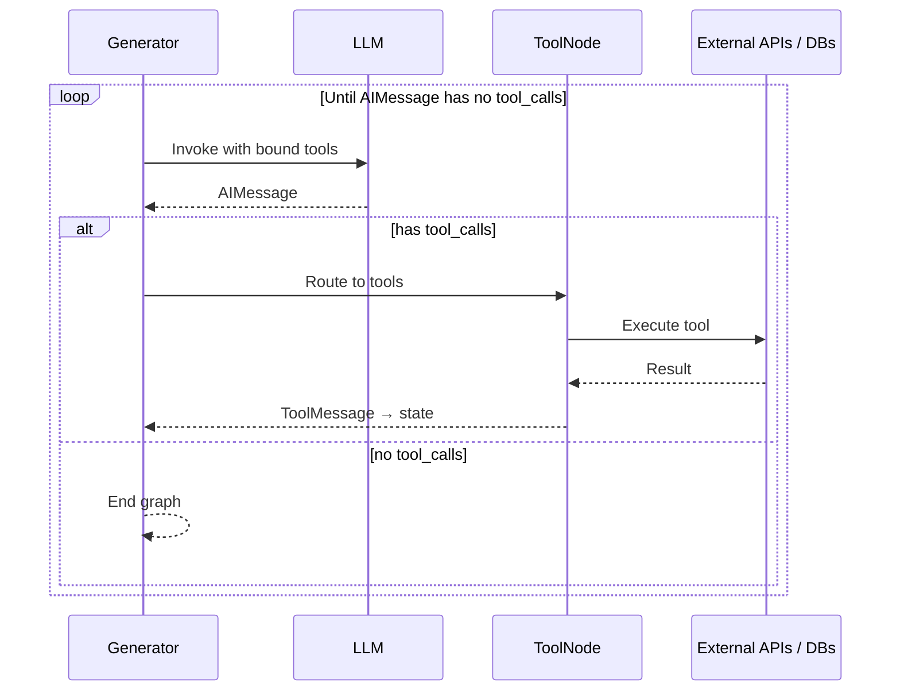

# Chat Agent

Gemini 3.5 Flash / 2.5 Flash 기반 AI 메신저. LangGraph.js 에이전트 파이프라인, Google Search grounding, 멀티모달 입력, 11종 인터랙티브 시각화 렌더러.

---

## 1. Features

### 1-1. Conversation & Auth

- **Login-less**: 자동 닉네임·아바타로 즉시 시작
- **Persistent history**: Supabase(PostgreSQL)에 세션·메시지 저장
- **Auto-title**: 대화 내용 기반 세션 제목 자동 생성
- **Sidebar infinite scroll**: 30개 단위 로드, 스크롤 시 추가 fetch
- **Localization**: KO / EN / ES / FR

### 1-2. AI Intelligence

- **Models**: `gemini-3.5-flash`(기본) / `gemini-2.5-flash`(선택) — 헤더 드롭다운, `preferred_model` 로컬 저장
- **Google Search Grounding**: 실시간 웹 검색 + 소스 칩 렌더링. 3.5 무료 티어는 2.5 single-pass로 폴백
- **Intent routing**: `gemini-2.5-flash-lite` 라우터 + 규칙 기반 폴백(`intentRules.ts`). `general` intent는 3-게이트 `needsSearch` 분류기로 검색 게이트 결정
- **Multimodal**: 이미지, PDF(30MB+), 동영상, DOCX/PPTX/XLSX, HWP/HWPX(kordoc)
- **YouTube**: 네이티브 Gemini 동영상 분석 (표준 URL / youtu.be / Shorts)
- **LangGraph agent**: Semantic Router → Vision / Generator ↔ Tools

상세(인텐트 라우팅·툴 바인딩·모델 정책·스트리밍): [docs/guide/REF_Architecture.md](docs/guide/REF_Architecture.md)

### 1-3. Visualization Renderers (11)

| Renderer             | Intent                          | Library / API                                     |
| -------------------- | ------------------------------- | ------------------------------------------------- |
| 💊 Drug-Viz          | `drug_id` / `drug_info`     | MFDS `mfds_pills` + ConnectDI                   |
| 🏥 Pharmacy-Viz      | `pharmacy_search`             | 공공데이터포털 전국 약국 API (만료 2028-05-06)    |
| 🏨 Hospital-Viz      | `hospital_search`             | 건강보험심사평가원 병원정보서비스 API (만료 2028-05-07) |
| 🐾 Vet-Viz           | `vet_search`                  | 행정안전부 동물병원 조회서비스 (만료 2028-05-10)  |
| ⚖️ Law-Viz          | `law_search`                  | 국가법령정보센터 Open API                         |
| 🎬 Movie-Viz         | `movie_search`                | 롯데·메가박스 direct JSON + CGV browserless(HMAC) |
| 🧪 Chem-Viz          | `chemistry`                   | smiles-drawer                                     |
| 🧬 Bio-Viz           | `biology`                     | NGL Viewer (3D PDB)                               |
| 📐 Diagram-Viz       | `physics`                     | Canvas 2D                                         |
| ✨ Constellation-Viz | `astronomy`                   | HTML5 Canvas + astronomy-engine                   |
| 📊 Chart-Viz         | `data_viz`                    | ApexCharts                                        |

렌더러별 상세(스키마·테스트 프롬프트): [docs/guide/](docs/guide/)

### 1-4. Performance & Security

**Lighthouse**: Performance 91 · Best Practices 100 · CLS 0.00  
**Bundle**: JS 365 KB gzip / CSS ~15 KB

**Security highlights:**
- Presigned URL 아키텍처 — 프론트에 Supabase 자격증명 미노출
- SSRF 방어 — `fetch-url` / `proxy-image` / `sync-drug-image` RFC 1918 + IPv6 private 범위 차단
- API 키 로테이션 — 429 → 60s cooldown, 401/403 → 24h blacklist
- 에러 sanitization — 내부 스택·메시지 클라이언트 미노출

---

## 2. Architecture

### 2-1. Agent & Tool Overview


```mermaid
flowchart TB
    In([User Input])

    subgraph Frontend ["Frontend (React 19 + Next.js App Router)"]
        UI[Main UI]
        Stream[useChatStream]
        Renderers["Renderers (11)"]
    end

    subgraph FetchAPI ["/api/fetch-url"]
        URLCache["url_cache (14-day TTL)"]
        Direct["Direct HTML fetch"]
        ScrapingBee["ScrapingBee (non-wikidocs fallback)"]
        CFChain["ScrapingBee → browserless → ScraperAPI\n(wikidocs CF bypass chain)"]
    end

    subgraph ChatAPI ["/api/chat"]
        Router["Semantic Router"]
        Vision["Vision Node (pill)"]
        Generator["Generator Node"]
        ToolNode["ToolNode"]
    end

    subgraph ShowtimesAPI ["/api/showtimes"]
        SWR["SWR cache 120s/30min"]
        ChainFetch["Lotte/Megabox direct + CGV browserless"]
    end

    subgraph External ["External"]
        Gemini[["Google Gemini AI"]]
        Supabase[("Supabase")]
        APIs[["Public APIs (MFDS / HIRA / Law / Vet / football-data.org)"]]
        Multiplex[["CGV / Lotte / Megabox"]]
    end

    Out([Rendered Answer + source chips])

    In --> UI --> Stream
    Stream -->|URL prefetch| URLCache -->|miss| Direct
    Direct -->|blocked/boilerplate, wikidocs| CFChain
    Direct -->|blocked/boilerplate, other| ScrapingBee
    URLCache <--> Supabase
    Stream -->|POST /api/chat| Router
    Router -->|drug_id + image| Vision --> Generator
    Router -->|other intents| Generator
    Generator -->|tool_calls| ToolNode --> APIs
    Renderers -->|movie card| SWR --> ChainFetch <--> Multiplex
    Generator <--> Gemini
    ToolNode -.->|ToolMessage| Generator
    Generator -.->|SSE stream| Stream -.-> UI -.-> Renderers -.-> Out
    Stream <--> Supabase

    classDef io fill:#16a34a,stroke:#15803d,color:#fff;
    class In,Out io;
```

상세 다이어그램(LangGraph flow, Runtime Branches, URL Prefetch, Pill ID, DB/Storage):  
→ [docs/guide/REF_Architecture.md](docs/guide/REF_Architecture.md)

### 2-2. Tool-Calling Loop


```mermaid
sequenceDiagram
    participant G as Generator
    participant L as LLM
    participant T as ToolNode
    participant E as External APIs / DBs

    loop Until AIMessage has no tool_calls
        G->>L: Invoke with bound tools
        L-->>G: AIMessage
        alt has tool_calls
            G->>T: Route to tools
            T->>E: Execute tool
            E-->>T: Result
            T-->>G: ToolMessage → state
        else no tool_calls
            G-->>G: End graph
        end
    end
```

인텐트별 툴 바인딩·라우팅 상세: [docs/guide/REF_Architecture.md](docs/guide/REF_Architecture.md)

---

## 3. Tech Stack

| Layer         | Technology                                                                |
| ------------- | ------------------------------------------------------------------------- |
| Frontend      | React 19, Next.js 16 App Router, TypeScript, Tailwind CSS, Framer Motion  |
| Visualization | ApexCharts, smiles-drawer, NGL Viewer, HTML5 Canvas, astronomy-engine    |
| Backend       | Next.js Route Handlers (Vercel), LangGraph.js                             |
| AI            | Gemini 3.5 Flash / 2.5 Flash / Flash-Lite, @google/genai SDK, LangChain  |
| Database      | Supabase (PostgreSQL + Storage)                                           |

모델별 사용 정책: [docs/guide/REF_Architecture.md#model-policy](docs/guide/REF_Architecture.md)  
DB 스키마: [docs/guide/REF_DB.md](docs/guide/REF_DB.md)

---

## 4. Project Structure

```
├── app/
│   ├── layout.tsx / page.tsx / globals.css
│   └── api/
│       ├── chat/route.ts               # LangGraph SSE streaming (maxDuration 60)
│       ├── speech/route.ts             # TTS (gemini-2.5-flash-preview-tts)
│       ├── showtimes/route.ts          # 3-chain showtimes + SWR cache
│       ├── fetch-url/route.ts          # URL prefetch: cache → direct → ScrapingBee/CF chain
│       ├── parse-document/route.ts     # HWP/DOCX/PPTX → kordoc Markdown
│       ├── sessions/route.ts           # Session/message CRUD
│       ├── upload/route.ts             # Supabase Storage upload proxy
│       ├── summarize-title/route.ts
│       ├── sync-drug-image/route.ts
│       ├── pill-search/route.ts
│       ├── auth/route.ts
│       ├── create-signed-url/route.ts
│       └── proxy-image/route.ts
├── server/
│   ├── config.ts                       # API key pool + rotation
│   ├── models.ts                       # Server model registry
│   ├── mfds-logic.ts / pill-logic.ts
│   ├── supabase.ts
│   └── agent/
│       ├── graph.ts                    # LangGraph StateGraph
│       ├── prompt.ts                   # System instruction builder
│       ├── state.ts / intentRules.ts
│       ├── tools.ts                    # identify_pill, search_web (DDG)
│       ├── drug-info-tool.ts / pharmacy-tool.ts / hospital-tool.ts
│       ├── vet-tool.ts / law-tool.ts / movie-tool.ts / worldcup-tool.ts
│       └── nodes/
│           ├── router.ts / vision.ts / generator.ts / langchain-path.ts
│           ├── search-gate.ts / sdk-contents.ts
│           ├── generation-config.ts / pill-messages.ts / retry.ts
├── components/                         # 22 UI components (11 renderers + core)
├── lib/
│   ├── theaters.ts / movieContext.ts
│   └── sports/football-data.ts         # football-data.org WC data layer
├── utils/
│   ├── astronomyHelper.ts / celestialMath.ts
│   └── streamingMarkdown.ts            # Anti-flicker table gating (mid-stream)
├── src/
│   ├── lib/models.ts
│   └── hooks/                          # useAuthSession / useChatSessions / useChatStream
├── services/geminiService.ts
├── data/theater-branches.json          # 532 branches (CGV 177 · Lotte 239 · Megabox 116)
├── docs/                               # See §4-1 for conventions
├── App.tsx / types.ts / next.config.ts / tailwind.config.js
```

### 4-1. Documentation Conventions (`docs/`)

**Date format: `YYMMDD`** (e.g. `260602` = 2026-06-02)

| Folder               | Purpose                      | Filename rule              | Example                            |
| -------------------- | ---------------------------- | -------------------------- | ---------------------------------- |
| `docs/`              | Living index docs            | Fixed names                | `DEV_HISTORY.md`, `TODO.md`        |
| `docs/logs/YYYY/MM/` | Dated session work logs      | `DEV_YYMMDD.md`            | `docs/logs/2026/06/DEV_260602.md`  |
| `docs/plans/`        | Plans, designs, analyses     | `PLAN_<TOPIC>[_YYMMDD].md` | `PLAN_THINKING_LATENCY_260602.md`  |
| `docs/guide/`        | Renderer & feature reference | `REF_<Topic>.md`           | `REF_Chart.md`                     |

- 새 로그 파일 생성 시 `DEV_HISTORY.md`에 한 줄 추가.
- `docs/plans/` — 항상 `PLAN_` 접두사, `UPPER_SNAKE_CASE`. 상세 분석엔 `_YYMMDD` 접미사.

---

## 5. Getting Started

### 5-1. Environment variables

`.env.example`을 복사해 `.env.local`로 저장 후 각 항목을 채운다.

```bash
cp .env.example .env.local
```

전체 항목 설명: [.env.example](.env.example)

### 5-2. Install & run

```bash
npm install
npm run dev        # Next.js dev server (default port 3000)
npm run build
npm start
```

---

> Detailed changelog: [docs/DEV_HISTORY.md](docs/DEV_HISTORY.md)
