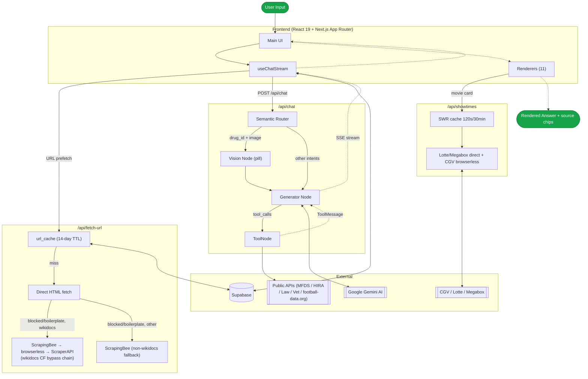
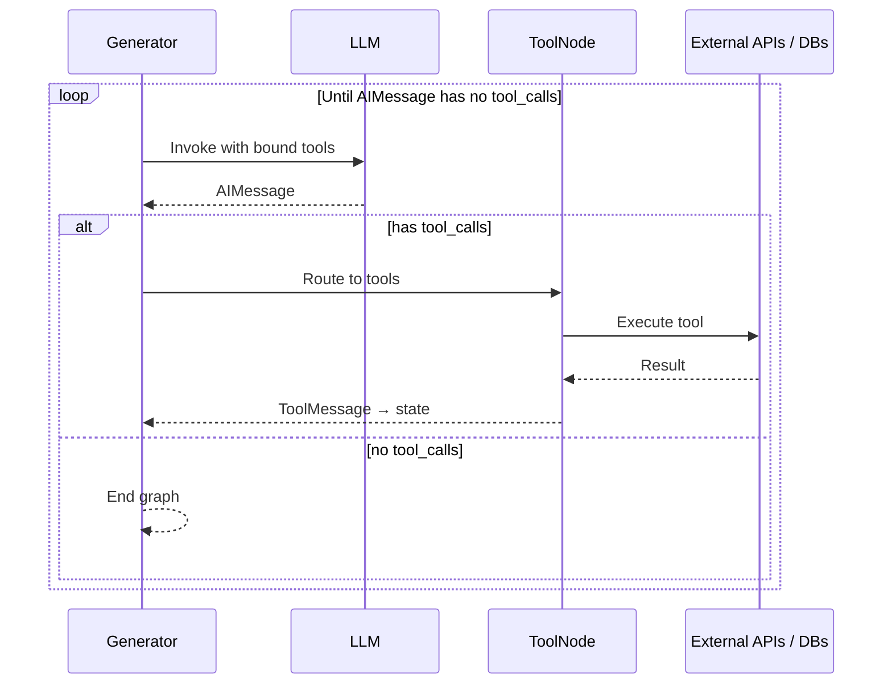

# Chat Agent

A Gemini 3.5 Flash / 2.5 Flash AI messenger — LangGraph.js agent pipeline, Google Search grounding, multimodal input, and 11 interactive visualization renderers.

---

## 1. Features

### 1-1. Conversation & Auth

- **Login-less**: starts instantly with an auto-generated nickname and avatar
- **Persistent history**: sessions and messages stored in Supabase (PostgreSQL)
- **Auto-title**: session titles generated automatically from conversation content
- **Sidebar infinite scroll**: loads 30 at a time, fetches more on scroll
- **Localization**: KO / EN / ES / FR

### 1-2. AI Intelligence

- **Models**: `gemini-3.5-flash` (default) / `gemini-2.5-flash` (optional) — header dropdown, persisted in `preferred_model` local storage
- **Google Search Grounding**: real-time web search with source chips. On the free tier, 3.5 falls back to a 2.5 single-pass for grounded answers
- **Intent routing**: `gemini-2.5-flash-lite` router + rule-based fallback (`intentRules.ts`). The `general` intent uses a 3-gate `needsSearch` classifier to decide the search gate
- **Multimodal**: images, PDF (30MB+), video, DOCX/PPTX/XLSX, HWP/HWPX (kordoc)
- **YouTube**: native Gemini video analysis (standard URL / youtu.be / Shorts)
- **LangGraph agent**: Semantic Router → Vision / Generator ↔ Tools

Details (intent routing, tool binding, model policy, streaming): [docs/guide/REF_Architecture.md](docs/guide/REF_Architecture.md)

### 1-3. Visualization Renderers (11)

| Renderer             | Intent                          | Library / API                                     |
| -------------------- | ------------------------------- | ------------------------------------------------- |
| 💊 Drug-Viz          | `drug_id` / `drug_info`     | MFDS `mfds_pills` + ConnectDI                   |
| 🏥 Pharmacy-Viz      | `pharmacy_search`             | Korea Public Data Portal nationwide pharmacy API (expires 2028-05-06) |
| 🏨 Hospital-Viz      | `hospital_search`             | HIRA hospital information service API (expires 2028-05-07) |
| 🐾 Vet-Viz           | `vet_search`                  | MOIS animal hospital lookup service (expires 2028-05-10) |
| ⚖️ Law-Viz          | `law_search`                  | Korea Law Information Center Open API              |
| 🎬 Movie-Viz         | `movie_search`                | Lotte/Megabox direct JSON + CGV browserless (HMAC) |
| 🧪 Chem-Viz          | `chemistry`                   | smiles-drawer                                     |
| 🧬 Bio-Viz           | `biology`                     | NGL Viewer (3D PDB)                               |
| 📐 Diagram-Viz       | `physics`                     | Canvas 2D                                         |
| ✨ Constellation-Viz | `astronomy`                   | HTML5 Canvas + astronomy-engine                   |
| 📊 Chart-Viz         | `data_viz`                    | ApexCharts                                        |

Per-renderer details (schemas, test prompts): [docs/guide/](docs/guide/)

### 1-4. Performance & Security

**Lighthouse**: Performance 91 · Best Practices 100 · CLS 0.00  
**Bundle**: JS 365 KB gzip / CSS ~15 KB

**Security highlights:**
- Presigned URL architecture — Supabase credentials never exposed to the frontend
- SSRF defense — `fetch-url` / `proxy-image` / `sync-drug-image` block RFC 1918 + IPv6 private ranges
- API key rotation — 429 → 60s cooldown, 401/403 → 24h blacklist
- Error sanitization — internal stacks/messages never exposed to the client

---

## 2. Architecture

### 2-1. Agent & Tool Overview


```mermaid
flowchart TB
    In([User Input])

    subgraph Frontend ["Frontend (React 19 + Next.js App Router)"]
        UI[Main UI]
        Stream[useChatStream]
        Renderers["Renderers (11)"]
    end

    subgraph FetchAPI ["/api/fetch-url"]
        URLCache["url_cache (14-day TTL)"]
        Direct["Direct HTML fetch"]
        ScrapingBee["ScrapingBee (non-wikidocs fallback)"]
        CFChain["ScrapingBee → browserless → ScraperAPI\n(wikidocs CF bypass chain)"]
    end

    subgraph ChatAPI ["/api/chat"]
        Router["Semantic Router"]
        Vision["Vision Node (pill)"]
        Generator["Generator Node"]
        ToolNode["ToolNode"]
    end

    subgraph ShowtimesAPI ["/api/showtimes"]
        SWR["SWR cache 120s/30min"]
        ChainFetch["Lotte/Megabox direct + CGV browserless"]
    end

    subgraph External ["External"]
        Gemini[["Google Gemini AI"]]
        Supabase[("Supabase")]
        APIs[["Public APIs (MFDS / HIRA / Law / Vet / football-data.org)"]]
        Multiplex[["CGV / Lotte / Megabox"]]
    end

    Out([Rendered Answer + source chips])

    In --> UI --> Stream
    Stream -->|URL prefetch| URLCache -->|miss| Direct
    Direct -->|blocked/boilerplate, wikidocs| CFChain
    Direct -->|blocked/boilerplate, other| ScrapingBee
    URLCache <--> Supabase
    Stream -->|POST /api/chat| Router
    Router -->|drug_id + image| Vision --> Generator
    Router -->|other intents| Generator
    Generator -->|tool_calls| ToolNode --> APIs
    Renderers -->|movie card| SWR --> ChainFetch <--> Multiplex
    Generator <--> Gemini
    ToolNode -.->|ToolMessage| Generator
    Generator -.->|SSE stream| Stream -.-> UI -.-> Renderers -.-> Out
    Stream <--> Supabase

    classDef io fill:#16a34a,stroke:#15803d,color:#fff;
    class In,Out io;
```

Detailed diagrams (LangGraph flow, Runtime Branches, URL Prefetch, Pill ID, DB/Storage):  
→ [docs/guide/REF_Architecture.md](docs/guide/REF_Architecture.md)

### 2-2. Tool-Calling Loop


```mermaid
sequenceDiagram
    participant G as Generator
    participant L as LLM
    participant T as ToolNode
    participant E as External APIs / DBs

    loop Until AIMessage has no tool_calls
        G->>L: Invoke with bound tools
        L-->>G: AIMessage
        alt has tool_calls
            G->>T: Route to tools
            T->>E: Execute tool
            E-->>T: Result
            T-->>G: ToolMessage → state
        else no tool_calls
            G-->>G: End graph
        end
    end
```

Per-intent tool binding and routing details: [docs/guide/REF_Architecture.md](docs/guide/REF_Architecture.md)

---

## 3. Tech Stack

| Layer         | Technology                                                                |
| ------------- | ------------------------------------------------------------------------- |
| Frontend      | React 19, Next.js 16 App Router, TypeScript, Tailwind CSS, Framer Motion  |
| Visualization | ApexCharts, smiles-drawer, NGL Viewer, HTML5 Canvas, astronomy-engine    |
| Backend       | Next.js Route Handlers (Vercel), LangGraph.js                             |
| AI            | Gemini 3.5 Flash / 2.5 Flash / Flash-Lite, @google/genai SDK, LangChain  |
| Database      | Supabase (PostgreSQL + Storage)                                           |

Per-model usage policy: [docs/guide/REF_Architecture.md#model-policy](docs/guide/REF_Architecture.md)  
DB schema: [docs/guide/REF_DB.md](docs/guide/REF_DB.md)

---

## 4. Project Structure

```
├── app/
│   ├── layout.tsx / page.tsx / globals.css
│   └── api/
│       ├── chat/route.ts               # LangGraph SSE streaming (maxDuration 60)
│       ├── speech/route.ts             # TTS (gemini-2.5-flash-preview-tts)
│       ├── showtimes/route.ts          # 3-chain showtimes + SWR cache
│       ├── fetch-url/route.ts          # URL prefetch: cache → direct → ScrapingBee/CF chain
│       ├── parse-document/route.ts     # HWP/DOCX/PPTX → kordoc Markdown
│       ├── sessions/route.ts           # Session/message CRUD
│       ├── upload/route.ts             # Supabase Storage upload proxy
│       ├── summarize-title/route.ts
│       ├── sync-drug-image/route.ts
│       ├── pill-search/route.ts
│       ├── auth/route.ts
│       ├── create-signed-url/route.ts
│       └── proxy-image/route.ts
├── server/
│   ├── config.ts                       # API key pool + rotation
│   ├── models.ts                       # Server model registry
│   ├── mfds-logic.ts / pill-logic.ts
│   ├── supabase.ts
│   └── agent/
│       ├── graph.ts                    # LangGraph StateGraph
│       ├── prompt.ts                   # System instruction builder
│       ├── state.ts / intentRules.ts
│       ├── tools.ts                    # identify_pill, search_web (DDG)
│       ├── drug-info-tool.ts / pharmacy-tool.ts / hospital-tool.ts
│       ├── vet-tool.ts / law-tool.ts / movie-tool.ts / worldcup-tool.ts
│       └── nodes/
│           ├── router.ts / vision.ts / generator.ts / langchain-path.ts
│           ├── search-gate.ts / sdk-contents.ts
│           ├── generation-config.ts / pill-messages.ts / retry.ts
├── components/                         # 22 UI components (11 renderers + core)
├── lib/
│   ├── theaters.ts / movieContext.ts
│   └── sports/football-data.ts         # football-data.org WC data layer
├── utils/
│   ├── astronomyHelper.ts / celestialMath.ts
│   └── streamingMarkdown.ts            # Anti-flicker table gating (mid-stream)
├── src/
│   ├── lib/models.ts
│   └── hooks/                          # useAuthSession / useChatSessions / useChatStream
├── services/geminiService.ts
├── data/theater-branches.json          # 424 branches (CGV 177 · Lotte 133 · Megabox 114)
├── docs/                               # See §4-1 for conventions
├── App.tsx / types.ts / next.config.ts / tailwind.config.js
```

### 4-1. Documentation Conventions (`docs/`)

**Date format: `YYMMDD`** (e.g. `260602` = 2026-06-02)

| Folder               | Purpose                      | Filename rule              | Example                            |
| -------------------- | ---------------------------- | -------------------------- | ---------------------------------- |
| `docs/`              | Living index docs            | Fixed names                | `DEV_HISTORY.md`, `TODO.md`        |
| `docs/logs/YYYY/MM/` | Dated session work logs      | `DEV_YYMMDD.md`            | `docs/logs/2026/06/DEV_260602.md`  |
| `docs/plans/`        | Plans, designs, analyses     | `PLAN_<TOPIC>[_YYMMDD].md` | `PLAN_THINKING_LATENCY_260602.md`  |
| `docs/guide/`        | Renderer & feature reference | `REF_<Topic>.md`           | `REF_Chart.md`                     |

- When creating a new log file, add a one-line entry to `DEV_HISTORY.md`.
- `docs/plans/` — always `PLAN_` prefix, `UPPER_SNAKE_CASE`. Detailed analyses get a `_YYMMDD` suffix.

---

## 5. Getting Started

### 5-1. Environment variables

Copy `.env.example` to `.env.local` and fill in each value.

```bash
cp .env.example .env.local
```

Full field descriptions: [.env.example](.env.example)

### 5-2. Install & run

```bash
npm install
npm run dev        # Next.js dev server (default port 3000)
npm run build
npm start
```

---

> Detailed changelog: [docs/DEV_HISTORY.md](docs/DEV_HISTORY.md)
