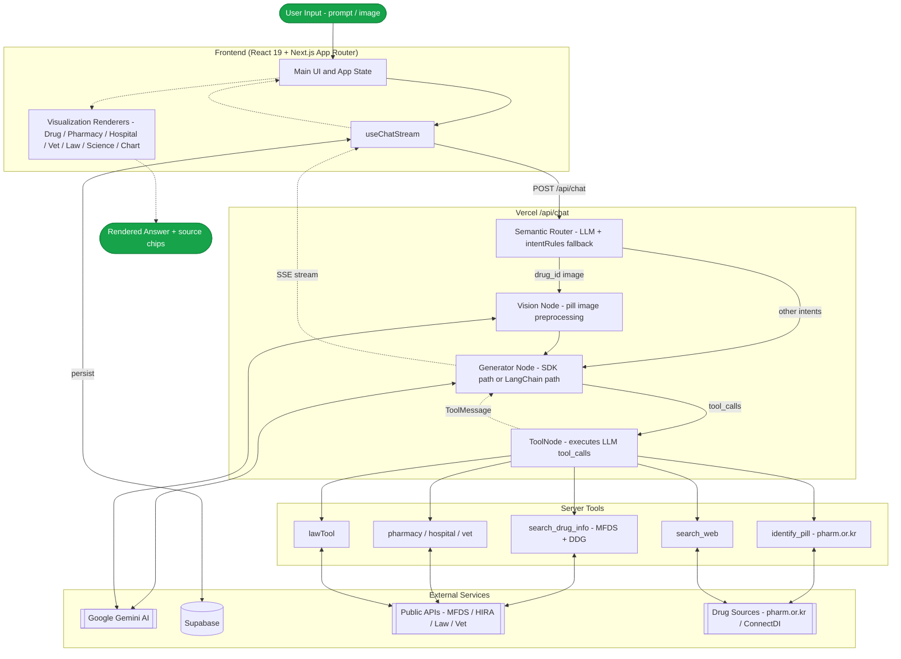
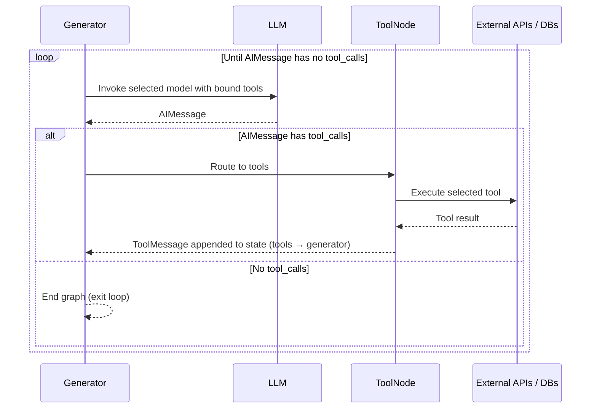

# Chat Agent with Gemini

An intelligent AI messenger powered by **Gemini 3.5 Flash / 2.5 Flash**, combining **Supabase** persistent storage, a **LangGraph.js** agentic pipeline, Google Search grounding, multimodal analysis, and 10 interactive visualization renderers.

---

## 1. Features

### 1-1. Conversation & Auth

- **Login-less**: Start instantly with an auto-assigned random nickname and avatar
- **Persistent history**: Sessions and messages stored in Supabase (PostgreSQL)
- **Auto-title**: Session titles generated automatically from conversation content
- **Sidebar infinite scroll**: Session list loads 30 items at a time; additional sessions fetched on scroll
- **Localization**: Full support for KO / EN / ES / FR

### 1-2. AI Intelligence

- **Gemini 3.5 Flash** as the default chat model, with **Gemini 2.5 Flash** selectable as an alternative
- **Gemini Flash-Lite** for semantic routing
- **Model selector**: Header dropdown switches between models; `preferred_model` persisted locally
- **Google Search Grounding**: Real-time web search with source chip rendering
- **3.5 Search two-track**: 3.5 Flash on free tier can't ground directly — 2.5 Flash gathers grounded facts, then 3.5 Flash synthesizes the final answer
- **`general` needsSearch routing**: For `general` intent, a 3-gate classifier (rule-based OFF/ON + LLM gray-zone) determines whether Google Search is needed — suppresses unnecessary two-track latency for code/translation/math; default-on safety net for ambiguous cases; multi-turn follow-up guard suppresses re-search when previous turn was already searched
- **Empty response auto-retry**: When 3.5 Flash returns empty text (thinking exhaustion), automatically retries with `thinkingLevel: "minimal"` before LangChain fallback
- **Safety block detection**: `finishReason === 'SAFETY'` blocks propagate immediately with user-friendly localized messages (4 languages) instead of a generic error
- **YouTube analysis**: Native Gemini video reading; supports standard URLs, `youtu.be`, and Shorts (`/shorts/`)
- **Multimodal input**: Images, PDF (30MB+), video, DOCX / HWPX / PPTX / XLSX
- **LangGraph agent**: Semantic Router → Vision / Generator / Tools with intent-based path routing and deterministic fallbacks

### 1-3. Visualization Renderers (10)

| Renderer | Intent | Trigger | Library |
|---|---|---|---|
| 💊 Drug-Viz | `drug_id` / `drug_info` | 약품명 질의 / 알약 이미지 식별 | MFDS + pharm.or.kr + ConnectDI |
| 🏥 Pharmacy-Viz | `pharmacy_search` | 약국 위치 탐색 | 공공데이터포털 전국 약국 API ⚠️ 만료 2028-05-06 |
| 🏨 Hospital-Viz | `hospital_search` | 병원·의원 위치 탐색 | 건강보험심사평가원 병원정보서비스 API ⚠️ 만료 2028-05-07 |
| 🐾 Vet-Viz | `vet_search` | 동물병원 위치 탐색 | 행정안전부 동물병원 조회서비스 ⚠️ 만료 2028-05-10 |
| ⚖️ Law-Viz | `law_search` | 법령 목록 / 본문 / 조항호목 | 국가법령정보센터 Open API |
| 🧪 Chem-Viz | `chemistry` | 분자 / 화학 구조 | smiles-drawer |
| 🧬 Bio-Viz | `biology` | 단백질 / DNA | NGL Viewer (3D PDB) |
| 📐 Diagram-Viz | `physics` | 자유물체도 / 포물선 / 충돌 / 경사면 | Canvas 2D |
| ✨ Constellation-Viz | `astronomy` | 별자리 / 천체 | HTML5 Canvas + astronomy-engine |
| 📊 Chart-Viz | `data_viz` | 데이터 / 통계 | ApexCharts |

### 1-4. 💊 Drug-Viz — Pill Identification Engine

- **Image-based pill identification**: Ambiguous image requests ("이거 뭐야?") route to Vision node and extract imprint / color / shape
- **Deterministic DB lookup**: Extracted pill properties stored in `state.pillData`; server directly queries pharm.or.kr without an extra LLM call
- **No raw vision JSON leakage**: Vision node streams are filtered from SSE; raw extraction JSON never reaches user-visible context
- **Exact-match safety policy**: Only `match_type = exact` may become a `json:drug` card; `imprint_only` / `similar` results return a candidate table with pharm.or.kr detail links
- **ConnectDI image sync**: Drug cards use ConnectDI HTML parsing and Supabase caching for image reliability
- **DDG fallback**: Text drug-info requests not found in MFDS fall back to DuckDuckGo search with source chips

### 1-5. ⚖️ Law-Viz — Korean Statute Cards

- **Hybrid lookup**: `lawSearch.do?target=law` for candidate laws → `lawService.do?target=law` for body/article text
- **Hybrid intent parsing**: Router selects `law_search`; `lawTool` then uses Gemini 2.5 Flash to normalize `{mode, law_name, article_no, query}` before Open API calls
- **Article links**: Body/article cards include per-article public source links without exposing `LAW_OC`
- **Colloquial law names**: Aliases (`소방법`, `교통법`, `개인정보법`, `근로법`) normalized to official search candidates

### 1-6. Performance

- Lighthouse **91 / 100** (up from 44)
- JS bundle **365 KB** gzip (down from 1.0 MB via code splitting + lazy loading)
- CSS bundle **~15 KB** (down from 124 KB via build-time Tailwind)
- CLS **0.00** / Best Practices **100 / 100**

### 1-7. Security

- **Presigned URL architecture**: Supabase credentials never exposed to the frontend
- **SSRF protection**: `fetch-url`, `proxy-image`, `sync-drug-image` enforce hostname blocklists (RFC 1918 + IPv6 private ranges) and whitelist-only patterns
- **Bucket access control**: `create-signed-url`, `upload` enforce `ALLOWED_BUCKETS` whitelist — arbitrary bucket access blocked
- **API key rotation**: 429 → 60s cooldown (`markKeyRateLimited`), 401/403 → 24h blacklist (`markKeyInvalid`); all-keys-exhausted returns `null`
- **Error sanitization**: Internal error details (`error.message`, stack) never forwarded to the client; status-code-based localized messages only
- **Safety block handling**: `finishReason === 'SAFETY'` propagated as a distinct `safety` error type with 4-language user messages; no unnecessary key retry
- **Request timeout protection**: All external fetches capped with `AbortController` (YouTube HTML 25s, MFDS/pharm.or.kr/DDG 8s, nedrug image 6s)

---

## 2. Architecture

### 2-1. Agent And Tool Overview

Solid arrows = request (input) path · dashed arrows = response (output) path.


```mermaid
flowchart TB
    In([User Input - prompt / image])

    subgraph Frontend ["Frontend (React 19 + Next.js App Router)"]
        UI[Main UI and App State]
        Stream[useChatStream]
        Renderers["Visualization Renderers - Drug / Pharmacy / Hospital / Vet / Law / Science / Chart"]
    end

    subgraph ChatAPI ["Vercel /api/chat"]
        Router["Semantic Router - LLM + intentRules fallback"]
        Vision["Vision Node - pill image preprocessing"]
        Generator["Generator Node - SDK path or LangChain path"]
        ToolNode["ToolNode - executes LLM tool_calls"]
    end

    subgraph Tools ["Server Tools"]
        DrugLookup["identify_pill - pharm.or.kr"]
        DrugInfo["search_drug_info - MFDS + DDG"]
        LocationTools["pharmacy / hospital / vet"]
        LawTool["lawTool"]
        WebSearch["search_web"]
    end

    subgraph External ["External Services"]
        Gemini[["Google Gemini AI"]]
        Supabase[("Supabase")]
        PublicAPIs[["Public APIs - MFDS / HIRA / Law / Vet"]]
        DrugSites[["Drug Sources - pharm.or.kr / ConnectDI"]]
    end

    Out([Rendered Answer + source chips])

    %% Request (input) path - solid
    In --> UI
    UI --> Stream
    Stream -->|POST /api/chat| Router
    Router -->|drug_id image| Vision
    Router -->|other intents| Generator
    Vision --> Generator
    Generator -->|tool_calls| ToolNode
    ToolNode --> DrugLookup
    ToolNode --> DrugInfo
    ToolNode --> LocationTools
    ToolNode --> LawTool
    ToolNode --> WebSearch
    Generator <--> Gemini
    Vision <--> Gemini
    DrugLookup <--> DrugSites
    DrugInfo <--> PublicAPIs
    LocationTools <--> PublicAPIs
    LawTool <--> PublicAPIs
    WebSearch <--> DrugSites

    %% Response (output) path - dashed
    ToolNode -.->|ToolMessage| Generator
    Generator -.->|SSE stream| Stream
    Stream -.-> UI
    UI -.-> Renderers
    Renderers -.-> Out
    Stream <-->|persist| Supabase

    classDef io fill:#16a34a,stroke:#15803d,color:#fff;
    class In,Out io;
```

### 2-2. LangGraph Agent Flow

High-level StateGraph node flow (router → vision/generator → tools → output).

> 📊 Diagram: [LangGraph Agent Flow](docs/guide/REF_Architecture.md#langgraph-agent-flow)

### 2-3. Agent Runtime Branches

The agent uses two execution paths inside `generator.ts`.

> 📊 Diagram: [Agent Runtime Branches](docs/guide/REF_Architecture.md#agent-runtime-branches)

Branch rules:

- SDK path handles `general`, `medical_qa`, and renderer intents (`astronomy`, `biology`, `chemistry`, `physics`, `data_viz`)
- LangChain path handles intents that need local tools: `drug_id`, `drug_info`, `pharmacy_search`, `hospital_search`, `vet_search`, `law_search`
- Google Search is disabled for multimodal requests (Gemini grounding is incompatible with image/video/PDF parts)
- Renderer intents disable Google Search unless the user explicitly requests search/sources/latest information
- 3.5 Flash free-tier grounding uses a two-track route: 2.5 Flash gathers grounded facts, then 3.5 Flash synthesizes the final answer

### 2-4. Tool-Calling Loop


```mermaid
sequenceDiagram
    participant G as Generator
    participant L as LLM
    participant T as ToolNode
    participant E as External APIs / DBs

    loop Until AIMessage has no tool_calls
        G->>L: Invoke selected model with bound tools
        L-->>G: AIMessage
        alt AIMessage has tool_calls
            G->>T: Route to tools
            T->>E: Execute selected tool
            E-->>T: Tool result
            T-->>G: ToolMessage appended to state (tools → generator)
        else No tool_calls
            G-->>G: End graph (exit loop)
        end
    end
```

Tool-binding policy:

| Intent | Tools exposed to LLM | Notes |
|---|---|---|
| `drug_id` without `pillData` | `identify_pill`, `search_web` | Legacy/fallback path only |
| `drug_id` with `pillData` | none after direct DB lookup | Prevents recursion; non-exact returns table before LLM |
| `drug_info` | `search_drug_info`, `search_web` | MFDS first, DDG fallback |
| `pharmacy_search` | `pharmacyTool`, `search_web` | Fast-passed as `json:pharmacy` |
| `hospital_search` | `hospitalTool`, `search_web` | Fast-passed as `json:hospital` |
| `vet_search` | `vetTool`, `search_web` | Fast-passed as `json:vet` |
| `law_search` | `lawTool` | Handles query normalization and Open API calls |

### 2-5. Pill Image Identification Flow

Image identification fast-path: router → vision extraction → direct DB lookup → exact card / candidate table / failure.

> 📊 Diagram: [Pill Image Identification Flow](docs/guide/REF_Architecture.md#pill-image-identification-flow)

### 2-6. Tool Inventory

| Tool | File | Purpose |
|---|---|---|
| `identify_pill` | `server/agent/tools.ts` | MFDS `mfds_pills` DB 1순위 → pharm.or.kr fallback; imprint / color / shape 3-stage match |
| `search_web` | `server/agent/tools.ts` | DuckDuckGo HTML fallback search and source extraction |
| `search_drug_info` | `server/agent/drug-info-tool.ts` | MFDS drug lookup, official image/detail data, non-pill fallback |
| `pharmacyTool` | `server/agent/pharmacy-tool.ts` | National pharmacy search |
| `hospitalTool` | `server/agent/hospital-tool.ts` | HIRA hospital/clinic search |
| `vetTool` | `server/agent/vet-tool.ts` | Animal hospital search |
| `lawTool` | `server/agent/law-tool.ts` | Korean law list/body/article lookup |

### 2-7. Streaming And Source Handling

`app/api/chat/route.ts` consumes LangGraph stream events and forwards clean SSE events to the client.

- SDK responses send text directly via `sendEvent`
- LangChain `on_chat_model_stream` chunks are sanitized before forwarding
- Vision node chunks are filtered out (contain internal JSON extraction data)
- Tool source URLs parsed from `[WEB_SOURCE_URLS]` and emitted as source chips
- Fast-pass renderers stream completed `json:pharmacy`, `json:hospital`, `json:vet`, `json:law` blocks without an extra LLM synthesis step
- Final assistant content saved to Supabase after streaming completes

### 2-8. Intent Routing

| Intent | Path | Model |
|---|---|---|
| `drug_id` (image) | Router fast-path → Vision → direct DB lookup → exact card or candidate table | Vision: 2.5 Flash |
| `drug_info` | LangChain + `search_drug_info` / DDG fallback | selected model |
| `pharmacy_search` | LangChain + pharmacy public API tool | selected model |
| `hospital_search` | LangChain + HIRA hospital API tool | selected model |
| `vet_search` | LangChain + animal hospital API tool | selected model |
| `law_search` | LangChain + Korean law Open API tool | selected model |
| `medical_qa` | SDK + Google Search grounding | selected model, 3.5 uses two-track |
| `biology` / `chemistry` / `physics` / `astronomy` / `data_viz` | SDK renderer output | selected model, Search off unless explicitly requested |
| `general` | SDK, Google Search gated by `needsSearch` 3-gate classifier | selected model, 3.5 uses two-track when search is on |

Router behavior:

- Router LLM: `gemini-2.5-flash-lite`
- Deterministic fallback rules in `server/agent/intentRules.ts` (KO / EN / ES / FR keywords)
- Renderer intents disable Google Search by default; explicit "search/source/latest" requests re-enable it

### 2-9. Database And Storage Flow

How API routes write to PostgreSQL tables and Storage buckets.

> 📊 Diagram: [Database And Storage Flow](docs/guide/REF_Architecture.md#database-and-storage-flow)

| Table | Written by | Purpose |
|---|---|---|
| `users` | `/api/auth` | Guest profile: `id`, `nickname`, `display_name`, `avatar_url` |
| `chat_sessions` | `/api/sessions`, `/api/chat` | Session metadata: owner, title, `updated_at` |
| `chat_messages` | `/api/chat` | User/assistant messages, attachment URL, grounding sources |

| Bucket | Purpose |
|---|---|
| `chat-imgs` | User image uploads + cached drug-card images |
| `chat-videos` | Uploaded videos |
| `chat-docs` | Uploaded PDFs and documents |

---

## 3. Tech Stack

| Layer | Technology |
|---|---|
| Frontend | React 19, Next.js 16 App Router, TypeScript, Tailwind CSS, Framer Motion |
| Visualization | ApexCharts, smiles-drawer, NGL, HTML5 Canvas |
| Backend | Next.js Route Handlers (Vercel), LangGraph.js |
| AI | Gemini 2.5 Flash / 3.5 Flash / Flash-Lite, @google/genai SDK, LangChain |
| Database | Supabase (PostgreSQL, Storage) |

### 3-1. Model Usage

| Purpose | Model |
|---|---|
| Main chat (default) | `gemini-3.5-flash` |
| User-selectable | `gemini-3.5-flash`, `gemini-2.5-flash` |
| Semantic router | `gemini-2.5-flash-lite` |
| Pill vision preprocessing | `gemini-2.5-flash` |
| 3.5 + Search grounding | Stage 1: `gemini-2.5-flash` + Search → Stage 2: `gemini-3.5-flash` synthesis |
| TTS | `gemini-2.5-flash-preview-tts` |
| Session title | `gemini-2.5-flash-lite` (primary) / `gemini-2.5-flash` (fallback) |

---

## 4. Project Structure

```
├── app/                        # Next.js App Router
│   ├── layout.tsx              # Root layout (HTML, CDN scripts, theme init)
│   ├── page.tsx                # Entry point — dynamic import App (ssr: false)
│   ├── globals.css
│   └── api/                    # Route Handlers (maxDuration: 60, nodejs runtime)
│       ├── chat/route.ts       # Main Gemini streaming endpoint (LangGraph, SSE)
│       ├── speech/route.ts     # TTS (gemini-2.5-flash-preview-tts)
│       ├── summarize-title/route.ts
│       ├── sync-drug-image/route.ts
│       ├── pill-search/route.ts
│       ├── sessions/route.ts   # Session / message CRUD (offset/limit pagination)
│       ├── upload/route.ts     # Supabase Storage upload proxy
│       ├── fetch-url/route.ts  # Web scraping + Jina AI fallback
│       ├── fetch-transcript/route.ts  # YouTube transcript stub (disabled; uses native Gemini video analysis)
│       ├── auth/route.ts
│       ├── create-signed-url/route.ts
│       └── proxy-image/route.ts
├── server/                     # Server-only utilities (never bundled to client)
│   ├── config.ts               # API key pool + rotation logic
│   ├── models.ts               # Server model registry
│   ├── agent/
│   │   ├── graph.ts            # LangGraph StateGraph definition
│   │   ├── intentRules.ts      # Deterministic multilingual routing fallbacks
│   │   ├── nodes/              # router.ts / vision.ts / generator.ts
│   │   ├── prompt.ts           # System instruction builder
│   │   ├── state.ts            # AgentState type definition
│   │   ├── tools.ts            # identify_pill, search_web (DDG)
│   │   ├── drug-info-tool.ts
│   │   ├── pharmacy-tool.ts
│   │   ├── hospital-tool.ts
│   │   ├── vet-tool.ts
│   │   └── law-tool.ts
│   ├── mfds-logic.ts           # MFDS mfds_pills Supabase 3-stage matching + sortByRelevance
│   ├── pill-logic.ts
│   └── supabase.ts
├── components/                 # UI components
│   ├── ChatMessage.tsx         # Markdown + visualization block parser
│   ├── DrugRenderer.tsx
│   ├── PharmacyRenderer.tsx
│   ├── HospitalRenderer.tsx
│   ├── VetRenderer.tsx
│   ├── LawRenderer.tsx
│   ├── BioRenderer.tsx         # 3D protein structure (NGL)
│   ├── ChemicalRenderer.tsx    # SMILES molecular structure
│   ├── ConstellationRenderer.tsx
│   ├── ChartRenderer.tsx
│   ├── DiagramRenderer.tsx
│   └── ...
├── src/
│   ├── lib/models.ts           # Frontend chat model registry
│   └── hooks/
│       ├── useAuthSession.ts
│       ├── useChatSessions.ts  # Session CRUD + infinite scroll
│       └── useChatStream.ts    # Message send orchestration
├── services/
│   └── geminiService.ts        # API wrapper + session/user remote calls
├── docs/                       # See §4-1 for naming conventions
│   ├── DEV_HISTORY.md          # Dev history index (one line per session)
│   ├── TODO.md
│   ├── logs/DEV_YYMMDD.md      # Dated session work logs (latest: DEV_260602.md)
│   ├── plans/PLAN_*.md         # Plan / design / analysis docs (start with PLAN_INDEX.md)
│   └── guide/REF_*.md          # Renderer & feature reference guides
├── App.tsx                     # Root component (layout + hooks composition)
├── next.config.ts              # Security headers
├── types.ts                    # Shared TypeScript types
└── tailwind.config.js
```

### 4-1. Documentation Conventions (`docs/`)

When adding a Markdown doc under `docs/`, place it in the right folder and follow the naming rule. **Date format is `YYMMDD`** (e.g. `260602` = 2026-06-02).

| Folder | Purpose | Filename rule | Example |
|---|---|---|---|
| `docs/` | Top-level living index docs | Fixed names | `DEV_HISTORY.md`, `TODO.md` |
| `docs/logs/` | Dated session work logs (one per work session) | `DEV_YYMMDD.md` | `DEV_260602.md` |
| `docs/plans/` | Plans, designs, analyses, change summaries | `PLAN_<TOPIC>[_YYMMDD].md` | `PLAN_THINKING_LATENCY_260602.md` |
| `docs/guide/` | Renderer / feature reference guides | `REF_<Topic>.md` | `REF_Chart.md` |

Rules:
- **`docs/plans/` — always `PLAN_` prefix**, `UPPER_SNAKE_CASE` topic. Add a `_YYMMDD` suffix for dated/one-off analyses; omit it for evergreen plans. Do **not** add a redundant `_PLAN` suffix (use `PLAN_DB_MIGRATION.md`, not `PLAN_DB_MIGRATION_PLAN.md`).
- **`docs/logs/` — `DEV_YYMMDD.md`**, one file per session/day. Add a matching one-line entry to `DEV_HISTORY.md`.
- **`docs/guide/` — `REF_` prefix** for renderer/feature references.
- Each plan/log starts with a blockquote header: `> 작성일: YYYY-MM-DD` and `> 상태: …`.
- When renaming a doc, update any `[text](../plans/…)` links that point to it.

---

## 5. Getting Started

### 5-1. Environment variables (`.env.local`)

```env
SUPABASE_URL=your_supabase_url
SUPABASE_KEY=your_supabase_service_role_key
API_KEY=your_gemini_key_1
API_KEY2=your_gemini_key_2   # optional: additional keys for rotation

# Drug Search APIs
MFDS_API_ENDPOINT=your_mfds_endpoint
MFDS_API_KEY=your_mfds_key

# Public Info APIs
PHARM_KEY=your_national_pharmacy_and_hospital_api_key   # 약국 + HIRA 병원 공용 (만료 2028-05-06/07)
VET_KEY=your_animal_hospital_api_key                    # 행정안전부 동물병원 (만료 2028-05-10)
LAW_OC=your_law_openapi_oc                              # 국가법령정보센터 OC 코드
```

### 5-2. Install & run

```bash
npm install
npm run dev        # Next.js dev server (port 3001)
npm run build      # Production build
npm start          # Production server
```

---

> Detailed changelog: [docs/DEV_HISTORY.md](docs/DEV_HISTORY.md)
