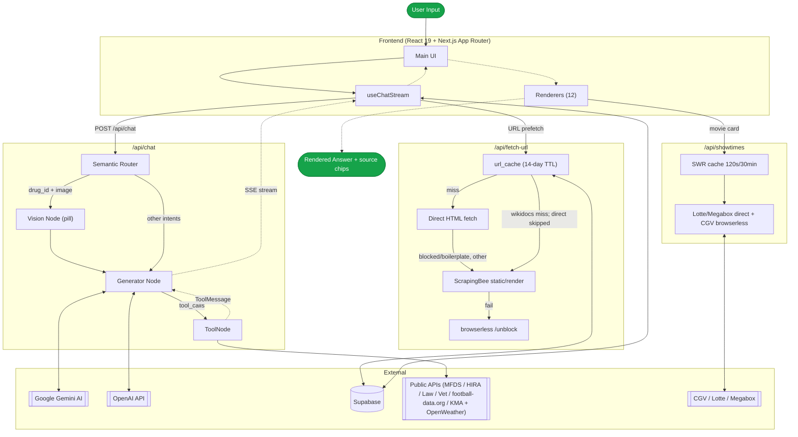
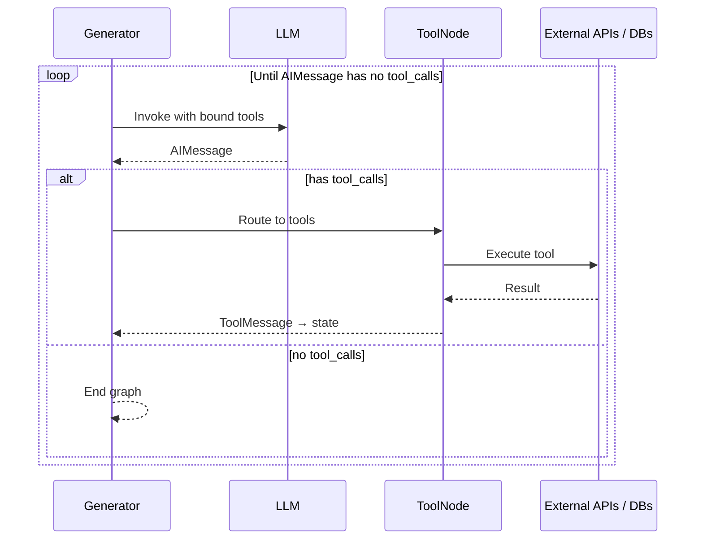

# Chat Agent

A multi-provider AI messenger powered by Gemini and OpenAI — LangGraph.js agent pipeline, web grounding, multimodal input, and 12 interactive visualization renderers.

---

## 0. Public API Key Expiry

Every data.go.kr service is granted per-service on one account key (`PHARM_KEY`); when one expires the others keep working, so a lapse shows up as a single broken card rather than an outage. Renew before these dates:

| Service | Used by | Expires |
| --- | --- | --- |
| 전국 약국 정보 조회 | pharmacy card, `is_open_now` | 2028-05-06 |
| 병원정보서비스 (`hospInfoServicev2`) | hospital card | 2028-05-07 |
| 의료기관별상세정보서비스 (`MadmDtlInfoService2.8`) | hospital treatment hours, emergency room | **2028-08-23** |
| 동물병원 조회서비스 | vet card (license status only) | 2028-05-10 |

---

## 1. Features

### 1-1. Conversation & Auth

- **Login-less**: starts instantly with an auto-generated nickname and avatar
- **Persistent history**: sessions and messages stored in Supabase (PostgreSQL)
- **Auto-title**: session titles generated automatically from conversation content
- **Sidebar infinite scroll**: loads 30 at a time, fetches more on scroll
- **Localization**: KO / EN / ES / FR — the client sends a lang code, and `server/agent/lang.ts` is the single source that maps it for prompts and renderer specs

### 1-2. AI Intelligence

- **Models**: Gemini 3.7 Flash / **3.6 Flash (default)** / 3.5 Flash / 2.5 Flash, plus GPT-5.4 mini / GPT-5.6 Luna. The grouped provider picker is persisted in `preferred_model` local storage
- **Web grounding**: the selected Gemini or GPT model handles ordinary text, fetched URL content, images, and web-search answers. Gemini search paths may use 2.5 Flash where the selected Gemini model requires it
- **Numbered citations (both providers)**: OpenAI `url_citation` annotations and Gemini `groundingSupports` are both turned into clickable `[N]` markers in the body plus matching badges below. Only sources actually cited get a number; a model-written bare `[N]` with no backing source is still stripped as a fabricated citation. Gemini's segment offsets are UTF-8 byte offsets, not JS string indices — see `server/agent/gemini-citations.ts`
- **Intent routing**: currently `gemini-2.5-flash-lite` + rule-based fallback (`intentRules.ts`). One JSON call returns `intent`, `needs_search`, and `follow_up`; provider-native routing for GPT is a tracked follow-up
- **Provider-native tools**: GPT selections use OpenAI Responses strict function calling for drug/pharmacy/hospital/vet/law/movie/sports/weather. Card tools fast-pass their renderer block; drug and sports results are synthesized by the selected GPT
- **Card follow-up**: weather/movie cards stay on screen across turns instead of being redrawn. The client reports which cards are visible (`activeCards`), because the server only receives the last 10 messages
- **Open-now facts are computed server-side, never guessed**: pharmacy hours come from the pharmacy API and hospital hours from the HIRA detail service, and the server — not the model — decides `is_open_now`. Only when the authoritative source has no record (HIRA detail coverage measured at 30% overall, 14% for clinics) does the turn fall back to web search, and that answer must say it is unconfirmed and to call ahead. Vet cards carry licence status only, so they always take the search path
- **Multimodal**: images, PDF (30MB+), video, DOCX/PPTX/XLSX, HWP/HWPX (kordoc). GPT video/audio and Gemini-native file inputs use a capability fallback to Gemini 2.5 Flash
- **YouTube**: captions can be handled as text by the selected model; native video analysis uses Gemini 2.5 Flash
- **LangGraph agent**: Semantic Router → Vision / Generator ↔ Tools

Details (intent routing, tool binding, model policy, streaming): [docs/guide/REF_Architecture.md](docs/guide/REF_Architecture.md)

### 1-3. Visualization Renderers (12)

| Renderer             | Intent                          | Library / API                                     |
| -------------------- | ------------------------------- | ------------------------------------------------- |
| 💊 Drug-Viz          | `drug_id` / `drug_info`     | MFDS `mfds_pills` + ConnectDI                   |
| 🏥 Pharmacy-Viz      | `pharmacy_search`             | Korea Public Data Portal nationwide pharmacy API (expires 2028-05-06) |
| 🏨 Hospital-Viz      | `hospital_search`             | HIRA hospital information service API (expires 2028-05-07) + HIRA per-institution detail service `MadmDtlInfoService2.8` for treatment hours (expires 2028-08-23), with web-search fallback where no detail record exists |
| 🐾 Vet-Viz           | `vet_search`                  | MOIS animal hospital lookup service (expires 2028-05-10) |
| ⚖️ Law-Viz          | `law_search`                  | Korea Law Information Center Open API              |
| 🎬 Movie-Viz         | `movie_search`                | Lotte/Megabox direct JSON + CGV browserless (HMAC) |
| 🌦️ Weather-Viz       | `weather`                     | KMA API Hub (한국, `dfsXyConv` 격자) + OpenWeather (해외·폴백) |
| 🧪 Chem-Viz          | `chemistry`                   | smiles-drawer                                     |
| 🧬 Bio-Viz           | `biology`                     | NGL Viewer (3D PDB)                               |
| 📐 Diagram-Viz       | `physics`                     | Canvas 2D                                         |
| ✨ Constellation-Viz | `astronomy`                   | HTML5 Canvas + astronomy-engine                   |
| 📊 Chart-Viz         | `data_viz`                    | ApexCharts                                        |

Per-renderer details (schemas, test prompts): [docs/guide/](docs/guide/)

### 1-4. Performance & Security

**Lighthouse**: Performance 91 · Best Practices 100 · CLS 0.00  
**Bundle**: JS 365 KB gzip / CSS ~15 KB

**Security highlights:**
- Presigned URL architecture — Supabase credentials never exposed to the frontend
- **Storage 인증 + 유저별 격리** (2026-08-17) — 업로드 3종이 Bearer 토큰을 요구하고,
  JWT `sub` 로 `${uid}/` prefix 를 조립하며, `storage.objects` RLS 가 소유권을 강제한다.
  🔴 그 전까지 **인증 자체가 없었다** — 누구나 공개 버킷에 파일을 쌓을 수 있었다.
  🟡 **Phase 2 미완**: 버킷은 아직 공개라 **URL 을 아는 제3자는 읽을 수 있다**
  (`chat_messages.attachment_url` 에 공개 URL 이 저장돼 있어 백필이 선행이다).
- SSRF defense — `fetch-url` / `proxy-image` / `sync-drug-image` block RFC 1918 + IPv6 private ranges
- API key rotation — 429 → 60s cooldown, 401/403 → 24h blacklist
- Error sanitization — internal stacks/messages never exposed to the client

---

## 2. Architecture

### 2-1. Agent & Tool Overview


```mermaid
flowchart TB
    In([User Input])

    subgraph Frontend ["Frontend (React 19 + Next.js App Router)"]
        UI[Main UI]
        Stream[useChatStream]
        Renderers["Renderers (12)"]
    end

    subgraph FetchAPI ["/api/fetch-url"]
        URLCache["url_cache (14-day TTL)"]
        Direct["Direct HTML fetch"]
        ScrapingBee["ScrapingBee static/render"]
        Browserless["browserless /unblock"]
    end

    subgraph ChatAPI ["/api/chat"]
        Router["Semantic Router"]
        Vision["Vision Node (pill)"]
        Generator["Generator Node"]
        ToolNode["ToolNode"]
    end

    subgraph ShowtimesAPI ["/api/showtimes"]
        SWR["SWR cache 120s/30min"]
        ChainFetch["Lotte/Megabox direct + CGV browserless"]
    end

    subgraph External ["External"]
        Gemini[["Google Gemini AI"]]
        OpenAI[["OpenAI API"]]
        Supabase[("Supabase")]
        APIs[["Public APIs (MFDS / HIRA / Law / Vet / football-data.org / KMA + OpenWeather)"]]
        Multiplex[["CGV / Lotte / Megabox"]]
    end

    Out([Rendered Answer + source chips])

    In --> UI --> Stream
    Stream -->|URL prefetch| URLCache -->|miss| Direct
    Direct -->|blocked/boilerplate, other| ScrapingBee
    URLCache -->|wikidocs miss; direct skipped| ScrapingBee
    ScrapingBee -->|fail| Browserless
    URLCache <--> Supabase
    Stream -->|POST /api/chat| Router
    Router -->|drug_id + image| Vision --> Generator
    Router -->|other intents| Generator
    Generator -->|tool_calls| ToolNode --> APIs
    Renderers -->|movie card| SWR --> ChainFetch <--> Multiplex
    Generator <--> Gemini
    Generator <--> OpenAI
    ToolNode -.->|ToolMessage| Generator
    Generator -.->|SSE stream| Stream -.-> UI -.-> Renderers -.-> Out
    Stream <--> Supabase

    classDef io fill:#16a34a,stroke:#15803d,color:#fff;
    class In,Out io;
```

Detailed diagrams (LangGraph flow, Runtime Branches, URL Prefetch, Pill ID, DB/Storage):  
→ [docs/guide/REF_Architecture.md](docs/guide/REF_Architecture.md)

### 2-2. Tool-Calling Loop


```mermaid
sequenceDiagram
    participant G as Generator
    participant L as LLM
    participant T as ToolNode
    participant E as External APIs / DBs

    loop Until AIMessage has no tool_calls
        G->>L: Invoke with bound tools
        L-->>G: AIMessage
        alt has tool_calls
            G->>T: Route to tools
            T->>E: Execute tool
            E-->>T: Result
            T-->>G: ToolMessage → state
        else no tool_calls
            G-->>G: End graph
        end
    end
```

Per-intent tool binding and routing details: [docs/guide/REF_Architecture.md](docs/guide/REF_Architecture.md)

---

## 3. Tech Stack

| Layer         | Technology                                                                |
| ------------- | ------------------------------------------------------------------------- |
| Frontend      | React 19, Next.js 16 App Router, TypeScript, Tailwind CSS, Framer Motion  |
| Markdown      | react-markdown + remark-gfm / remark-math (`$$` only) / remark-cjk-friendly / rehype-katex |
| Visualization | ApexCharts, smiles-drawer, NGL Viewer, HTML5 Canvas, astronomy-engine    |
| Backend       | Next.js Route Handlers (Vercel), LangGraph.js                             |
| AI            | Gemini 3.7/3.6/3.5/2.5 Flash, GPT-5.4 mini / GPT-5.6 Luna, Google GenAI SDK, OpenAI Responses API, LangChain |
| Database      | Supabase (PostgreSQL + Storage)                                           |

Per-model usage policy: [docs/guide/REF_Architecture.md#model-policy](docs/guide/REF_Architecture.md)  
DB schema: [docs/guide/REF_DB.md](docs/guide/REF_DB.md)

---

## 4. Project Structure

```
├── app/
│   ├── layout.tsx / page.tsx / globals.css
│   └── api/
│       ├── chat/route.ts               # LangGraph SSE streaming (maxDuration 300)
│       ├── speech/route.ts             # TTS (gemini-2.5-flash-preview-tts)
│       ├── showtimes/route.ts          # 3-chain showtimes + SWR cache
│       ├── fetch-url/route.ts          # URL prefetch: cache → direct/ScrapingBee → browserless
│       ├── parse-document/route.ts     # HWP/DOCX/PPTX → kordoc Markdown
│       ├── sessions/route.ts           # Session/message CRUD
│       ├── summarize-title/route.ts
│       ├── sync-drug-image/route.ts
│       ├── pill-search/route.ts
│       ├── create-signed-url/route.ts
│       └── proxy-image/route.ts
├── server/
│   ├── config.ts                       # API key pool + rotation
│   ├── models.ts                       # Server model registry
│   ├── chat-error-policy.ts            # Provider error classification + client-safe messages
│   ├── openai/                         # OpenAI Responses adapter + model metadata
│   ├── mfds-logic.ts / pill-logic.ts
│   ├── supabase.ts
│   ├── lib/weather/index.ts             # KMA + OpenWeather core (dfsXyConv, precip parse)
│   └── agent/
│       ├── graph.ts                    # LangGraph StateGraph
│       ├── prompt.ts                   # Base + intent-scoped renderer sections
│       ├── lang.ts                     # Single source for server language mapping
│       ├── history.ts                  # Client history → LangChain messages
│       ├── state.ts / intentRules.ts   # state: activeCards / *Followup / movieContext
│       ├── tools.ts                    # identify_pill, search_web (DDG)
│       ├── drug-info-tool.ts / pharmacy-tool.ts / hospital-tool.ts
│       ├── vet-tool.ts / law-tool.ts / movie-tool.ts / worldcup-tool.ts
│       ├── weather-tool.ts              # weather intent (multi-city)
│       └── nodes/
│           ├── router.ts / vision.ts / generator.ts / langchain-path.ts
│           ├── search-gate.ts / sdk-contents.ts
│           ├── generation-config.ts / pill-messages.ts / retry.ts
│           └── image-flags.ts               # 신규첨부 vs 히스토리 이미지 (순수 — 하니스가 import)
│       └── weather-followup.ts         # 날씨 후속 판정 (순수 함수 — 하니스가 import)
├── components/                         # 25 UI components (12 renderers + core)
├── lib/
│   ├── supabase/client.ts / route.ts   # 인증 스택 (NEXT_PUBLIC_* 를 읽는다)
│   ├── storage-name.ts                 # 업로드 파일명 → Storage 키 정규화 (순수)
│   ├── theaters.ts / movieContext.ts
│   └── sports/football-data.ts         # football-data.org WC data layer
├── docs/guide/db/                        # 🔴 DB 스키마의 출처. §5-2 참조
│   ├── auth-mvp-*.sql                  # 인증 MVP 스키마 · 컷오버 · 검증
│   ├── storage-user-prefix-rls.sql     # storage.objects RLS (3버킷 × 4정책)
│   ├── url-cache.sql / mfds-pills.sql  # URL 캐시 · 식약처 낱알 DB
│   └── sync-mfds-pills.mjs             # 약품 ~25,000행 적재기
├── tests/                              # 🔴 회귀 하니스 (`npm test`). tests/README.md
│   ├── test-intent-rules / test-search-policy / test-weather-followup
│   ├── test-storage-name / test-pill-messages / test-ddg-parse
│   ├── test-thinking-config / test-openai-url-fetch / test-chat-models
│   └── tsconfig.probe.json + lib/      # `server-only` 모듈을 tsx 로 직접 돌리는 우회
├── utils/
│   ├── astronomyHelper.ts / celestialMath.ts
│   └── streamingMarkdown.ts            # Anti-flicker table gating (mid-stream)
├── src/
│   ├── lib/models.ts
│   └── hooks/                          # useAuthSession / useChatSessions / useChatStream
├── services/geminiService.ts
├── data/theater-branches.json          # 424 branches (CGV 177 · Lotte 133 · Megabox 114)
├── docs/                               # See §4-1 for conventions
├── App.tsx / types.ts / next.config.ts / tailwind.config.js
```

### 4-1. Documentation Conventions (`docs/`)

**Date format: `YYMMDD`** (e.g. `260602` = 2026-06-02)

| Folder               | Purpose                      | Filename rule              | Example                            |
| -------------------- | ---------------------------- | -------------------------- | ---------------------------------- |
| `docs/`              | Living index docs            | Fixed names                | `DEV_HISTORY.md`, `TODO.md`        |
| `docs/logs/YYYY/MM/` | Dated session work logs      | `DEV_YYMMDD.md`            | `docs/logs/2026/06/DEV_260602.md`  |
| `docs/plans/`        | Plans, designs, analyses     | `PLAN_<TOPIC>[_YYMMDD].md` | `PLAN_THINKING_LATENCY_260602.md`  |
| `docs/guide/`        | Renderer & feature reference | `REF_<Topic>.md`           | `REF_Chart.md`                     |

- Start at [docs/README.md](docs/README.md) for the current documentation map and latest work; feature references are indexed at [docs/guide/README.md](docs/guide/README.md).
- When creating a new log file, add a one-line entry to `DEV_HISTORY.md` and the relevant monthly log index.
- `docs/plans/` — always `PLAN_` prefix, `UPPER_SNAKE_CASE`. Detailed analyses get a `_YYMMDD` suffix.

---

## 5. Getting Started

### 5-1. Environment variables

Copy `.env.example` to `.env.local` and fill in each value.

```bash
cp .env.example .env.local
```

Full field descriptions: [.env.example](.env.example)

### 5-2. Database setup — `docs/guide/db/`

🔴 **새 Supabase 프로젝트를 세울 때 이 폴더를 전부 실행해야 한다.** 전부 멱등이다.

| 순서 | 파일 | 만드는 것 |
|---|---|---|
| 1 | `auth-mvp-schema.sql` | `profiles` · `chat_sessions` · `chat_messages` + RLS |
| 2 | `auth-mvp-storage-buckets.sql` | `chat-imgs` · `chat-videos` · `chat-docs` |
| 3 | `storage-user-prefix-rls.sql` | `storage.objects` 유저별 prefix 정책 |
| 4 | `url-cache.sql` | URL 프리페치 캐시 |
| 5 | `mfds-pills.sql` | 식약처 낱알 DB → 이어서 `node docs/guide/db/sync-mfds-pills.mjs` 로 적재 |

> ⚠️ **3번은 코드 배포보다 먼저** 실행한다. 정책이 없는 상태로 코드를 올리면 업로드가 전부 거부된다.
>
> 🔴 **이 표가 왜 있나 (2026-08-17)**: `auth-mvp-schema.sql` 이 만드는 건 3개뿐인데, 인증 MVP 가
> 빈 프로젝트를 새로 세울 때 **아무도 나머지를 몰랐다.** `url_cache` 는 DDL 이 문서에만,
> `mfds_pills` 는 gitignore 된 스크립트 **주석 안에만** 있었다. 결과: URL 캐시가 45일간 죽어
> 매 요청이 유료 스크래퍼를 태웠고, **약품 식별 1순위 DB 가 존재한 적이 없었다.**
> 둘 다 코드가 `error` 를 버려서 **아무 증상 없이** 동작하는 것처럼 보였다.
> → **스키마의 출처는 이 폴더다. 문서도, 스크립트 주석도 아니다.**

### 5-3. Install & run

```bash
npm install
npm run dev        # Next.js dev server (default port 3000)
npm run build
npm start
```

### 5-4. Verification

```bash
npm run verify     # typecheck + 회귀 하니스 (현재 green — 커밋 전 이걸 돌린다)
npm run typecheck  # tsc --noEmit
npm test           # 하니스 10종 (tests/) — 외부 네트워크 없이 핵심 라우팅·정책·오류 계약 검증
npm run lint       # eslint (기존 에러 30건 — 아직 verify 에 포함하지 않는다)
```

> 🔴 **폴더가 곧 정책이다** (2026-08-18 정리). `.gitignore` 에 예외를 다는 대신 위치로 가른다:
> **`tests/`** 회귀 하니스 10종 — 시크릿·네트워크 없이 돌고 프로덕션 로직을 import 해서 잰다([tests/README.md](tests/README.md)). 외부 공급자 실측은 `tests/manual/`에서 별도로 실행한다.
> **`docs/guide/db/`** 스키마 SQL + 적재 스크립트 — 환경 재현의 유일한 출처([README](docs/guide/db/README.md)).
> **`scripts/`** 는 **통째로 `.gitignore`** 다 — 실 API 키로 외부를 때리는 일회성 습작 전용이라
> 언제 사라져도 되는 것만 둔다. 예전엔 한 폴더에 섞어두고 예외를 6줄 달았는데,
> 그 탓에 `mfds_pills` DDL 이 레포에서 사라져 **dev 에 테이블이 없었다**(§5-2).
>
> ⚠️ `lint` 를 `verify` 에 넣지 않은 이유: 기존 에러 30건 때문에 **항상 빨간 명령**이 되고,
> 그건 `next lint` 제거 후 깨진 채 방치됐던 상태와 같은 실패다. 30건을 정리한 뒤 넣는다.

---

> Detailed changelog: [docs/DEV_HISTORY.md](docs/DEV_HISTORY.md)
