# 🚀 Chat with Gemini - Next-Gen AI Persistent Messenger

**Chat with Gemini** is an intelligent AI messenger that combines the power of Google's **Gemini 2.5 Flash** engine with **Supabase** persistent storage. It offers a seamless **Login-less** experience while maintaining **Persistent History** across devices.

---

## ✨ Key Features

### ⚡ Login-less Experience (Guest-First)
- **Automatic Anonymous Auth**: Start chatting immediately with a random nickname and profile. No tedious sign-up or email verification required.
- **Profile Customization**: Easily set your custom nickname and avatar from the sidebar. All profile data is saved securely in the cloud.

### 💾 Persistent Conversation History
- **Supabase Integration**: All messages and sessions are stored in Supabase (PostgreSQL). Your chat history remains intact even after a page refresh or device change.
- **Intelligent Session Management**: Create, delete, and rename chat sessions. An AI-powered titling system (using Gemma 3) automatically generates representative titles for your conversations.

### 🌐 Comprehensive Deep Localization
- **Multi-language Support**: Fully supports **English (EN)**, **Korean (KO)**, **Spanish (ES)**, and **French (FR)**.
- **Visualizer Localization**: All visualization modules (Bio, Chemical, Charts) automatically localize their UI labels (e.g., "Chain", "Molecular Structure", "Analyzing...") based on the global setting.
- **Strict Response Enforcement**: Optimized system prompts ensure Gemini adheres to the selected language regardless of input language.

### 🔍 Intelligence & Multimodality
- **PDF, Image & Video Analysis**: Upload documents (PDF), images, or native video files (MP4, MOV). Gemini can summarize, extract data, or describe visual/auditory content. Features a **Video-to-Text conversion strategy** that stores AI-generated summaries as session context to optimize subsequent queries.
- **Real-time Google Search**: For time-sensitive queries, the AI performs a live web search and provides accurate **Grounding Cards** with source citations.
- **Hybrid YouTube Analysis**: Paste a YouTube URL to extract summaries. If captions are missing, Gemini can "watch" and analyze the video content directly.

### 📊 Intelligent Data, Chemical & Biological Visualization (Upgraded!)
- **Advanced Dynamic Charts**: Support for 8+ visualization types: **Bar, Line, Area, Pie, Donut, Scatter, Radar, and Treemap**.
- **Chemical Structure Rendering**: Asking about molecules (e.g., Caffeine, Aspirin) renders precise structures with **SMILES** support. Now includes **Molecule Naming** and **SVG Export**.
- **Bioinformatics Visualization (Bio-Viz)**: 
    - **3D Protein Structure**: Immersive rendering of PDB structures using **NGL Viewer** with high-quality cartoon representations.
    - **Perfect Visual Centering**: CSS-based layout optimization (`pt-32 pb-24`) ensures structures are precisely centered between header and footer badges, with dual `autoView` calls (600ms, 1200ms) for layout stability.
    - **Mobile-Optimized Tooltips**: On mobile, residue information appears as a **fixed bottom panel** instead of cursor-following tooltips, preventing finger occlusion during touch interactions.
    - **Intelligent Tracking**: Real-time **Residue Tracking** (#number) with fixed-position Glassmorphic Tooltips on desktop. 
    - **Large Scale Support**: Optimized for massive assemblies like **Connexin Channels** (e.g., 2ZW3) with multi-chain color differentiation.
    - **WebGL Optimization**: Explicit context disposal (dispose) and robust event listener management.
- **Result Export**: High-quality **Snapshot (PNG)** and **SVG Download** support with white-background compatibility for external reports.
- **Interactive Physics Simulation (Phy-Viz)**: 
    - **Matter.js Engine**: Real-time 2D physics simulations for classical mechanics, gravity, and collisions.
    - **Illustrated Explainer Mode**: Real-time **Vector Arrow** (Force, Velocity) and **Text Label** overlay for educational diagrams.
    - **Rotational Dynamics**: Supports angular velocity, torque, and momentum conservation experiments.
    - **Responsive Scaling**: Automatically adapts coordinates (800x400 Virtual Grid) for **Web (16:9)** and **Mobile (4:3)** views.
    - **Premium Interaction**: Supports touch-based dragging, reset functionality, and localized headers with glassmorphic design.
- **Interactive Constellation Map (Astro-Viz)**: 
    - **Real-time Sky Rendering**: Accurately renders the night sky based on current date/time and observer location with **diurnal motion** (star rotation).
    - **Zodiac 12 Support**: Full visualization of all 12 Zodiac constellations with connecting lines and localized names (KO/EN/ES/FR).
    - **Milky Way Engine**: Particle-cloud based **Milky Way rendering** that rotates seamlessly with the celestial sphere.
    - **Smart Interaction**: **Zoom & Pan** controls, Time Travel (Past/Future), and dynamic star labels that appear based on zoom level.
    - **Visual Polish**: Star magnitude resizing, atmospheric glow effects, and cursor interactivity.
- **Intelligent Drug Visualization (Drug-Viz) (v3.1 - Enhanced UX)**: 
    - **Premium Medication Cards**: Redesigned **Hero Section** with integrated titles and immersive images.
    - **Smart Reveal Architecture**: Integrated **600ms Synchronized Entrance** logic—waits for image data before revealing the card for a seamless first impression.
    - **Advanced Syncing UI**: Professional **Indigo-tinted Shimmer** and **Digital Specimen Slide** aesthetics for real-time image synchronization.
    - **Unified Information Architecture**: Consistent styling for **Ingredients & Dosage** with professional iconography.
    - **Efficacy Icon Overhaul**: Utilizes **100% Guaranteed Free FontAwesome 6** icons with a robust hybrid mapping system (Keyword > AI > Fallback).
    - **Expanded Efficacy Mapping**: Visual tags for **Metabolism, Weight Loss, Respiratory, and Eye/Vision** categories.
    - **Deep Localization**: Fully supports **KO, EN, ES, FR** with localized footer actions and headers.
- **Smart Parsing & Logic**: Real-time detection with sleek **loading skeletons**. Robustly handles inconsistent JSON and missing values (null/NaN).

### 🎨 Mobile & UX Enhancements
- **Drag & Drop and Paste**: Simply paste (Ctrl+V) images or drag files directly into the chat area. A sleek overlay guides your upload.
- **Advanced Document Support**: Directly analyzes `.docx`, `.hwpx`, `.pptx`, `.xlsx`, `.txt`, `.md`, and `.csv` using client-side text extraction (via Mammoth & JSZip), bypassing API MIME restrictions.
- **Premium LaTeX Rendering**: Optimized mathematical expressions with **KaTeX**. Features **Mobile-optimized horizontal scrolling**, neutral professional aesthetics, and distinct inline/block styling.
    - **AI Standards**: System-level directives ensure **Code Integrity** (single-block generation), modern syntax (ES6+, Python Type Hints), and proper language labeling.
    - **Advanced Typography**: Premium support for **H3 headings, Blockquotes, Keyboard keys (<kbd>), Strong/Emphasis**, and responsive Tables.
- **Mobile-First Design**: Optimized for mobile browsers with **Dynamic Viewport Height (100dvh)** and horizontal scroll support for all visualization types.
- **Improved Bio-Viz Alignment**: Enhanced **Vertical Centering** (`pt-10 pb-16`) and **Mobile Sequence Map** layout for balanced, professional presentation.
- **Collapsible Sidebar (Desktop)**: A Gemini-inspired, collapsible sidebar that maximizes workspace on large screens. Features a responsive "New Chat" button reconfiguration (Pill -> Icon).

---

## 🗺️ System Architecture & Intelligence

### 🏗️ Global Architecture
A high-level overview of the communication between the frontend React application, Vercel backend logic, and external powerhouse services.

```mermaid
flowchart TB
    %% Nodes Definition
    User([👤 User])
    
    subgraph Frontend ["🎨 Frontend Framework (React 19 + Vite)"]
        direction TB
        UI[Main UI & App State]
        
        subgraph ClientTools ["🛠️ Processing Tools"]
            direction LR
            Parsers["📄 Data Parsers<br/><small>Office/HWPX/PDF</small>"]
            LocalStore["💾 Browser Memory<br/><small>Persistence Layer</small>"]
        end
        
        subgraph Visualizers ["📊 Visualization Modules"]
            direction TB
            Astro["✨ Astro-Viz<br/><small>Sky Canvas</small>"]
            Bio["🧬 Bio-Viz<br/><small>3D PDB Rendering</small>"]
            Chem["🧪 Chem-Viz<br/><small>SMILES Drawer</small>"]
            Phy["🎾 Phy-Viz<br/><small>Physics Engine</small>"]
            Drug["💊 Drug-Viz<br/><small>Medication Cards</small>"]
            Charts["📈 Data-Viz<br/><small>ApexCharts</small>"]
        end
    end
    
    subgraph Backend ["⚙️ Serverless Infrastructure (Vercel)"]
        direction TB
        Gateway["API Gateway / Auth"]
        subgraph Logic ["Business Logic"]
            ChatPipe["/api/chat<br/><small>Prompt Engineering</small>"]
            TTS["/api/speech<br/><small>Audio Stream</small>"]
            Sync["/api/sync-image<br/><small>Secure Cache</small>"]
        end
    end
    
    subgraph Providers ["🌐 External Ecosystem"]
        direction TB
        Gemini[["🤖 Google Gemini AI<br/><small>Flash 2.5 / Lite</small>"]]
        Supabase[("💾 Supabase Storage<br/><small>PostgreSQL / RLS</small>")]
    end

    %% Connection Logic
    User <-->|WebSocket/HTTP| UI
    UI ==>|Structured Data| Astro
    UI ==>|Structured Data| Bio
    UI ==>|Structured Data| Chem
    UI ==>|Structured Data| Phy
    UI ==>|Structured Data| Drug
    UI ==>|Structured Data| Charts
    UI <--> Parsers
    UI <--> LocalStore
    UI <-->|HTTPS POST| Gateway
    Gateway --- ChatPipe
    Gateway --- TTS
    Gateway --- Sync
    ChatPipe <-->|Streaming| Gemini
    Sync <-->|Cache| Supabase
    ChatPipe <-->|Auth/Data| Supabase
    TTS <-->|Auth/Data| Supabase

    %% Styling
    classDef frontend fill:#f0f9ff,stroke:#0ea5e9,stroke-width:2px,color:#0369a1;
    classDef backend fill:#f0fdf4,stroke:#22c55e,stroke-width:2px,color:#15803d;
    classDef external fill:#fff7ed,stroke:#f97316,stroke-width:2px,color:#c2410c;
    classDef user fill:#faf5ff,stroke:#a855f7,stroke-width:2px,color:#7e22ce;
    
    class User user;
    class Frontend,UI,ClientTools,Visualizers,Astro,Bio,Chem,Phy,Drug,Charts,Parsers,LocalStore frontend;
    class Backend,Gateway,Logic,ChatPipe,TTS,Sync backend;
    class Providers,Gemini,Supabase external;
```



### 🧠 Intelligence Trigger Logic
This decision flow illustrates how Gemini AI analyzes incoming queries to dynamically activate the most relevant visualization module.

```mermaid
flowchart TD
    In([User Query / File Upload]) --> AI{AI Intent Analysis}
    
    AI -- "General Inquiry" --> Text([Markdown Chat Response])
    AI -- "Scientific/Data Topic" --> Pattern{Pattern Match?}
    
    Pattern -- "SMILES/Molecules" --> Chem((🧪 Chem-Viz))
    Pattern -- "PDB ID/Protein" --> Bio((🧬 Bio-Viz))
    Pattern -- "Physical Laws" --> Phy((🎾 Phy-Viz))
    Pattern -- "Drug/Medication" --> Drug((💊 Drug-Viz))
    Pattern -- "Celestial Body" --> Astro((✨ Astro-Viz))
    Pattern -- "Tabular Data" --> Charts((📈 Data-Viz))

    subgraph Output ["Premium UI Delivery"]
        Chem & Bio & Phy & Drug & Astro & Charts --> Card([Interactive Card Rendering])
    end

    %% Logic Styling (Decision Tree Style)
    classDef decision fill:#fff9c4,stroke:#fbc02d,stroke-width:2px;
    classDef process fill:#e1f5fe,stroke:#03a9f4,stroke-width:2px;
    class AI,Pattern decision;
    class Chem,Bio,Phy,Drug,Astro,Charts,Text process;
```



---

### Frontend
- **React 19** + **Vite** (TypeScript)
- **ApexCharts** (Data Visualization)
- **smiles-drawer** (Chemical Structure Rendering)
- **ngl** (3D Biological Visualization)
- **matter-js** (2D Physics Simulation)
- **HTML5 Canvas** (Constellation Rendering)
- **Tailwind CSS** (Premium Responsive Design)
- **Framer Motion** (Immersive Animations)

### Backend & Database
- **Vercel Serverless Functions** (API Layer)
- **Supabase** (PostgreSQL / Storage / Auth)

### AI Models
- **Chat**: `gemini-2.5-flash` (Primary) & `gemini-2.5-flash-lite` (Automatic Fallback)
- **Summarization**: `gemini-2.5-flash-lite` (Primary) & `gemma-3-4b-it` (Backup)
- **Speech**: `gemini-2.5-flash-preview-tts` (Premium natural-sounding voice)

---

## 📁 Project Structure

```

├── api/                   # Vercel Serverless Functions (Backend)
│   ├── auth.ts           # Anonymous login & Profile management
│   ├── chat.ts           # Gemini streaming logic (w/ Key Rotation & Viz Prompts)
│   ├── upload.ts         # Supabase Storage proxy for file uploads
│   ├── sessions.ts       # Chat session & Message CRUD
│   ├── speech.ts         # Text-to-Speech (TTS) service
│   ├── fetch-url.ts      # Real-time Web/Arxiv scraping
│   ├── fetch-transcript.ts # YouTube subtitle fetching
│   ├── summarize-title.ts # Intelligent titling via Gemma
│   └── lib/
│       └── supabase.ts   # Server-side Supabase client config
├── components/            # UI Components (Localized)
│   ├── ChatSidebar.tsx   # Session list & Language settings
│   ├── ChatInput.tsx     # Multimodal input & text extraction
│   ├── ChatArea.tsx      # Main message scroll area
│   ├── ChatMessage.tsx   # Markdown, Math & Viz block parsing
│   ├── ChartRenderer.tsx # Multi-type ApexCharts (Exportable)
│   ├── ChemicalRenderer.tsx # SMILES visualization (Named, Exportable)
│   ├── BioRenderer.tsx   # 3D structure & 1D sequence viewer (NGL)
│   ├── PhysicsRenderer.tsx # 2D physics simulation (Matter.js)
│   ├── ConstellationRenderer.tsx # Star map & Milky Way (Canvas)
│   ├── DrugRenderer.tsx  # Detailed medication cards (New!)
│   ├── Dialog.tsx        # Premium custom modals
│   ├── Header.tsx        # User profile & global settings
│   ├── Toast.tsx         # Notification feedback system
│   ├── LoadingScreen.tsx # Initial startup loading UI
│   └── WelcomeMessage.tsx # Empty state welcome guide
├── services/
│   └── geminiService.ts  # Frontend API bridge & audio control
├── App.tsx                # Central state & main layout
├── index.html             # Global CSS & KaTeX configs
└── types.ts               # Global types & interfaces
```

---

## 🔐 Security & Reliability

- **API Key Rotation & Model Fallback**: Utilizes **10+ API keys** in a Round-Robin fashion combined with an automatic **Model Fallback (Flash ➔ Flash-Lite)** strategy to eliminate **429/quota** errors and ensure maximum uptime.
- **Output Sanitization**: Real-time filtering for **Whitespace Hallucinations** caused by external tool grounding issues, ensuring a clean and reliable chat experience.
- **Row Level Security (RLS)**: Enforced via Supabase to ensure users can only access their own private conversation data.
- **Server-side Secrecy**: All sensitive credentials and API keys are stored in environment variables and never exposed to the client-side browser.
- **Payload Optimization**: Includes intelligent handling for Vercel's payload limits. Native video support (up to 20MB) uses **Supabase Storage** as an intermediate buffer to bypass serverless size restrictions (30MB API limit).

---

## 🚀 Getting Started

### 1. Configure Environment Variables (.env.local)
```env
SUPABASE_URL=your_supabase_url
SUPABASE_KEY=your_supabase_service_role_key
API_KEY=your_gemini_key_1
API_KEY2=your_gemini_key_2
...
```

### 2. Install & Run
```bash
npm install
npm run dev
```

---

Developed by **jpjp92**  
*Powered by Google Gemini & Supabase Persistent Memory Systems*
