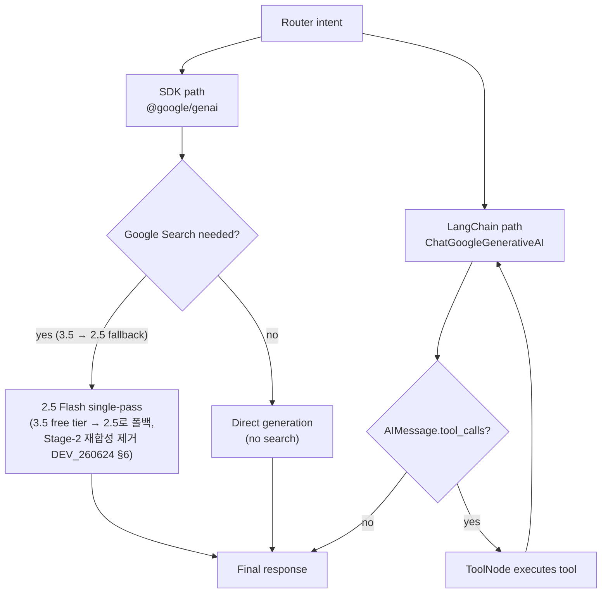
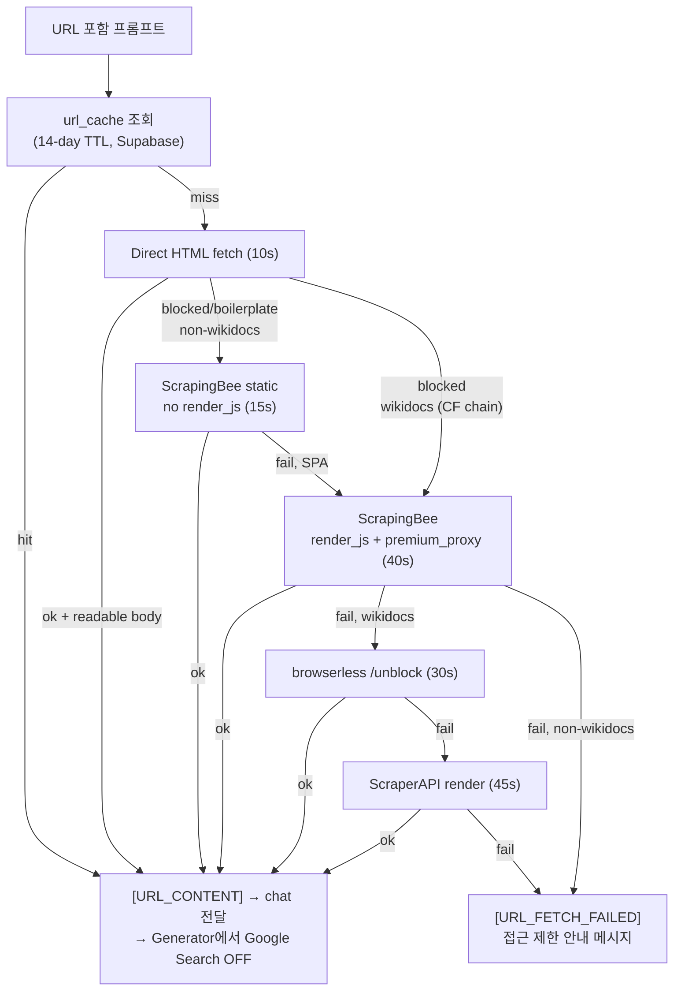
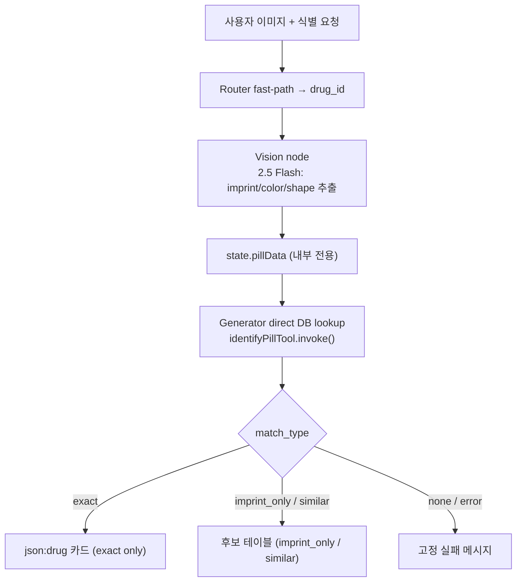

# REF: Architecture

> 작성일: 2026-06-26 · 최종 수정: 2026-08-01  
> 관련: [README §2](../../README.md#2-architecture) · [REF_App2_Agent](REF_App2_Agent.md)(에이전트 설계 근거)

상세 다이어그램과 런타임 정책을 모아둔 레퍼런스. README는 개요 다이어그램만 유지하고 상세는 여기에 기록한다.

---

## LangGraph Agent Flow


---

## Agent Runtime Branches

`generator.ts` 내부 두 실행 경로: SDK 경로(`@google/genai`) vs LangChain 경로(`ChatGoogleGenerativeAI`).



**Branch rules:**

| Path | Intents | Model |
|------|---------|-------|
| SDK | `general`, `medical_qa`, `astronomy`, `biology`, `chemistry`, `physics`, `data_viz` | `gemini-3.5-flash` (기본); search 시 `gemini-2.5-flash` single-pass |
| LangChain | `drug_id`, `drug_info`, `pharmacy_search`, `hospital_search`, `vet_search`, `law_search`, `movie_search`, `sports`, `weather` | `gemini-2.5-flash` (fast-pass intents: thinking off) |
| Vision (pill pre-process) | `drug_id` + image | `gemini-2.5-flash`, thinking off |

추가 규칙:
- **YouTube 영상 턴**: `isYoutubeRequest && hasVideoData` 시 `gemini-2.5-flash` 강제 (60s 초과 방지; DEV_260622 §7)
- **Multimodal + Search**: 동시 불가 → Google Search 강제 OFF
- **URL 컨텐츠 있을 때**: `[URL_CONTENT]` 주입 시 Google Search OFF (페이지 본문 우선) + 모델 `gemini-2.5-flash` + thinking off 고정 (throughput; DEV_260626 §2)
- **문서 첨부 시**: `[EXTRACTED_CONTENT:]` 있으면 grounding 기본 OFF, 사용자 명시 요청 시만 ON
- **Renderer intents**: Google Search 기본 OFF; 사용자가 "검색/최신/출처" 명시 시 ON
- **`sports` intent**: 전체 마크다운 표를 `on_chain_end` 단일 청크로 전송 (셀 단위 스트리밍 방지)

---

## URL Prefetch & Fallback Flow

URL이 포함된 프롬프트는 `/api/chat` 전에 `/api/fetch-url`에서 프리페치.  
캐시 히트 시 browserless/ScrapingBee 유닛 절약.



**폴백 요약:**
- non-wikidocs: Direct → ScrapingBee static(15s) → ScrapingBee render_js(40s) → FAILED
- wikidocs(Cloudflare): Direct → ScrapingBee render_js → browserless → ScraperAPI → FAILED
- 성공 응답은 `url_cache`에 upsert (14-day TTL)

---

## Pill Image Identification Flow



---

## Database & Storage Flow


DB 스키마 상세: [REF_DB.md](REF_DB.md)

---

## Intent Routing

| Intent | Path | Model |
|--------|------|-------|
| `drug_id` (image) | Router fast-path → Vision → direct DB lookup → exact card / candidate table | Vision: 2.5 Flash |
| `drug_info` | LangChain + `search_drug_info` / DDG fallback | 2.5 Flash |
| `pharmacy_search` | LangChain + pharmacy public API | 2.5 Flash |
| `hospital_search` | LangChain + HIRA hospital API | 2.5 Flash |
| `vet_search` | LangChain + animal hospital API | 2.5 Flash |
| `law_search` | LangChain + `lawTool` (Gemini normalization + Open API) | 2.5 Flash |
| `movie_search` | LangChain + `movieTool` → card가 `/api/showtimes` 클라이언트 fetch | 2.5 Flash |
| `weather` | LangChain + `weatherTool` (KMA + OpenWeather) → `json:weather` fast-pass | 2.5 Flash |
| `sports` | LangChain + `worldCupTool` (football-data.org, markdown) | 2.5 Flash |
| `medical_qa` | SDK + Google Search grounding | 3.5 Flash; search 시 2.5 single-pass |
| `biology` / `chemistry` / `physics` / `astronomy` / `data_viz` | SDK renderer | 3.5 Flash; Search 기본 OFF |
| `general` | SDK + `needsSearch` 3-gate classifier | 3.5 Flash; search 시 2.5 single-pass |

**Router:**
- LLM: `gemini-2.5-flash-lite`, `thinkingBudget:0` 명시
- 규칙 기반 폴백: `server/agent/intentRules.ts` (KO/EN/ES/FR 키워드)
- **단일 JSON 호출로 세 가지를 한 번에 판정**한다 — `intent` · `needs_search` · `follow_up`. 호출을 쪼개면 그만큼 지연이 붙고, 60s 캡 아래에서는 그게 곧 실패다.
- 판정 구조는 **3단**이다: ① 강한 규칙(확실한 것만) → ② 회색지대만 LLM → ③ 결정론적 폴백. `follow_up` LLM 판정은 `DISABLE_LLM_FOLLOWUP=1` 로 끄고 A/B 비교할 수 있다.
  - 영화 후속 판정에서 **물음표는 약한 신호**로 낮췄다. 강한 신호로 두면 `신촌은 어때?`(새 지역 요청)까지 후속으로 삼켜 카드가 안 뜬다(DEV_260801).

---

## Prompt Composition & Language

### 의도별 렌더러 스펙 주입

`server/agent/prompt.ts` 는 시스템 인스트럭션을 **base + 의도별 조각**으로 조립한다(`composeInstruction(langName, intent)`).

- 예전엔 렌더러 스펙 전부가 base 에 상주해 모든 턴에 주입됐다. **비용 문제가 아니라 문맥 오염 문제**였다 — base 의 `[WEATHER FORMATTING]`("날씨 정보엔 ALWAYS 5일 표")이 날씨와 무관한 `general` 턴까지 오염시켜 후속 대화에서 표가 재출력됐다(DEV_260731 §3-3). 암묵 캐싱 할인(78~98%)이 있어 길이 자체는 문제가 아니었다.
- `INTENT_RENDERERS` 가 의도 → 조각 목록을 결정한다. 예: `physics` → `diagram` + `chart`, `astronomy` → `constellation`, 약국·병원·법령 → **없음**(fast-pass 라 모델이 렌더러 블록을 쓸 일이 없다).
- `[TOOL AVAILABILITY]` — "ALWAYS use google_search" 류 지시가 도구를 바인딩하지 않는 렌더러 의도에까지 걸려 2.5가 `finishReason: UNEXPECTED_TOOL_CALL` 로 **빈 응답**을 냈다. 사용 가능한 도구를 의도별로 명시해 해결(DEV_260801 §8-3).

### 언어 표현 단일화

`server/agent/lang.ts` 가 서버 언어 표현의 단일 소스다.

| 계층 | 표현 | 예 |
|------|------|-----|
| 클라이언트 → API | `LangCode` | `'ko'`, `'en'`, `'es'`, `'fr'` |
| 프롬프트·렌더러 스펙 키 | `LangName` | `'Korean'`, `'English'`, … |

- `toLangName()` 은 **클라 입력을 신뢰하지 않는다** — 모르는 값이면 `Korean` 폴백.
- `langName` 이 `route.ts` → `compileAgentGraph` → 각 노드로 전달된다. 예전엔 `langchain-path` 가 **시스템 프롬프트 본문을 정규식으로 역추출**했는데, 프롬프트 첫 문장을 손대면 언어가 조용히 영어로 폴백되는 구조였다. 그 역추출은 제거됐다.
- 클라이언트 i18n(컴포넌트 문자열)은 별개 계층이다 — [PLAN_I18N_CLEANUP_260602](../plans/PLAN_I18N_CLEANUP_260602.md).

---

## Card Follow-up State

카드(날씨·영화)를 띄운 뒤의 후속 질문은 **카드를 다시 그리면 안 된다**. 관련 상태는 `server/agent/state.ts`.

| 필드 | 설정 주체 | 용도 |
|------|-----------|------|
| `activeCards` | **클라이언트** | 화면에 떠 있는 카드 종류 (`{ weather?: boolean }`) |
| `weatherFollowup` / `movieFollowup` | 라우터 | 이번 턴이 그 카드에 대한 후속인지 |
| `movieContext` | 클라이언트 | 화면의 상영표 요약(후속 답변 근거) |

**`activeCards` 가 클라이언트 판정인 이유**: 서버가 받는 히스토리는 최근 10개로 잘려 있다. 카드가 그 창 밖으로 밀리면 서버 스캔으로는 카드를 못 찾아 후속 판정이 통째로 꺼진다. 전체 히스토리를 가진 클라이언트가 20메시지 창으로 판정해 알려준다(`src/hooks/useChatStream.ts`). 구버전 클라(미전송)면 라우터의 창 내 스캔으로 폴백한다.

> 이 버그는 **로그에 `weatherCardShown` 을 찍기 전까지 오진했다.** "한국어 전용 규칙 때문에 영어가 실패한다"고 결론냈지만, 실제로는 규칙 도달 전에 카드 자체가 창 밖이었다. 영어 날씨 멀티턴 8/11 → 11/11 (DEV_260801 §9).

날씨·영화가 거의 같은 구조를 두 벌 갖고 있다. **세 번째 카드에 후속 판정이 필요해지면** 일반화한다 — 그 전까지는 쓰지 않는 추상화만 늘어난다([PLAN_BACKLOG_260801](../plans/PLAN_BACKLOG_260801.md) D1).

---

## Tool Inventory

| Tool | File | Purpose |
|------|------|---------|
| `identify_pill` | `server/agent/tools.ts` | MFDS `mfds_pills` 3-stage match (imprint/color/shape) + legacy fallback |
| `search_web` | `server/agent/tools.ts` | DuckDuckGo HTML fallback 검색 + 소스 추출 |
| `search_drug_info` | `server/agent/drug-info-tool.ts` | MFDS 약품 조회, 공식 이미지/상세, 비알약 fallback |
| `pharmacyTool` | `server/agent/pharmacy-tool.ts` | 전국 약국 검색 |
| `hospitalTool` | `server/agent/hospital-tool.ts` | HIRA 병원·의원 검색 |
| `vetTool` | `server/agent/vet-tool.ts` | 행정안전부 동물병원 검색 |
| `lawTool` | `server/agent/law-tool.ts` | 국가법령정보센터 법령 목록/본문/조항 조회 |
| `movieTool` | `server/agent/movie-tool.ts` | 지역 → 3-chain 기본 지점 (`json:movie`); 상영시간 클라이언트 fetch |
| `weatherTool` | `server/agent/weather-tool.ts` | 날씨 카드 (`json:weather`); KMA API Hub(국내, `dfsXyConv` 격자) + OpenWeather(해외·폴백), 다중 도시 |
| `worldCupTool` | `server/agent/worldcup-tool.ts` | FIFA WC 순위/대진/득점왕 (`lib/sports/football-data.ts`); markdown 출력 |

**지점 매칭 (`lib/theaters.ts`)** — 서버 툴과 클라 렌더러가 공유한다. `resolveBranch()` 는 매칭 성공 여부를 `matched` 로 같이 돌려주고, 지역을 말했는데 그 체인에 지점이 없으면 `defaultsForRegion()` 이 **`null`** 을 넣어 카드가 "지점이 없습니다"로 표시한다. 예전엔 조용히 기본 지점(가산디지털)으로 폴백해, `강남 상영표` 질문에 다른 동네 회차가 카드와 `movieContext` 에 섞여 들어갔다(DEV_260801 §3-3).

> 별칭은 **손으로 적는 맵**이다. 정규식으로 시·군·구 접미사를 깎는 방식은 `강남→강동`, `서면→매칭실패` 를 만들어 폐기했다(끝 글자 `동`·`면` 오인).

---

## Model Policy

| 용도 | 모델 |
|------|------|
| 기본 채팅 (SDK) | `gemini-3.5-flash` |
| YouTube 영상 분석 턴 | `gemini-2.5-flash` (영상 전송 턴만; 후속 텍스트는 3.5 복귀). **이유: 60s 캡** — 3.5는 영상 분석 59.2s로 천장 위험 (DEV_260622 §7) |
| 이미지·업로드 영상 턴 | `gemini-2.5-flash` + `thinkingBudget:0` (`hasMultimodalContent && !hasDocumentContent`; 최근 3턴 윈도우 내 미디어 재전송 동안 유지, 윈도우 밖이면 3.5 복귀). **이유: 60s 캡 + throughput** — 무료 3.5 이미지 분석 56s(2.5는 5s), Tier1 3.5는 3.5s (DEV_260626 §2) |
| URL 요약 턴 | `gemini-2.5-flash` + `thinkingBudget:0` (`[URL_CONTENT:` 주입 턴만; 후속은 3.5 복귀). **이유: throughput** — 본문이 답을 결정하는 추출성 작업, 3.5 무료티어 지연/503 회피 (DEV_260626 §2) |
| 외부 API 도구 인텐트 (LangChain) | `gemini-2.5-flash` (drug/pharmacy/hospital/vet/law/movie/sports; fast-pass = thinking off) |
| 알약 Vision 전처리 | `gemini-2.5-flash`, thinking off |
| 3.5 + Search grounding | `gemini-2.5-flash` single-pass (3.5 무료 티어 grounding 불가 → 2.5가 최종 답변 생성; Stage-2 재합성 제거 DEV_260624 §6) |
| 3.5 SDK 503/timeout 발생 시 | `gemini-2.5-flash`로 강등 후 재시도 (`unavailableDowngrade`; 같은 혼잡 3.5에 키 로테이션 무용). 호출당 25s `AbortSignal` 컷으로 Vercel 60s 캡 안에서 강등 예산 확보 (DEV_260626 §3 · DEV_260627 §3) |
| TTS | `gemini-2.5-flash-preview-tts` |
| 세션 제목 생성 | `gemini-2.5-flash-lite` (primary) / `gemini-2.5-flash` (fallback) |
| 라우터 | `gemini-2.5-flash-lite`, thinkingBudget:0 |

**정책 원칙:** 외부 API 도구 인텐트(tool JSON → 답변 구성)는 모델 추론보다 API 데이터가 답변의 질을 결정하므로 빠른 2.5로 고정. 일반 대화는 3.5 유지.

---

## Streaming & Source Handling

`app/api/chat/route.ts`가 LangGraph 스트림 이벤트를 소비해 SSE로 클라이언트에 전달.

- SDK 응답: `sendEvent`로 텍스트 직접 전달
- LangChain `on_chat_model_stream` 청크: Vision 노드 청크(내부 JSON 추출 데이터) 필터링 후 전달
- URL fetch 실패: 지역화된 접근 제한 안내로 short-circuit; 대체 검색 결과 요약 금지
- 툴 소스 URL: `[WEB_SOURCE_URLS]` 파싱 → 소스 칩으로 emit
- Fast-pass 렌더러: `json:pharmacy` / `json:hospital` / `json:vet` / `json:law` / `json:movie` / `json:weather` 블록을 추가 LLM 합성 없이 직접 스트림
- 스트리밍 완료 후 assistant 컨텐츠 Supabase 저장
- `utils/streamingMarkdown.ts` — `gateStreamingTables()`: 스트리밍 중 미완성 표 영역 숨김 (완성 시 통째 출현, 깜빡임 방지)

---

## Client Rendering Pipeline

`components/ChatMessage.tsx` 가 스트림 텍스트를 마크다운으로 렌더한다. 렌더러 카드는 ` ```json:<type> ` 펜스를 가로채 컴포넌트로 교체하고, 나머지는 `react-markdown` 이 처리한다.

```
remarkGfm → remarkMath({ singleDollarTextMath: false }) → remarkCjkFriendly   →  rehypeKatex
```

**순서와 옵션에 각각 이유가 있다:**

| 요소 | 이유 |
|------|------|
| `singleDollarTextMath: false` | 단일 `$` 를 수식으로 보면 `$100 ~ $200` 같은 금액이 수식으로 먹힌다. 대신 프롬프트가 `$$` 를 **의무**로 규정한다(DEV_260801 §3-1) |
| `remarkCjkFriendly` | CommonMark 우측 플랭킹 규칙상 닫는 `**` 가 **구두점 뒤 + 한글 조사 앞**이면 닫히지 않는다. `**1.40%**를` 가 원문 그대로 노출됐다(`**3.10%**,` 는 정상). "수치+단위+조사"는 한국어에서 흔해 재발 위험이 크다(DEV_260801 §3-4) |
| 순서 (gfm → cjk-friendly) | 플러그인 README 권장 순서 |

- 회귀 고정: `scripts/test-markdown-emphasis.mjs` — 강조가 **생겨야 하는** 케이스와 **생기면 안 되는** 케이스(`5 * 3 * 2`, `a_b_c`), `$$` 계약을 함께 잠근다. 이 조합을 바꾸면 돌린다.
  > `scripts/test-*` 는 `.gitignore` 대상이라 **레포에 올라가지 않는다**(로컬 검증용). 클론한 환경엔 없다.
- 차트 렌더러(`ChartRenderer.tsx`)는 결측값을 **`null` 로 보존**한다(ApexCharts 는 `null` 을 선 끊김으로 그린다). 예전엔 `0` 으로 채워 "없는 데이터"가 "값이 0"으로 보였다(DEV_260801 §3-2).

**텍스트 전처리는 최소로 유지한다.** 현재 남은 것은 `<br>` → `·` 치환과 `1~10` → `1&#126;10`(GFM 취소선 오인 방지) 둘뿐이다.

- 예전엔 한글 볼드 보정용 정규식이 세 군데 있었는데, **앞 강조의 닫는 `**` 와 뒤 강조의 여는 `**` 를 한 쌍으로 오인**해 뒤쪽 강조를 깨뜨렸다(DEV_260801 §3-4-1). 파서 규칙 문제를 정규식으로 우회하려던 시도였고, `remarkCjkFriendly` 도입으로 불필요해져 제거했다.
- 전처리를 추가·수정하면 `scripts/test-markdown-emphasis.mjs` 의 `preprocess()` 도 같이 맞춰야 한다. 그 스크립트 초판은 **파서만** 검사해 전처리 버그를 통과시켰다.

> 프롬프트와 렌더러는 **한 쌍으로 봐야 한다.** 프롬프트가 지시하는 형식을 렌더러가 실제로 처리하는지 확인하지 않으면, 모델 품질과 무관하게 100% 깨진다.
