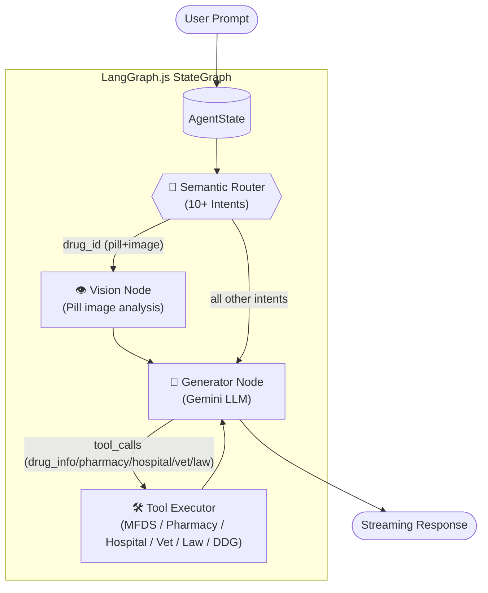
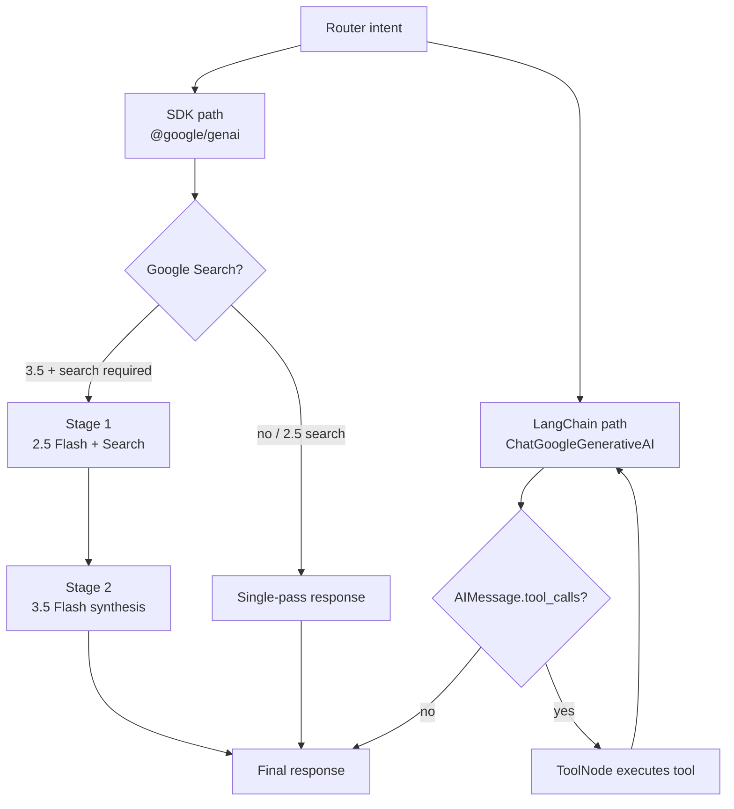
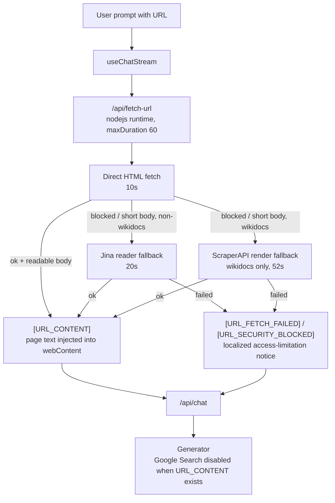
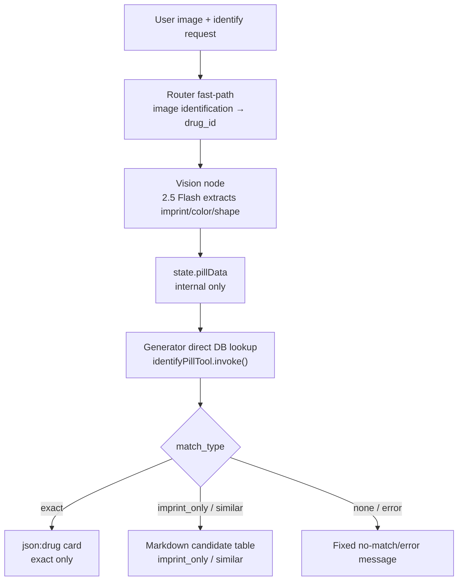
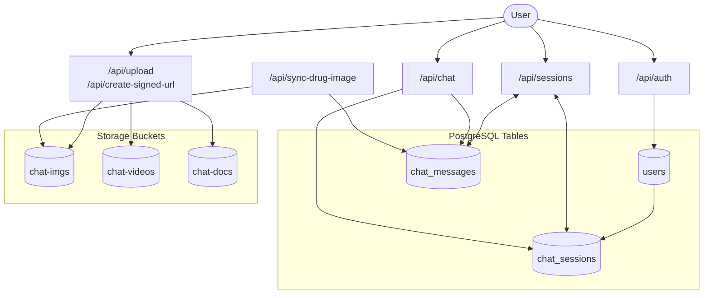

# REF: Architecture Diagrams

> Detailed architecture diagrams referenced from [README §2. Architecture](../../README.md#2-architecture).
> The README keeps two core diagrams inline (Agent & Tool Overview flowchart, Tool-Calling Loop sequence); the rest live here.

---

## LangGraph Agent Flow

High-level StateGraph node flow (router → vision/generator → tools → output).

---

## Agent Runtime Branches

The two execution paths inside `generator.ts` (SDK path vs LangChain path). See the README for the branch rules.

---

## URL Prefetch And Fallback Flow

Exact URL prompts are fetched before `/api/chat` so the generator can use the page body as the primary source and disable Google Search for that turn.

---

## Pill Image Identification Flow

Image identification fast-path: router → vision extraction → direct DB lookup → exact card / candidate table / failure.

---

## Database And Storage Flow

How API routes write to PostgreSQL tables and Storage buckets. See the README for the table/bucket reference.

