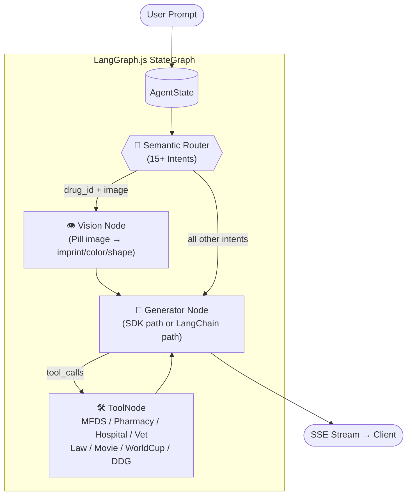
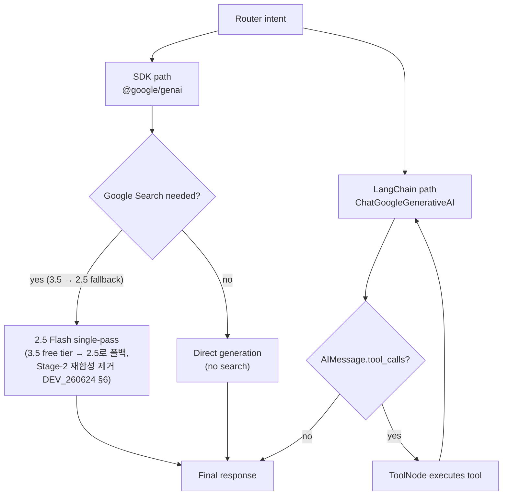
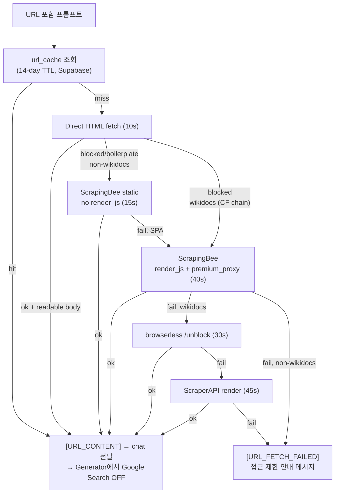
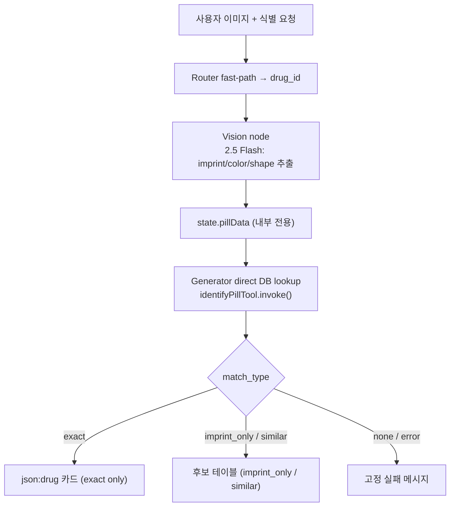
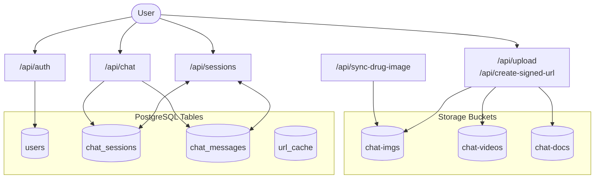

# REF: Architecture

> 작성일: 2026-06-26  
> 관련: [README §2](../../README.md#2-architecture)

상세 다이어그램과 런타임 정책을 모아둔 레퍼런스. README는 개요 다이어그램만 유지하고 상세는 여기에 기록한다.

---

## LangGraph Agent Flow

---

## Agent Runtime Branches

`generator.ts` 내부 두 실행 경로: SDK 경로(`@google/genai`) vs LangChain 경로(`ChatGoogleGenerativeAI`).

**Branch rules:**

| Path | Intents | Model |
|------|---------|-------|
| SDK | `general`, `medical_qa`, `astronomy`, `biology`, `chemistry`, `physics`, `data_viz` | `gemini-3.5-flash` (기본); search 시 `gemini-2.5-flash` single-pass |
| LangChain | `drug_id`, `drug_info`, `pharmacy_search`, `hospital_search`, `vet_search`, `law_search`, `movie_search`, `sports` | `gemini-2.5-flash` (fast-pass intents: thinking off) |
| Vision (pill pre-process) | `drug_id` + image | `gemini-2.5-flash`, thinking off |

추가 규칙:
- **YouTube 영상 턴**: `isYoutubeRequest && hasVideoData` 시 `gemini-2.5-flash` 강제 (60s 초과 방지; DEV_260622 §7)
- **Multimodal + Search**: 동시 불가 → Google Search 강제 OFF
- **URL 컨텐츠 있을 때**: `[URL_CONTENT]` 주입 시 Google Search OFF (페이지 본문 우선) + 모델 `gemini-2.5-flash` + thinking off 고정 (throughput; DEV_260626 §2)
- **문서 첨부 시**: `[EXTRACTED_CONTENT:]` 있으면 grounding 기본 OFF, 사용자 명시 요청 시만 ON
- **Renderer intents**: Google Search 기본 OFF; 사용자가 "검색/최신/출처" 명시 시 ON
- **`sports` intent**: 전체 마크다운 표를 `on_chain_end` 단일 청크로 전송 (셀 단위 스트리밍 방지)

---

## URL Prefetch & Fallback Flow

URL이 포함된 프롬프트는 `/api/chat` 전에 `/api/fetch-url`에서 프리페치.  
캐시 히트 시 browserless/ScrapingBee 유닛 절약.

**폴백 요약:**
- non-wikidocs: Direct → ScrapingBee static(15s) → ScrapingBee render_js(40s) → FAILED
- wikidocs(Cloudflare): Direct → ScrapingBee render_js → browserless → ScraperAPI → FAILED
- 성공 응답은 `url_cache`에 upsert (14-day TTL)

---

## Pill Image Identification Flow

---

## Database & Storage Flow

DB 스키마 상세: [REF_DB.md](REF_DB.md)

---

## Intent Routing

| Intent | Path | Model |
|--------|------|-------|
| `drug_id` (image) | Router fast-path → Vision → direct DB lookup → exact card / candidate table | Vision: 2.5 Flash |
| `drug_info` | LangChain + `search_drug_info` / DDG fallback | 2.5 Flash |
| `pharmacy_search` | LangChain + pharmacy public API | 2.5 Flash |
| `hospital_search` | LangChain + HIRA hospital API | 2.5 Flash |
| `vet_search` | LangChain + animal hospital API | 2.5 Flash |
| `law_search` | LangChain + `lawTool` (Gemini normalization + Open API) | 2.5 Flash |
| `movie_search` | LangChain + `movieTool` → card가 `/api/showtimes` 클라이언트 fetch | 2.5 Flash |
| `sports` | LangChain + `worldCupTool` (football-data.org, markdown) | 2.5 Flash |
| `medical_qa` | SDK + Google Search grounding | 3.5 Flash; search 시 2.5 single-pass |
| `biology` / `chemistry` / `physics` / `astronomy` / `data_viz` | SDK renderer | 3.5 Flash; Search 기본 OFF |
| `general` | SDK + `needsSearch` 3-gate classifier | 3.5 Flash; search 시 2.5 single-pass |

**Router:**
- LLM: `gemini-2.5-flash-lite`, `thinkingBudget:0` 명시
- 규칙 기반 폴백: `server/agent/intentRules.ts` (KO/EN/ES/FR 키워드)

---

## Tool Inventory

| Tool | File | Purpose |
|------|------|---------|
| `identify_pill` | `server/agent/tools.ts` | MFDS `mfds_pills` 3-stage match (imprint/color/shape) + legacy fallback |
| `search_web` | `server/agent/tools.ts` | DuckDuckGo HTML fallback 검색 + 소스 추출 |
| `search_drug_info` | `server/agent/drug-info-tool.ts` | MFDS 약품 조회, 공식 이미지/상세, 비알약 fallback |
| `pharmacyTool` | `server/agent/pharmacy-tool.ts` | 전국 약국 검색 |
| `hospitalTool` | `server/agent/hospital-tool.ts` | HIRA 병원·의원 검색 |
| `vetTool` | `server/agent/vet-tool.ts` | 행정안전부 동물병원 검색 |
| `lawTool` | `server/agent/law-tool.ts` | 국가법령정보센터 법령 목록/본문/조항 조회 |
| `movieTool` | `server/agent/movie-tool.ts` | 지역 → 3-chain 기본 지점 (`json:movie`); 상영시간 클라이언트 fetch |
| `worldCupTool` | `server/agent/worldcup-tool.ts` | FIFA WC 순위/대진/득점왕 (`lib/sports/football-data.ts`); markdown 출력 |

---

## Model Policy

| 용도 | 모델 |
|------|------|
| 기본 채팅 (SDK) | `gemini-3.5-flash` |
| YouTube 영상 분석 턴 | `gemini-2.5-flash` (영상 전송 턴만; 후속 텍스트는 3.5 복귀). **이유: 60s 캡** — 3.5는 영상 분석 59.2s로 천장 위험 (DEV_260622 §7) |
| 이미지·업로드 영상 턴 | `gemini-2.5-flash` + `thinkingBudget:0` (`hasMultimodalContent && !hasDocumentContent`; 최근 3턴 윈도우 내 미디어 재전송 동안 유지, 윈도우 밖이면 3.5 복귀). **이유: 60s 캡 + throughput** — 무료 3.5 이미지 분석 56s(2.5는 5s), Tier1 3.5는 3.5s (DEV_260626 §2) |
| URL 요약 턴 | `gemini-2.5-flash` + `thinkingBudget:0` (`[URL_CONTENT:` 주입 턴만; 후속은 3.5 복귀). **이유: throughput** — 본문이 답을 결정하는 추출성 작업, 3.5 무료티어 지연/503 회피 (DEV_260626 §2) |
| 외부 API 도구 인텐트 (LangChain) | `gemini-2.5-flash` (drug/pharmacy/hospital/vet/law/movie/sports; fast-pass = thinking off) |
| 알약 Vision 전처리 | `gemini-2.5-flash`, thinking off |
| 3.5 + Search grounding | `gemini-2.5-flash` single-pass (3.5 무료 티어 grounding 불가 → 2.5가 최종 답변 생성; Stage-2 재합성 제거 DEV_260624 §6) |
| 3.5 SDK 503 발생 시 | `gemini-2.5-flash`로 강등 후 재시도 (`unavailableDowngrade`; 같은 혼잡 3.5에 키 로테이션 무용; DEV_260626 §3) |
| TTS | `gemini-2.5-flash-preview-tts` |
| 세션 제목 생성 | `gemini-2.5-flash-lite` (primary) / `gemini-2.5-flash` (fallback) |
| 라우터 | `gemini-2.5-flash-lite`, thinkingBudget:0 |

**정책 원칙:** 외부 API 도구 인텐트(tool JSON → 답변 구성)는 모델 추론보다 API 데이터가 답변의 질을 결정하므로 빠른 2.5로 고정. 일반 대화는 3.5 유지.

---

## Streaming & Source Handling

`app/api/chat/route.ts`가 LangGraph 스트림 이벤트를 소비해 SSE로 클라이언트에 전달.

- SDK 응답: `sendEvent`로 텍스트 직접 전달
- LangChain `on_chat_model_stream` 청크: Vision 노드 청크(내부 JSON 추출 데이터) 필터링 후 전달
- URL fetch 실패: 지역화된 접근 제한 안내로 short-circuit; 대체 검색 결과 요약 금지
- 툴 소스 URL: `[WEB_SOURCE_URLS]` 파싱 → 소스 칩으로 emit
- Fast-pass 렌더러: `json:pharmacy` / `json:hospital` / `json:vet` / `json:law` / `json:movie` 블록을 추가 LLM 합성 없이 직접 스트림
- 스트리밍 완료 후 assistant 컨텐츠 Supabase 저장
- `utils/streamingMarkdown.ts` — `gateStreamingTables()`: 스트리밍 중 미완성 표 영역 숨김 (완성 시 통째 출현, 깜빡임 방지)
