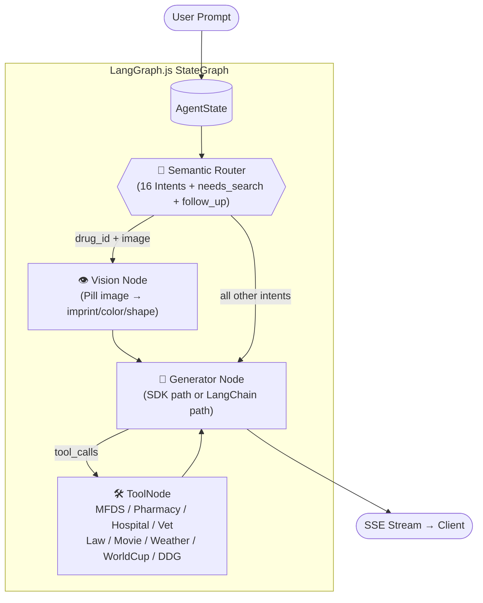
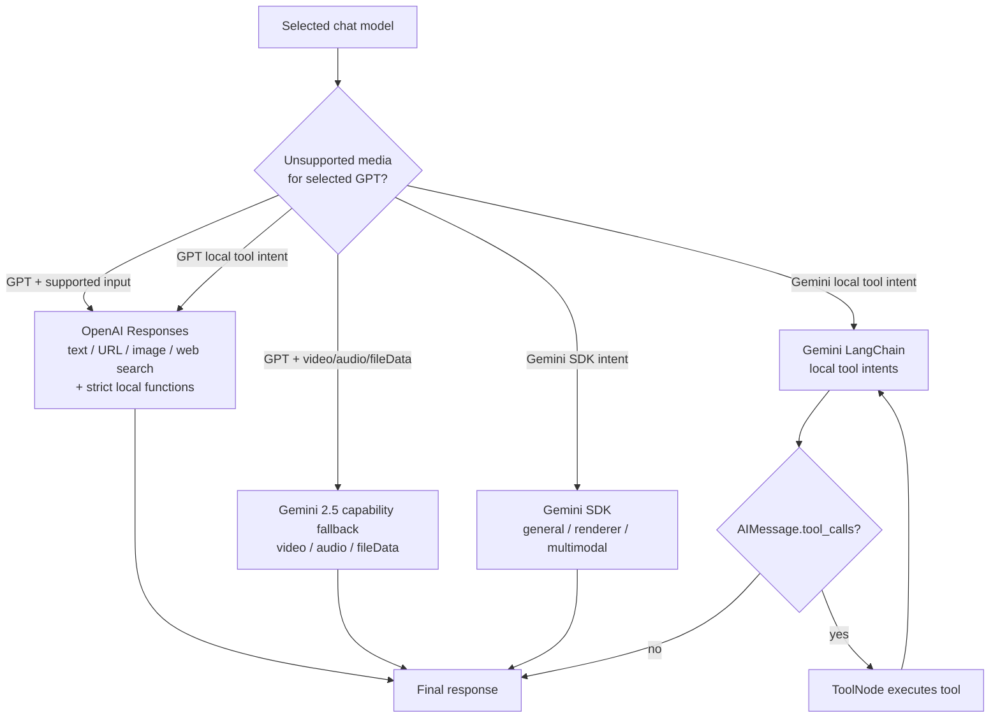
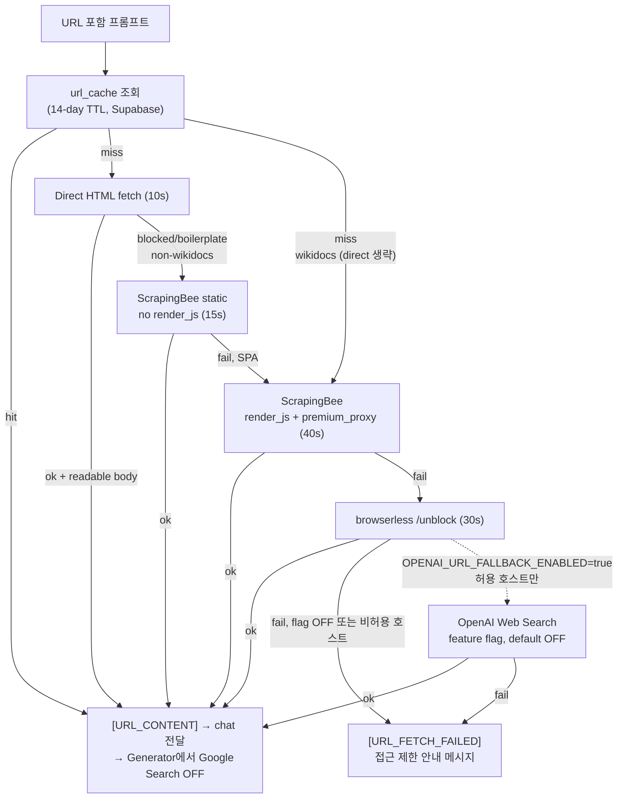
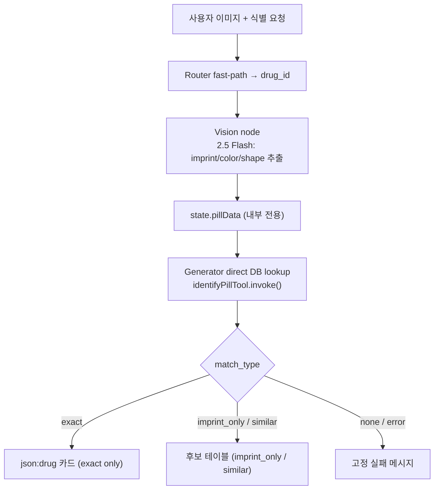
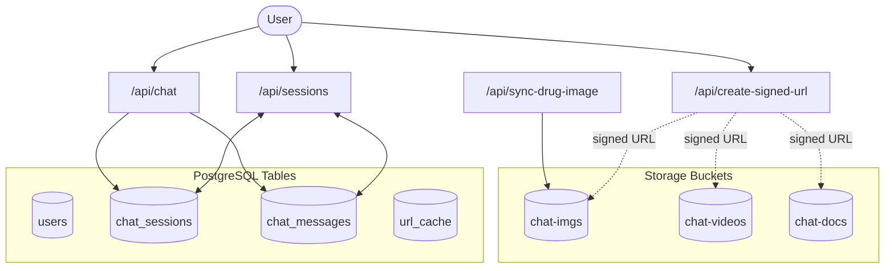

# REF: Architecture

> 작성일: 2026-06-26 · 최종 수정: 2026-08-23
> 관련: [README §2](../../README.md#2-architecture) · [REF_App2_Agent](REF_App2_Agent.md)(에이전트 설계 근거)

상세 다이어그램과 런타임 정책을 모아둔 레퍼런스. README는 개요 다이어그램만 유지하고 상세는 여기에 기록한다.

---

## LangGraph Agent Flow



---

## Agent Runtime Branches

`generator.ts`는 선택 모델과 입력 capability에 따라 OpenAI Responses, Gemini SDK, Gemini LangChain 경로를 고른다. 초기 intent router는 아직 Gemini 우선이지만, GPT 일반 생성과 로컬 도구 실행은 Gemini 키와 분리돼 있다.



**Branch rules:**

| Path | Intents | Model |
|------|---------|-------|
| OpenAI Responses | GPT 선택 시 일반 텍스트, URL 본문, 이미지, 웹 검색, 로컬 도구 8종 | 선택한 GPT 모델 유지 |
| Gemini SDK | `general`, `medical_qa`, `astronomy`, `biology`, `chemistry`, `physics`, `data_viz` | 선택한 Gemini 모델; capability/search 정책에 따라 2.5 사용 |
| LangChain | `drug_id`, `drug_info`, `pharmacy_search`, `hospital_search`, `vet_search`, `law_search`, `movie_search`, `sports`, `weather` | `gemini-2.5-flash` (fast-pass intents: thinking off) |
| Vision (pill pre-process) | `drug_id` + image | `gemini-2.5-flash`, thinking off |

추가 규칙:
- **GPT 로컬 도구**: strict 함수 1개를 intent별로 강제하고 병렬 호출은 끈다. 날씨·영화·약국·병원·동물병원·법령은 카드 블록 fast-pass, 약품·스포츠는 함수 결과를 같은 GPT가 종합한다
- **GPT 약품 검색**: MFDS 로컬 조회 뒤 OpenAI `web_search`를 사용하며 내부 Gemini 검색으로 전환하지 않는다
- **GPT + YouTube 원본/업로드 영상·오디오/fileData**: `gemini-2.5-flash` capability fallback
- **YouTube 자막이 텍스트로 확보된 경우**: 선택 모델 유지
- **Multimodal + Search**: 동시 불가 → Google Search 강제 OFF
- **URL 컨텐츠 있을 때**: `[URL_CONTENT]` 주입 시 별도 Google Search는 OFF하고 페이지 본문을 선택 모델이 처리. Gemini 3.x는 모델별 long-input capability 정책 적용
- **문서 첨부 시**: `[EXTRACTED_CONTENT:]` 있으면 grounding 기본 OFF, 사용자 명시 요청 시만 ON
- **Renderer intents**: Google Search 기본 OFF; 사용자가 "검색/최신/출처" 명시 시 ON
- **`sports` intent**: 전체 마크다운 표를 `on_chain_end` 단일 청크로 전송 (셀 단위 스트리밍 방지)

---

## URL Prefetch & Fallback Flow

URL이 포함된 프롬프트는 `/api/chat` 전에 `/api/fetch-url`에서 프리페치.  
캐시 히트 시 browserless/ScrapingBee 유닛 절약.



**폴백 요약:**
- 일반 URL: Direct → ScrapingBee static(15s) → ScrapingBee render_js/premium/KR(40s) → browserless(30s) → FAILED
- Wikidocs(Cloudflare): Direct 생략 → ScrapingBee render_js/premium/KR → browserless → FAILED
- OpenAI Web Search는 기본 OFF. `OPENAI_URL_FALLBACK_ENABLED=true`일 때 허용 호스트에서만 최후단 보조 폴백
- ScraperAPI는 2026-08-22 실측 500/55.8s 후 체인에서 제외
- 성공 응답은 `url_cache`에 upsert (14-day TTL)

**2026-08-23 실측:** GeekNews는 Chrome/141 direct 200·169ms·7,604자로 유료 호출 없이 끝난다. Brunch 실주소는 direct redirect loop 후 ScrapingBee static 200·8.89s·4,507자, Wikidocs 신규 글은 ScrapingBee render/premium/KR 200·5.66s·12,460자로 확인했다. 세부 표는 [DEV_260823](../logs/2026/08/DEV_260823.md)을 따른다.

---

## Pill Image Identification Flow



---

## Database & Storage Flow



> **업로드는 파일이 함수를 거치지 않는다** — `/api/create-signed-url` 은 서명만 발급하고,
> 브라우저가 Storage 로 직접 PUT 한다(점선). 서버 경유 방식(`/api/upload`)은 본문 4.5MB 한도·
> 함수 타임아웃·메모리 때문에 2026-03-09 에 대체됐고, **2026-08-17 에 라우트를 삭제**했다.
> `/api/auth` 도 인증 MVP 때 소멸했다(IDOR-1). 경로 규약: `${auth.uid()}/{timestamp}_{name}`.

DB 스키마 상세: [REF_DB.md](REF_DB.md)

---

## Intent Routing

| Intent | Path | Model |
|--------|------|-------|
| `drug_id` (image) | Router fast-path → Vision → direct DB lookup → exact card / candidate table | Vision: 2.5 Flash |
| `drug_info` | Gemini: LangChain+Google/DDG · GPT: strict function→MFDS→OpenAI web search→GPT 합성 | 선택 공급자 |
| `pharmacy_search` | 공급자별 function calling + pharmacy public API fast-pass | 선택 공급자 |
| `hospital_search` | 공급자별 function calling + HIRA hospital API fast-pass | 선택 공급자 |
| `vet_search` | 공급자별 function calling + animal hospital API fast-pass | 선택 공급자 |
| `law_search` | 공급자별 function calling + 국가법령 Open API fast-pass | 선택 공급자 |
| `movie_search` | 공급자별 function calling → card가 `/api/showtimes` 클라이언트 fetch | 선택 공급자 |
| `weather` | 공급자별 function calling + KMA/OpenWeather → `json:weather` fast-pass | 선택 공급자 |
| `weather` **후속** | 라우터가 `general` 로 강등(`weatherFollowup`) → SDK 경로 + 검색 OFF → **히스토리 카드로 산문 답변**. fast-pass를 타지 않는다 | — |
| `sports` | 공급자별 function calling + football-data.org, 선택 모델이 Markdown 종합 | 선택 공급자 |
| `medical_qa` | 선택 공급자 일반 생성 + 필요 시 검색 | 선택 모델; Gemini는 모델별 search capability 적용 |
| `biology` / `chemistry` / `physics` / `astronomy` / `data_viz` | 선택 공급자 renderer 경로 | 선택 모델; Search 기본 OFF |
| `general` | 선택 공급자 생성 + `needsSearch` 3-gate classifier | 선택 모델 |

**Router:**
- LLM: 현재 `gemini-2.5-flash-lite`, `thinkingBudget:0` 명시. GPT가 선택돼도 이 선행 의존성이 남아 있으며 공급자별 router 분리는 [멀티 공급자 라우팅 계획](../plans/PLAN_MULTI_PROVIDER_ROUTING_260823.md)의 P0이다
- 규칙 기반 폴백: `server/agent/intentRules.ts` (KO/EN/ES/FR 키워드)
  - **폴백은 확신할 때만 잡는다 — 재현율보다 정밀도가 우선.** 놓친 것은 `general`이 받아주지만(검색 붙고 산문으로 답함), 잘못 잡은 것은 받아줄 곳이 없다(렌더러 스펙 주입 + 검색 OFF). 한국어는 공백 없이 결합해 `\b`가 안 먹으므로 **단독 명사는 대개 문맥 동반을 요구해야 한다** — `힘`·`속도`·`날씨`·`병원`·`달`이 전부 이 이유로 좁혀졌다(PLAN_INTENT_RULES_PRECISION_260816).
  - `FALLBACK_RULES` **배열 순서 = 우선순위**(first-match-wins). 특히 `vet_search`가 `hospital_search`보다 **앞이어야 한다** — `동물병원`의 `병원`이 먼저 걸리면 수의 경로가 죽는다. `data_viz`는 맨 끝(`차트`·`그래프`는 모든 분야와 결합).
  - 검증: `npx tsx tests/test-intent-rules.mts` — 양방향(잡아야 할 것 / 잡으면 안 될 것) 채점. **정규식을 복사하지 않고 프로덕션을 import한다.**
- **단일 JSON 호출로 세 가지를 한 번에 판정**한다 — `intent` · `needs_search` · `follow_up`. `/api/chat`의 현재 `maxDuration=300`과 무관하게 선행 호출을 쪼개면 TTFT와 공급자 실패 지점이 늘어난다.
- 판정 구조는 **3단**이다: ① 강한 규칙(확실한 것만) → ② 회색지대만 LLM → ③ 결정론적 폴백. `follow_up` LLM 판정은 `DISABLE_LLM_FOLLOWUP=1` 로 끄고 A/B 비교할 수 있다.
  - 영화 후속 판정에서 **물음표는 약한 신호**로 낮췄다. 강한 신호로 두면 `신촌은 어때?`(새 지역 요청)까지 후속으로 삼켜 카드가 안 뜬다(DEV_260801).
  - 🔴 **3단 구조는 1단이 넓으면 무너진다.** 날씨 후속에서 `날씨 + 알려/줘`가 1단(새 조회)에 있어 날씨를 묻는 **모든** 자연스러운 발화가 거기서 끝났고, 2·3단은 **사실상 죽은 코드**였다. 사용자가 같은 걸 세 번 물어도 카드만 세 번 뜨고 한 번도 답하지 않았다. → 판정 축을 *"날씨를 물었나"* 에서 **"화면에 없는 도시가 나왔나"** 로 교체(2026-08-17, DEV_260815_DEPLOY_CHECK §5차).
- 날씨 후속 판정은 `server/agent/weather-followup.ts` 의 **순수 함수**다(하니스가 임포트해야 해서 라우터 인라인에서 분리).
  - 검증: `npx tsx tests/test-weather-followup.mts`.
  - **닫힌 부류만 거부목록으로 다룬다**(지시어·담화표지·시간어). 도시명은 열린 부류라 사전(`isKnownCityName`, `server/lib/weather`의 `CITY_ALIASES` 재사용)으로 판정한다. 거부목록에 `아니`가 없어서 `아니 날씨 추세 알려줘`의 `아니`가 도시로 잡히던 결함이 이 구분을 만들었다.

---

## Prompt Composition & Language

### 의도별 렌더러 스펙 주입

`server/agent/prompt.ts` 는 시스템 인스트럭션을 **base + 의도별 조각**으로 조립한다. 조립은 한 함수가 아니라 **두 지점에 나뉘어** 있다 — base 는 [route.ts](../../app/api/chat/route.ts) 가 `getSystemInstruction(langName)` 으로 만들어 그래프 상태에 싣고, 렌더러 스펙(`getRendererSections`)과 의도 힌트(`getIntentFocusHint`)는 의도가 확정된 뒤 [generator.ts](../../server/agent/nodes/generator.ts) 가 붙인다. 순서는 **base → 렌더러 스펙 → 의도 힌트** 로 동일하다(base 선두 고정 = 암묵 캐싱 프리픽스 유지).

- 예전엔 렌더러 스펙 전부가 base 에 상주해 모든 턴에 주입됐다. **비용 문제가 아니라 문맥 오염 문제**였다 — base 의 `[WEATHER FORMATTING]`("날씨 정보엔 ALWAYS 5일 표")이 날씨와 무관한 `general` 턴까지 오염시켜 후속 대화에서 표가 재출력됐다(DEV_260731 §3-3). 암묵 캐싱 할인(78~98%)이 있어 길이 자체는 문제가 아니었다.
- `INTENT_RENDERERS` 가 의도 → 조각 목록을 결정한다. 예: `physics` → `diagram` + `chart`, `astronomy` → `constellation`, 약국·병원·법령 → **없음**(fast-pass 라 모델이 렌더러 블록을 쓸 일이 없다).
- `[TOOL AVAILABILITY]` — "ALWAYS use google_search" 류 지시가 도구를 바인딩하지 않는 렌더러 의도에까지 걸려 2.5가 `finishReason: UNEXPECTED_TOOL_CALL` 로 **빈 응답**을 냈다. 사용 가능한 도구를 의도별로 명시해 해결(DEV_260801 §8-3).

### 언어 표현 단일화

`server/agent/lang.ts` 가 서버 언어 표현의 단일 소스다.

| 계층 | 표현 | 예 |
|------|------|-----|
| 클라이언트 → API | `LangCode` | `'ko'`, `'en'`, `'es'`, `'fr'` |
| 프롬프트·렌더러 스펙 키 | `LangName` | `'Korean'`, `'English'`, … |

- `toLangName()` 은 **클라 입력을 신뢰하지 않는다** — 모르는 값이면 `Korean` 폴백.
- `langName` 이 `route.ts` → `compileAgentGraph` → 각 노드로 전달된다. 예전엔 `langchain-path` 가 **시스템 프롬프트 본문을 정규식으로 역추출**했는데, 프롬프트 첫 문장을 손대면 언어가 조용히 영어로 폴백되는 구조였다. 그 역추출은 제거됐다.
- 클라이언트 i18n(컴포넌트 문자열)은 별개 계층이다 — [PLAN_I18N_CLEANUP_260602](../plans/PLAN_I18N_CLEANUP_260602.md).

---

## Card Follow-up State

카드(날씨·영화)를 띄운 뒤의 후속 질문은 **카드를 다시 그리면 안 된다**. 관련 상태는 `server/agent/state.ts`.

| 필드 | 설정 주체 | 용도 |
|------|-----------|------|
| `activeCards` | **클라이언트** | 화면에 떠 있는 카드 종류 (`{ weather?: boolean }`) |
| `weatherFollowup` / `movieFollowup` | 라우터 | 이번 턴이 그 카드에 대한 후속인지 |
| `movieContext` | 클라이언트 | 화면의 상영표 요약(후속 답변 근거) |

**`activeCards` 가 클라이언트 판정인 이유**: 서버가 받는 히스토리는 최근 10개로 잘려 있다. 카드가 그 창 밖으로 밀리면 서버 스캔으로는 카드를 못 찾아 후속 판정이 통째로 꺼진다. 전체 히스토리를 가진 클라이언트가 20메시지 창으로 판정해 알려준다(`src/hooks/useChatStream.ts`). 구버전 클라(미전송)면 라우터의 창 내 스캔으로 폴백한다.

> 이 버그는 **로그에 `weatherCardShown` 을 찍기 전까지 오진했다.** "한국어 전용 규칙 때문에 영어가 실패한다"고 결론냈지만, 실제로는 규칙 도달 전에 카드 자체가 창 밖이었다. 영어 날씨 멀티턴 8/11 → 11/11 (DEV_260801 §9).

**카드가 떠 있다(boolean)로는 부족하다 — 어느 도시인지도 있어야 한다.** 라우터가 히스토리의 `json:weather` 에서 `location.name` 을 모아(`shownWeatherCities`) 후속 판정에 넘긴다. 이게 없으면 서울 카드가 떠 있는 상태에서 `내일 부산 비와?` 에 **서울 데이터로 답한다** — 카드가 하나 더 뜨는 것보다 나쁜 실패다(2026-08-17).

날씨·영화가 거의 같은 구조를 두 벌 갖고 있다. **세 번째 카드에 후속 판정이 필요해지면** 일반화한다 — 그 전까지는 쓰지 않는 추상화만 늘어난다([PLAN_BACKLOG_260801](../plans/PLAN_BACKLOG_260801.md) D1).

---

## Tool Inventory

| Tool | File | Purpose |
|------|------|---------|
| `identify_pill` | `server/agent/tools.ts` | MFDS `mfds_pills` 3-stage match (imprint/color/shape) + legacy fallback |
| `search_web` | `server/agent/tools.ts` | DuckDuckGo HTML fallback 검색 + 소스 추출 |
| `search_drug_info` | `server/agent/drug-info-tool.ts` | MFDS 약품 조회, 공식 이미지/상세, 비알약 fallback |
| `pharmacyTool` | `server/agent/pharmacy-tool.ts` | 전국 약국 검색 |
| `hospitalTool` | `server/agent/hospital-tool.ts` | HIRA 병원·의원 검색 |
| `vetTool` | `server/agent/vet-tool.ts` | 행정안전부 동물병원 검색 |
| `lawTool` | `server/agent/law-tool.ts` | 국가법령정보센터 법령 목록/본문/조항 조회 |
| `movieTool` | `server/agent/movie-tool.ts` | 지역 → 3-chain 기본 지점 (`json:movie`); 상영시간 클라이언트 fetch |
| `weatherTool` | `server/agent/weather-tool.ts` | 날씨 카드 (`json:weather`); KMA API Hub(국내, `dfsXyConv` 격자) + OpenWeather(해외·폴백), 다중 도시 |
| `worldCupTool` | `server/agent/worldcup-tool.ts` | FIFA WC 순위/대진/득점왕 (`lib/sports/football-data.ts`); markdown 출력 |

**지점 매칭 (`lib/theaters.ts`)** — 서버 툴과 클라 렌더러가 공유한다. `resolveBranch()` 는 매칭 성공 여부를 `matched` 로 같이 돌려주고, 지역을 말했는데 그 체인에 지점이 없으면 `defaultsForRegion()` 이 **`null`** 을 넣어 카드가 "지점이 없습니다"로 표시한다. 예전엔 조용히 기본 지점(가산디지털)으로 폴백해, `강남 상영표` 질문에 다른 동네 회차가 카드와 `movieContext` 에 섞여 들어갔다(DEV_260801 §3-3).

> 별칭은 **손으로 적는 맵**이다. 정규식으로 시·군·구 접미사를 깎는 방식은 `강남→강동`, `서면→매칭실패` 를 만들어 폐기했다(끝 글자 `동`·`면` 오인).

---

## Model Policy

| 용도 | 모델 |
|------|------|
| 기본 채팅 | `gemini-3.6-flash` |
| 선택 가능 모델 | Gemini 3.7 / 3.6 / 3.5 / 2.5 Flash, GPT-5.4 mini, GPT-5.6 Luna |
| GPT 일반 텍스트·URL 본문·이미지·웹 검색 | 선택한 GPT 유지. GPT 쿼터/API 오류를 Gemini 답변으로 숨겨 전환하지 않음 |
| GPT + YouTube 원본·업로드 영상/오디오·fileData | `gemini-2.5-flash` capability fallback. 텍스트 자막이면 GPT 유지 |
| Gemini 일반·URL·검색·멀티모달 | 선택한 Gemini를 우선하고 `MODEL_CAPS`의 search/long-input/multimodal/fileData 축에 따라 2.5 fallback |
| 외부 API 도구 인텐트 (LangChain) | `gemini-2.5-flash` (drug/pharmacy/hospital/vet/law/movie/sports; fast-pass = thinking off) |
| 알약 Vision 전처리 | `gemini-2.5-flash`, thinking off |
| TTS | `gemini-2.5-flash-preview-tts` |
| 세션 제목 생성 | `gemini-2.5-flash-lite` (primary) / `gemini-2.5-flash` (fallback) |
| 초기 라우터 (현재) | `gemini-2.5-flash-lite`, thinkingBudget:0. GPT 선택 시에도 Gemini 키를 먼저 요구하는 충돌은 미해결 |

**정책 원칙:** 일반 입력은 선택 모델을 유지하고, 공급자 간 자동 전환은 unsupported modality에만 허용한다. 쿼터·결제·인증·일시 장애는 다른 공급자로 넘기지 않으며 사용자에게 정제된 안내만 보여준다. 현재 Gemini 선행 router와 GPT 로컬 도구 호출 미구현은 [PLAN_MULTI_PROVIDER_ROUTING_260823](../plans/PLAN_MULTI_PROVIDER_ROUTING_260823.md)에 추적한다.

---

## Streaming & Source Handling

`app/api/chat/route.ts`가 LangGraph 스트림 이벤트를 소비해 SSE로 클라이언트에 전달.

- SDK 응답: `sendEvent`로 텍스트 직접 전달
- LangChain `on_chat_model_stream` 청크: Vision 노드 청크(내부 JSON 추출 데이터) 필터링 후 전달
- URL fetch 실패: 지역화된 접근 제한 안내로 short-circuit; 대체 검색 결과 요약 금지
- 툴 소스 URL: `[WEB_SOURCE_URLS]` 파싱 → 소스 칩으로 emit
- Fast-pass 렌더러: `json:pharmacy` / `json:hospital` / `json:vet` / `json:law` / `json:movie` / `json:weather` 블록을 추가 LLM 합성 없이 직접 스트림
- 스트리밍 완료 후 assistant 컨텐츠 Supabase 저장
- `utils/streamingMarkdown.ts` — `gateStreamingTables()`: 스트리밍 중 미완성 표 영역 숨김 (완성 시 통째 출현, 깜빡임 방지)

---

## Client Rendering Pipeline

`components/ChatMessage.tsx` 가 스트림 텍스트를 마크다운으로 렌더한다. 렌더러 카드는 ` ```json:<type> ` 펜스를 가로채 컴포넌트로 교체하고, 나머지는 `react-markdown` 이 처리한다.

```
remarkGfm → remarkMath({ singleDollarTextMath: false }) → remarkCjkFriendly   →  rehypeKatex
```

**순서와 옵션에 각각 이유가 있다:**

| 요소 | 이유 |
|------|------|
| `singleDollarTextMath: false` | 단일 `$` 를 수식으로 보면 `$100 ~ $200` 같은 금액이 수식으로 먹힌다. 대신 프롬프트가 `$$` 를 **의무**로 규정한다(DEV_260801 §3-1) |
| `remarkCjkFriendly` | CommonMark 우측 플랭킹 규칙상 닫는 `**` 가 **구두점 뒤 + 한글 조사 앞**이면 닫히지 않는다. `**1.40%**를` 가 원문 그대로 노출됐다(`**3.10%**,` 는 정상). "수치+단위+조사"는 한국어에서 흔해 재발 위험이 크다(DEV_260801 §3-4) |
| 순서 (gfm → cjk-friendly) | 플러그인 README 권장 순서 |

- 회귀 고정: `scripts/test-markdown-emphasis.mjs` — 강조가 **생겨야 하는** 케이스와 **생기면 안 되는** 케이스(`5 * 3 * 2`, `a_b_c`), `$$` 계약을 함께 잠근다. 이 조합을 바꾸면 돌린다.
  > `scripts/test-*` 는 `.gitignore` 대상이라 **레포에 올라가지 않는다**(로컬 검증용). 클론한 환경엔 없다.
- 차트 렌더러(`ChartRenderer.tsx`)는 결측값을 **`null` 로 보존**한다(ApexCharts 는 `null` 을 선 끊김으로 그린다). 예전엔 `0` 으로 채워 "없는 데이터"가 "값이 0"으로 보였다(DEV_260801 §3-2).

**텍스트 전처리는 최소로 유지한다.** 현재 남은 것은 `<br>` → `·` 치환과 `1~10` → `1&#126;10`(GFM 취소선 오인 방지) 둘뿐이다.

- 예전엔 한글 볼드 보정용 정규식이 세 군데 있었는데, **앞 강조의 닫는 `**` 와 뒤 강조의 여는 `**` 를 한 쌍으로 오인**해 뒤쪽 강조를 깨뜨렸다(DEV_260801 §3-4-1). 파서 규칙 문제를 정규식으로 우회하려던 시도였고, `remarkCjkFriendly` 도입으로 불필요해져 제거했다.
- 전처리를 추가·수정하면 `scripts/test-markdown-emphasis.mjs` 의 `preprocess()` 도 같이 맞춰야 한다. 그 스크립트 초판은 **파서만** 검사해 전처리 버그를 통과시켰다.

> 프롬프트와 렌더러는 **한 쌍으로 봐야 한다.** 프롬프트가 지시하는 형식을 렌더러가 실제로 처리하는지 확인하지 않으면, 모델 품질과 무관하게 100% 깨진다.
