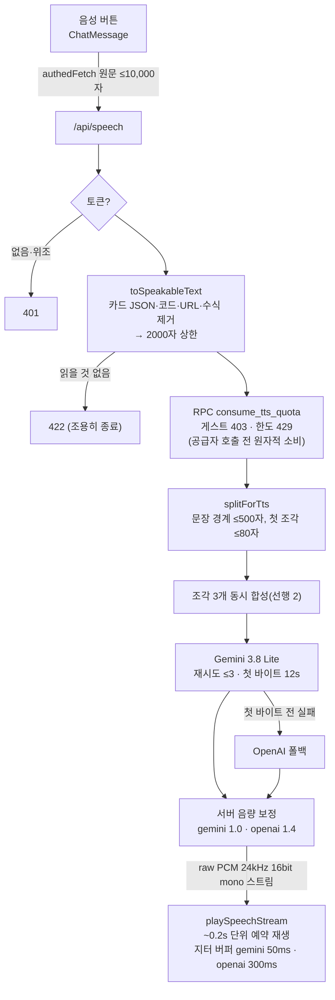

# REF: TTS (소리 내어 읽기)

> 최종 점검: 2026-10-04 · 상태: **dev 구현, main 미배포**
> 설계·측정 이력: [PLAN_TTS_STREAMING_261002](../plans/PLAN_TTS_STREAMING_261002.md) · 날짜 로그: [DEV_261003](../logs/2026/10/DEV_261003.md)
> 코드: `app/api/speech/route.ts` · `server/tts/` · `services/geminiService.ts`(`playSpeechStream`) · `components/ChatMessage.tsx`

---

## 1. 모델 정책

| 순위 | 모델 | 언제 |
|---|---|---|
| **1순위** | Gemini `gemini-3.8-flash-lite-tts` (음성 `Kore`) | 기본. `TTS_PROVIDER` 미설정 또는 `gemini` |
| **폴백** | OpenAI `gpt-4o-mini-tts` (음성 `alloy`) | 1순위가 **조각의 첫 바이트 전**에 실패할 때. 키가 있으면 자동, `TTS_FALLBACK=off` 로 끈다 |

- `TTS_PROVIDER=openai` 로 순서를 뒤집을 수 있다(OpenAI 1순위 → Gemini 폴백).
- 🔴 **OpenAI `gpt-4o-mini-tts` 는 2027-01-06 API 에서 제거된다**(2026-10-01 공지, `tts-1`·`tts-1-hd` 포함).
  공식 대체 `gpt-realtime-2.1-mini` 는 음성 대화 모델이라 원문 그대로 읽기를 보장하지 않는다 → **2026-12 안에 폴백을 `gemini-3.8-flash-tts` 로 교체**한다(TODO).
- ⚖️ **채팅 모델 정책의 예외다.** 채팅은 쿼터·장애를 다른 공급자로 넘기지 않는다(다른 모델의 답을 선택 모델 답처럼 보이게 하지 않기 위해, [REF_Architecture §Model Policy](REF_Architecture.md#model-policy)).
  TTS 는 **읽을 내용이 같고 목소리만 바뀌므로** 공급자 폴백을 허용한다.

### 모델 선택 근거 (실측, 2026-10-02~04)

| 모델 | 2000자 첫 소리 | 2000자 생성 시간 | 문장 누락 | 비고 |
|---|---|---|---|---|
| **Gemini 3.8 Flash Lite TTS** | 1.2~1.4s | **28~30s** | 0/5 | 채택(1순위) |
| OpenAI `gpt-4o-mini-tts` | 0.6~1.4s | 22~27s | 0/7 | 채택(폴백) — 2027-01-06 제거 |
| Gemini 3.8 Flash TTS | 1.5~1.7s | 54~55s | 0/5 | 느림. 2027 폴백 후보 |
| Gemini 3.1 Flash TTS (preview) | 0.9~1.5s | 37~41s | **1/7** | 2026-10-03~04 잠시 사용 후 교체 |
| Gemini 2.5 Flash TTS | = 전체 시간 | — | — | 🔴 stream 호출도 **한 덩어리**, 2000자 0/2 실패 — 2026-10-02 까지의 원래 모델 |
| `gpt-realtime-2.1-mini` | — | — | — | 미채택 — 대화 모델(읽기 계약 없음), WebSocket 세션 |

문장 누락은 약 340자(2조각)를 반복 합성해 **전사로 원문 문장을 대조**했다. 오디오 길이(±3%)로는 한 문장 누락을 못 잡는다.

---

## 2. 비용

오디오 출력이 비용의 대부분이고 **오디오 길이에 비례**한다(25 토큰/초 = 1,500 토큰/분). 한국어 ≈ 13.6초/100자.

| 모델 | 오디오 출력 단가 | 분당 | 보통 답변(300~500자, ≈1분) | 최대 2000자(≈4.7분) |
|---|---|---|---|---|
| **Gemini 3.8 Flash Lite TTS** | **$6/1M** (2026-12-31 까지) | ≈$0.009 | ≈$0.009 | **≈$0.04** |
| ↳ 2027-01-01 부터 | $12/1M (2배) | ≈$0.018 | ≈$0.018 | ≈$0.08 |
| OpenAI `gpt-4o-mini-tts` | $12/1M (대시보드 역산 ≈$0.016/분) | ≈$0.015 | ≈$0.015 | ≈$0.07 |
| Gemini 3.1 Flash TTS | $20/1M | ≈$0.03 | ≈$0.03 | ≈$0.14 |

- 단가는 2026-10 공개 가격(출처: 공급자 가격표·LiteLLM·eesel 정리). 채택·한도 변경 전에 재확인한다.
- **회원 한도 20,000자/일** = 2000자 10회 ≈ Lite **$0.4/일/회원**(2027 $0.8), OpenAI 폴백으로만 읽으면 ≈$0.7.
- 공급자 월 상한(콘솔): Gemini — AI Studio **Project Spend Cap**(반영 ~10분 지연), OpenAI — 프로젝트 **hard limit**(429 로 차단). 권장 $10~20/월.
  OpenAI TTS 는 **전용 키 `OPENAI_API_TTS`**(별도 프로젝트) — 공유 키면 상한 도달 시 GPT 채팅까지 멈춘다.

---

## 3. 흐름

| 규칙 | 값 | 이유 |
|---|---|---|
| 조각 상한 | 500자 | 한 요청 ~800자를 넘으면 두 공급자 모두 **중간을 건너뛰거나 반복**(끝은 읽음). 700자도 OpenAI 2/4 생략, 500자 8/8 정상 |
| 첫 조각 | ≤80자 | 첫 소리를 당긴다 |
| 선행(prefetch) | 2 | 전체 시간 최소(p1 대비 ~절반) |
| 재시도 | 조각당 ≤3회, **첫 바이트 전에만** | 오디오를 낸 뒤 재시도하면 앞부분이 두 번 나온다. 영구 4xx·사용자 취소는 재시도 안 함 |
| 첫 바이트 타임아웃 | 12s | 응답 없이 걸린 시도를 60s 까지 기다려 61초 뒤 500 이 났다 |
| 폴백 | 첫 조각 실패 → 요청 전체 / 이후 조각 실패 → 그 조각만 | 목소리 하나 유지 vs 내용 누락 방지 |
| 이후 조각 최종 실패 | 건너뛰고 계속 | 한 조각을 잃는 편이 나머지 전부를 잃는 것보다 낫다 |
| 음량 | 서버 PCM 보정 | 3.8 Lite 원음이 풀스케일(피크 32768) — 예전 1.8 증폭이 찌그러뜨렸다. OpenAI 는 3.3dB 작다 |
| 응답 크기 | 2000자 ≈ 13MB | 스트리밍이라 Vercel 4.5MB 응답 제한 대상 아님 |

---

## 4. 인증·한도

| 대상 | 결과 |
|---|---|
| 토큰 없음·위조 | 401 — 공급자 호출 0회(실측) |
| 게스트(익명) | 403 |
| 회원 | **20,000자/일**(KST 자정 리셋). 초과 429 |

- RPC `consume_tts_quota` — [tts-quota.sql](db/tts-quota.sql). 테이블 `tts_usage` 는 RLS on·정책 없음(사용자 읽기·쓰기 불가), 한도는 함수 상수.
- 한도는 **합성 전에** 소비한다 — 합성이 실패해도 차감된다(보수적).
- RPC 가 없으면 TTS 를 부르지 않는다(fail-closed) → 🔴 **새 DB 에는 SQL 적용 후 배포.** 현재 dev DB(poc-test)만 적용, main DB 미적용.

---

## 5. 오류 처리 — 사용자에게 코드·원문을 보이지 않는다

| 상황 | 서버 응답 | 사용자 안내(ko, 4개 언어) |
|---|---|---|
| 게스트 | 403 `Members only` | 음성 읽기는 로그인한 회원만 사용할 수 있습니다. |
| 한도 초과 | 429 `Daily limit reached` | 오늘 음성 읽기 한도를 모두 사용했습니다. 내일 다시 이용해주세요. |
| 세션 만료 | 401 | 로그인이 만료되었습니다. 다시 로그인한 뒤 시도해주세요. |
| 서버 미도달 | — | 네트워크 연결이 불안정합니다. 연결을 확인한 뒤 다시 시도해주세요. |
| 두 공급자 모두 실패 등 | 500 `Failed to generate speech` | 음성을 만들지 못했습니다. 잠시 후 다시 시도해주세요. |
| 사용자 중지 · 422 · 재생 중 끊김 | — | 안내 없음(끊김은 받은 만큼 재생) |

- 공급자 원문(Gemini SDK JSON, OpenAI 응답 본문)은 **서버 로그(`console.warn/error`)에만** 남는다. 실측(2026-10-04): Gemini 무효 키 + 폴백 끔, 두 공급자 모두 무효 키 → 응답 본문 `{"error":"Failed to generate speech"}` 만.
- 클라이언트는 `TtsError(kind)` 로 분류하고 원인은 `console.warn` 에만 남긴다(`console.error` 는 dev 오버레이에 원문을 띄운다).

---

## 6. 환경 변수

| 변수 | 값 | 설명 |
|---|---|---|
| `TTS_PROVIDER` | `gemini`(기본) · `openai` | 1순위 공급자 |
| `TTS_FALLBACK` | `off` | 폴백 끄기(미설정이면 다른 공급자 키가 있을 때 켜짐) |
| `TTS_USE_TIER1` | `true` | Gemini 를 유료 `API_KEY_TIER1` 로만. 미설정이면 무료 풀 `API_KEY`~`API_KEY12` 로테이션(한도가 작다) |
| `API_KEY_TIER1` | Gemini 유료 키 | 위와 짝 |
| `OPENAI_API_TTS` | OpenAI 키 | TTS 전용(권장). 없으면 `OPENAI_API_KEY_TIER1` 로 내려간다 |

Vercel(2026-10-04): Production 에 `TTS_USE_TIER1`·`API_KEY_TIER1`·`OPENAI_API_TTS` 등록. Preview 에는 `TTS_USE_TIER1`·`API_KEY_TIER1` 이 없어 Gemini 무료 풀 → 실패 시 OpenAI 폴백.

---

## 7. 검증

| 종류 | 위치 |
|---|---|
| 오프라인 하니스(`npm test`) | `tests/test-tts-split.mts` · `test-tts-retry.mts` · `test-tts-speakable.mts` |
| 수동 프로브(유료) | `tests/manual/probe-tts-latency.mts` · `probe-tts-chunking.mts` · `probe-speech-route.mts`(회원 토큰 `TTS_PROBE_BEARER`) — [tests/README](../../tests/README.md) |

## 8. 남은 것

- 🔴 2026-12 안에 폴백을 `gemini-3.8-flash-tts` 로 교체(OpenAI 2027-01-06 제거)
- main DB 에 `tts-quota.sql` 적용 후 main 배포
- Gemini 가 응답 없이 걸리는 장애에서는 재시도 3회 × 12s 를 다 쓴 뒤 폴백 — 최대 ~37s
- 귀로 확인: 조각 경계 · 음량 균형 · iOS Safari · 음성 후보 비교
- 말하기 속도 조절(미구현), 카드만 있는 답변에서 버튼 숨김(미구현)
